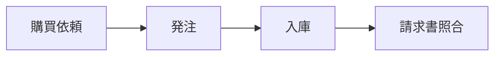
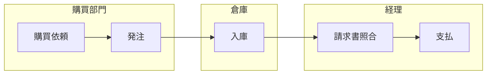
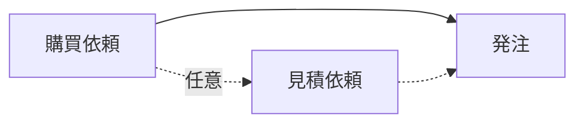

# SAP Blog Hugo - プロジェクトガイド

## 作業前の確認ルール

指示に曖昧な点・解釈が複数できる点があれば、**作業開始前に必ずまとめて質問する**。細かすぎると感じても質問すること。手戻りを防ぐため、前半で認識を合わせることを最優先にする。

---

## 記事レビュー観点

ブログ記事を作成・レビューする際は、以下の観点を**必ず確認すること**（指示がなくても自動的に適用する）。

### 1. why so / so what の関係
- 各ステップ・セクションで「なぜその業務が必要か（why so）」と「それが何を意味するか・どうすべきか（so what）」が明示されているか
- 業務的意義が説明されているだけで、読者への示唆（so what）が抜けていないか
- 特に「〇〇しないとどうなるか」という逆の視点も盛り込まれているか

### 2. 論理の飛躍がないか
- 専門用語が説明なく突然登場していないか（例：GR/IR勘定、転送指図など）
- 前のステップの説明なしに次のステップを前提にしていないか
- 他のモジュール・記事の知識を前提にする場合は、参照先または簡単な説明を添えているか

### 3. Mermaid図の品質チェック（必須）

記事に含まれるMermaid図を作成・レビューする際は、以下を**必ず確認すること**。

#### 誰が見ても理解できるか
- ノードのラベルは「業務名」が主役。トランザクションコードは補足として小さく添える程度にし、コードだけのノードにしない
- 省略可能なステップは点線矢印（`-.->`)で表現し、実線と区別する
- ノード内に詰め込む情報は最大2要素まで（業務名 + Tコード、または業務名 + 担当者）。3要素以上は図を分割するか本文で補う
- 「自動処理」と「手動処理」を同じ図に混在させる場合は形状で区別する（自動：角丸`(())`、手動：矩形`[]`など）

#### 凡例の記載（必須）
- **すべてのMermaidブロックの直後**に、その図で使っている視覚要素を説明する凡例を必ず書く
- 凡例に含める内容（使っているものだけ記載）：
  - 矢印の種類（実線 = 必須フロー、点線 = 省略可能）
  - ノードの形状（矩形 = 手動操作、角丸 = システム自動処理 など）
  - subgraphの意味（担当部門、モジュール区分 など）
  - 英数字コードがある場合はTコードの説明も添える
- 凡例のフォーマット（項目をspanで横並びにして視認性を確保する）：
```html
<div style="font-size: 0.8rem; color: #666; margin-top: 0.5rem; padding: 0.4rem 0.75rem; background: #f8f8f8; border-radius: 4px; display: flex; flex-wrap: wrap; gap: 0.25rem 1.5rem;">
  <span>凡例</span>
  <span><strong>→</strong> 〇〇</span>
  <span><strong>-.-></strong> 〇〇</span>
  <span><strong>[ ]</strong> 〇〇</span>
  <span><strong>英数字コード</strong> = Tコード（SAPの操作コマンド）</span>
</div>
```
- 使っていない要素は省略する。その図に登場する要素だけを記載する

#### 縦長にしない（最重要）
- **原則：`flowchart LR`（左右方向）を使う**。`TD`（上下）は6ノード以内の単純な直列フローのみ許可
- subgraphを使う場合は**必ず`LR`**。`TD` + subgraph の組み合わせは使わない
- 1つの図のノード数が8を超える場合は図を分割する
- subgraph内のノード間エッジと、subgraph間をまたぐエッジが混在すると崩れやすいため、subgraph間の接続は最小限にする

#### 自動挿入のルール
記事を作成する際は、指示がなくても以下を**自動的に**実行すること。
- 記事の内容を読んで「図があると理解しやすい箇所」を自分で判断し、Mermaidで作成して差し込む
- 判断基準：
  - 複数ステップをまたぐ業務フロー → `flowchart LR`
  - 部門・システム間をまたぐ流れ → `flowchart LR`（subgraphでスイムレーン表現）
  - システム構成・モジュール関係 → `flowchart LR`
  - マスタデータの関連・依存関係 → `flowchart LR` or `classDiagram`
  - 時系列の処理フロー → `sequenceDiagram`
- **SAPの画面キャプチャは不要**（取得・公開できない環境のため、一切作らない）
- Mermaidで表現しにくい図（写真・イラスト等）のみ image-placeholder を使う

---

## 記事フォーマット標準

### Front matter
- `author`: "SAP入門ナレッジ 編集部" で統一
- `draft: false` で公開状態

#### カテゴリ（categories）ルール — 必ず1つだけ付与する

| カテゴリ | 使う場面 |
|---|---|
| `業務フロー` | 各モジュールの業務手順・SAP操作フローを解説する記事 |
| `技術・ツール` | Tコード・データ移行・ABAP・テーブル検索などの技術的解説 |
| `導入・事例` | SAP導入手法・プロジェクト事例・移行事例 |
| `入門・学習` | SAP基礎知識・学習法・資格情報など初学者向けコンテンツ |
| `キャリア` | SAPコンサルタントのキャリア・転職・スキルアップ情報 |

#### タグ（tags）ルール — 記事内容に応じて複数付与する

以下の分類から記事に登場するものを選ぶ。存在しないタグは新規追加してOK。

- **モジュール系**：`MM` / `SD` / `FI` / `PP` / `CO` / `QM` / `Basis` / `ABAP`
- **業務プロセス系**：`購買管理` / `在庫管理` / `販売管理` / `出荷管理` / `財務会計` / `P2P` / `O2C` / `R2R` / `業務フロー` / `業務効率化`
- **技術・ツール系**：`トランザクションコード` / `データ移行` / `BAPI` / `LSMW` / `テーブル検索` / `開発Tips`
- **製品系**：`S/4HANA Cloud` / `SAP Activate` / `SAP BTP`
- **入門・学習系**：`SAP入門` / `初心者` / `基礎知識`
- **業種系**：`製造業` / `流通業` / `サービス業`

### 各業務フロー記事の構成
1. はじめに（サイクル名の定義）
2. モジュール全体像（表形式）
3. STEP 0: マスタデータ
4. STEP 1〜N: 各業務ステップ（業務的意味 → SAPでの操作）
5. 全体サマリ表 + スイムレーン図（Mermaidで作成）
6. よくある疑問（FAQ形式）
7. まとめ（箇条書きで要点整理）

### 図の作成方針
- フロー図・スイムレーン・アーキテクチャ図は **Mermaid** で作成する
- SAPの画面キャプチャは**一切不要**（理由：取得・公開できない環境）
- Mermaidの書き方：

````markdown

````

スイムレーン（部門またぎ）の例：
````markdown

````

省略可能ステップの例（点線矢印）：
````markdown

````

### 画像プレースホルダー
SAPキャプチャ以外で画像が必要な場合のみ使用：
```html
<!-- 画像が必要な箇所：説明 -->
<div class="image-placeholder" style="border: 2px dashed #ccc; padding: 40px; text-align: center; margin: 24px 0; background: #f9f9f9;">
  <p style="color: #999; font-size: 14px;">【画像が必要】タイトル<br>具体的に何を写した画像が必要かの説明</p>
</div>
```
