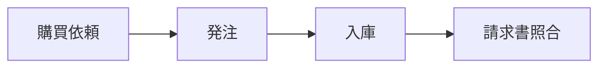
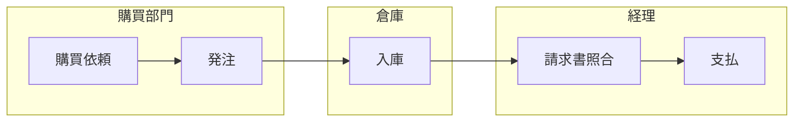

# SAP Blog Hugo - プロジェクトガイド

## 作業前の確認ルール

指示に曖昧な点・解釈が複数できる点があれば、**作業開始前に必ずまとめて質問する**。細かすぎると感じても質問すること。手戻りを防ぐため、前半で認識を合わせることを最優先にする。

---

## 記事レビュー観点

ブログ記事を作成・レビューする際は、以下の観点を**必ず確認すること**（指示がなくても自動的に適用する）。

### 1. why so / so what の関係
- 各ステップ・セクションで「なぜその業務が必要か（why so）」と「それが何を意味するか・どうすべきか（so what）」が明示されているか
- 業務的意義が説明されているだけで、読者への示唆（so what）が抜けていないか
- 特に「〇〇しないとどうなるか」という逆の視点も盛り込まれているか

### 2. 論理の飛躍がないか
- 専門用語が説明なく突然登場していないか（例：GR/IR勘定、転送指図など）
- 前のステップの説明なしに次のステップを前提にしていないか
- 他のモジュール・記事の知識を前提にする場合は、参照先または簡単な説明を添えているか

### 3. Mermaid図の自動挿入（必須）
記事を作成する際は、指示がなくても以下を**自動的に**実行すること。

- 記事の内容を読んで「図があると理解しやすい箇所」を自分で判断し、Mermaidで作成して差し込む
- 判断基準：
  - 複数ステップをまたぐ業務フロー → `flowchart`
  - 部門・システム間をまたぐ流れ → `flowchart`（subgraphでスイムレーン表現）
  - システム構成・モジュール関係 → `flowchart`
  - マスタデータの関連・依存関係 → `flowchart` or `classDiagram`
  - 時系列の処理フロー → `sequenceDiagram`
- **SAPの画面キャプチャは不要**（取得・公開できない環境のため、一切作らない）
- Mermaidで表現しにくい図（写真・イラスト等）のみ image-placeholder を使う

---

## 記事フォーマット標準

### Front matter
- `categories`: 業務フロー / 導入事例 / 入門 などを使用
- `author`: "SAP入門ナレッジ 編集部" で統一
- `draft: false` で公開状態

### 各業務フロー記事の構成
1. はじめに（サイクル名の定義）
2. モジュール全体像（表形式）
3. STEP 0: マスタデータ
4. STEP 1〜N: 各業務ステップ（業務的意味 → SAPでの操作）
5. 全体サマリ表 + スイムレーン図（Mermaidで作成）
6. よくある疑問（FAQ形式）
7. まとめ（箇条書きで要点整理）

### 図の作成方針
- フロー図・スイムレーン・アーキテクチャ図は **Mermaid** で作成する
- SAPの画面キャプチャは**一切不要**（理由：取得・公開できない環境）
- Mermaidの書き方：

````markdown

````

スイムレーン（部門またぎ）の例：
````markdown

````

### 画像プレースホルダー
SAPキャプチャ以外で画像が必要な場合のみ使用：
```html
<!-- 画像が必要な箇所：説明 -->
<div class="image-placeholder" style="border: 2px dashed #ccc; padding: 40px; text-align: center; margin: 24px 0; background: #f9f9f9;">
  <p style="color: #999; font-size: 14px;">【画像が必要】タイトル<br>具体的に何を写した画像が必要かの説明</p>
</div>
```
