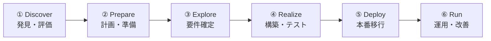

## SAP Activateとは

SAP Activateは、SAPシステムの導入を効率的に進めるための公式フレームワークです。アジャイル手法とベストプラクティスを組み合わせ、プロジェクトリスクを最小化しながら迅速な導入を実現します。

## 6つのフェーズ全体像

  凡例
  <strong>→</strong> フェーズの進行順序
  <strong>[ ]</strong> 各フェーズ（手動・人による活動）

## 6つのフェーズ

<h3 class="card-title">① Discover（発見）</h3>

プロジェクトの目的・スコープを定義し、ビジネス価値を評価します。

<ul style="margin-left: 1.5rem;">
  <li>現状分析</li>
  <li>要件整理</li>
  <li>ROI評価</li>
</ul>

<h3 class="card-title">② Prepare（準備）</h3>

プロジェクト計画を策定し、チームと環境を整備します。

<ul style="margin-left: 1.5rem;">
  <li>プロジェクト計画</li>
  <li>チーム編成</li>
  <li>環境構築</li>
</ul>

<h3 class="card-title">③ Explore（探索）</h3>

Fit-to-Standardワークショップを実施し、業務要件を確定します。

<ul style="margin-left: 1.5rem;">
  <li>ワークショップ</li>
  <li>ギャップ分析</li>
  <li>設計確定</li>
</ul>

<h3 class="card-title">④ Realize（実現）</h3>

システムの設定・カスタマイズを行い、テストを実施します。

<ul style="margin-left: 1.5rem;">
  <li>システム設定</li>
  <li>データ移行</li>
  <li>テスト</li>
</ul>

<h3 class="card-title">⑤ Deploy（展開）</h3>

本番環境への移行と、エンドユーザートレーニングを実施します。

<ul style="margin-left: 1.5rem;">
  <li>カットオーバー</li>
  <li>ユーザー教育</li>
  <li>本番移行</li>
</ul>

<h3 class="card-title">⑥ Run（運用）</h3>

本番稼働後の運用・保守・継続的改善を行います。

<ul style="margin-left: 1.5rem;">
  <li>運用監視</li>
  <li>ヘルプデスク</li>
  <li>継続改善</li>
</ul>

## Activateのメリット

- **スピード向上**：標準化されたプロセスにより、導入期間を大幅短縮
- **リスク軽減**：ベストプラクティスに基づく手法でプロジェクトリスクを最小化
- **品質確保**：各フェーズのゲートレビューで品質を担保
- **柔軟性**：アジャイルアプローチにより、変化する要件に対応可能
