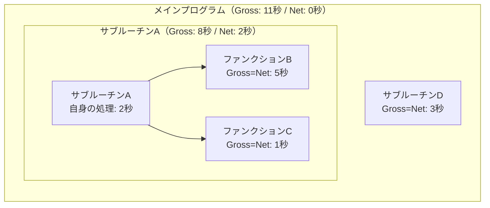
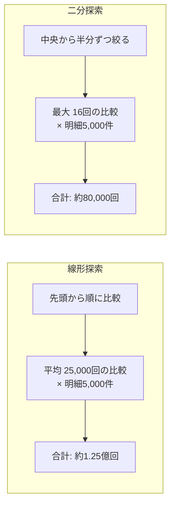

## はじめに

ABAPプログラムの開発では、「正しく動くこと」の次に求められるのが「十分な速度で動くこと」です。特にバッチ処理やレポートプログラムでは、数万〜数百万件のデータを扱うため、わずかな非効率がトータルの処理時間に大きく影響します。

本記事では、ABAPのパフォーマンスチューニングを以下の3つの軸で解説します。

1. **SE30（SAT）の基本的な使い方** — ボトルネックの特定方法
2. **Gross時間とNet時間の違い** — 分析結果の正しい読み方
3. **実案件の事例** — 内部テーブルのREAD TABLEにおけるBINARY SEARCH適用による改善

**なぜパフォーマンスチューニングを学ぶ必要があるのか（why so）**：処理が遅いプログラムは、単に「待ち時間が長い」だけの問題ではありません。バッチ処理が夜間ウィンドウ内に終わらない、オンライン処理でユーザーがタイムアウトに遭遇する、他のプログラムの処理にまで影響を及ぼすなど、運用全体に波及します。バッチ処理の仕組みと運用については[SM36 / SM37 完全解説｜SAPバックグラウンドジョブの定義・監視・運用](/blog/sap-background-job/)で解説しています。「動いているから問題ない」ではなく、**処理時間を計測し、ボトルネックを特定し、根拠をもって改善する**スキルが開発者には必要です。

---

## SE30（SAT）とは

**SE30**（S/4HANA環境では **SAT** に名称変更）は、ABAPプログラムの**ランタイム分析ツール**です。プログラムを実行しながら、どの処理にどれだけ時間がかかっているかを記録・可視化します。

**なぜSE30を使うのか（why so）**：パフォーマンス問題に対して「なんとなく遅そうな箇所」を勘で直すのは危険です。実際に計測すると、予想と異なる箇所がボトルネックだったということは珍しくありません。SE30はプログラムの実行時間を**客観的なデータ**として取得し、どこに時間がかかっているかを数値で示してくれます。

### SE30の基本的な使い方

SE30の操作は大きく**3ステップ**です。


<div style="font-size: 0.8rem; color: #666; margin-top: 0.5rem; padding: 0.4rem 0.75rem; background: #f8f8f8; border-radius: 4px; display: flex; flex-wrap: wrap; gap: 0.25rem 1.5rem;">
  <span>凡例</span>
  <span><strong>→</strong> 操作の順序</span>
  <span><strong>[ ]</strong> 各ステップの操作内容</span>
  <span><strong>英数字コード</strong> = Tコード（SAPの操作コマンド）</span>
</div>

#### ステップ①：測定対象を指定する

1. Tコード **SE30**（または **SAT**）を実行
2. 初期画面で測定対象を指定する
   - **トランザクション**：Tコードを入力して、そのTコードの実行全体を測定
   - **プログラム**：レポートプログラム名を指定して測定
   - **ファンクションモジュール**：特定のFMだけを測定

#### ステップ②：プログラムを実行する

- 「実行」ボタンを押すと、指定したプログラムが通常通り起動する
- **普段と同じ操作**でプログラムを動かす（テストデータの入力、実行ボタンの押下など）
- バックグラウンドでSE30が処理時間を記録している
- プログラムが終了すると、測定が完了する

#### ステップ③：結果を分析する

測定が完了したら「評価」ボタンを押して結果を確認します。分析画面には主に以下の情報が表示されます。

| 表示項目 | 内容 |
|---------|------|
| **ヒットリスト** | 呼び出された処理（サブルーチン、FM、メソッドなど）の一覧。各処理のGross時間・Net時間・呼び出し回数が表示される |
| **呼び出し階層** | どの処理がどの処理を呼んでいるかのツリー構造。ボトルネックの呼び出し元を追跡できる |
| **データベースアクセス** | SQL文ごとの実行時間・実行回数。DBアクセスがボトルネックの場合に有効 |

**読者への示唆（so what）**：SE30の分析で最初に確認すべきは**ヒットリスト**です。Gross時間の降順でソートし、上位に来ている処理がボトルネック候補です。ただし、Gross時間だけを見ると誤った判断をすることがあります。次のセクションで、Gross時間とNet時間の違いを理解しましょう。

---

## Gross時間とNet時間の違い

SE30の分析結果を正しく読むために、**Gross時間**と**Net時間**の違いを理解することが不可欠です。

### 定義

| 用語 | 意味 |
|------|------|
| **Gross時間** | その処理自体の実行時間 ＋ その処理から**呼び出された子処理の実行時間すべて**を含む合計時間 |
| **Net時間** | その処理**自体だけ**の実行時間。子処理の時間は含まない |

### 具体例で理解する

以下のような呼び出し構造を考えてみましょう。

```
メインプログラム
  ├── サブルーチンA（自身の処理: 2秒）
  │     ├── ファンクションB（自身の処理: 5秒）
  │     └── ファンクションC（自身の処理: 1秒）
  └── サブルーチンD（自身の処理: 3秒）
```

この場合、各処理のGross時間とNet時間は以下のようになります。

| 処理 | Net時間 | Gross時間 | 計算の内訳 |
|------|---------|-----------|-----------|
| サブルーチンA | 2秒 | 8秒 | 自身2秒 + B(5秒) + C(1秒) |
| ファンクションB | 5秒 | 5秒 | 子処理なし |
| ファンクションC | 1秒 | 1秒 | 子処理なし |
| サブルーチンD | 3秒 | 3秒 | 子処理なし |
| メインプログラム | 0秒 | 11秒 | A(8秒) + D(3秒) |



<div style="font-size: 0.8rem; color: #666; margin-top: 0.5rem; padding: 0.4rem 0.75rem; background: #f8f8f8; border-radius: 4px; display: flex; flex-wrap: wrap; gap: 0.25rem 1.5rem;">
  <span>凡例</span>
  <span><strong>→</strong> 呼び出し関係</span>
  <span><strong>[ ]</strong> 各処理（Net時間 = 自身の処理時間）</span>
  <span><strong>subgraph</strong> = 親子関係（Gross時間 = 枠内の合計）</span>
</div>

### なぜ両方を見る必要があるのか

**Gross時間だけを見た場合の落とし穴**：上の例でGross時間の降順にソートすると、「メインプログラム（11秒）→ サブルーチンA（8秒）→ ファンクションB（5秒）」という順になります。メインプログラムやサブルーチンAのGross時間が大きいからといって、それ自体を最適化しても意味がありません。**真のボトルネックはNet時間が大きい処理**です。

**正しい読み方**：

1. まず**Gross時間**で全体のうちどの処理ツリーに時間がかかっているかを把握する（大きな塊を見つける）
2. 次にその中で**Net時間**が大きい処理を特定する（実際に時間を消費している処理を見つける）
3. さらに**呼び出し回数**を確認する（1回あたりは短くても、大量に呼ばれている処理がボトルネックの場合がある）

**読者への示唆（so what）**：SE30のヒットリストを見るときは、**Net時間 × 呼び出し回数**の組み合わせに注目してください。「1回あたりのNet時間は短いが、数万回呼ばれている」というパターンが、最も見落としやすく、かつ改善効果の大きいボトルネックです。次の実案件の事例がまさにこのパターンに該当します。

---

## 実案件の事例：内部テーブルのREAD TABLEとBINARY SEARCH

### 背景

ある案件で、品質管理に関するレポートプログラムのパフォーマンス問題が発生しました。処理の概要は以下の通りです。

- 入力：対象期間の**伝票明細**（数千件）
- 処理：各伝票明細に紐づく**検査ロット**から、品質特性値を取得する
- 出力：明細ごとの特性値を一覧表示

### 問題の構造

このプログラムでは、検査ロットの特性値を格納した**内部テーブル（数万件）** を事前に一括取得し、伝票明細ごとに `READ TABLE` で該当するロットの特性値を検索していました。

```
処理の流れ:
  1. 検査ロットの特性値を一括SELECT → 内部テーブル lt_char（数万件）
  2. 伝票明細をLOOP（数千件）
     └── 明細ごとに READ TABLE lt_char でロットに紐づく特性値を検索
```

**一見すると合理的な設計**に見えます。SQLの発行回数を減らすために一括取得しており、SELECTのパフォーマンスは問題ありません。しかし、実際には処理に**数十分**かかっていました。

### ボトルネックの特定

SE30で測定したところ、以下のことがわかりました。

| 処理 | Net時間（1回あたり） | 呼び出し回数 | 合計時間 |
|------|-------------------|------------|---------|
| READ TABLE lt_char | 約10ミリ秒 | 約5,000回 | **約50秒** |

1回あたり10ミリ秒は一見短く見えますが、5,000回繰り返すことで合計50秒になっていました。

### なぜREAD TABLEが遅かったのか：線形探索の問題

`READ TABLE` をオプションなしで使用すると、内部テーブルの先頭から順番にデータを探す**線形探索（リニアサーチ）** が行われます。

```
線形探索（デフォルト）：
  内部テーブル: [レコード1] [レコード2] [レコード3] ... [レコード50,000]
  探索方法:      1件目から順番に比較 → 最悪の場合、50,000件すべてを確認
```

数万件の内部テーブルに対して線形探索を行うと、平均で**テーブル件数の半分**（この場合約25,000回）の比較が必要です。これを5,000回の明細ごとに繰り返すため、比較回数は合計で **25,000 × 5,000 = 1億2,500万回** にも達します。

### 解決策：BINARY SEARCHの適用

`READ TABLE` に **`BINARY SEARCH`** オプションを指定すると、**二分探索（バイナリサーチ）** に切り替わります。二分探索では、ソート済みのテーブルに対して中央の値と比較し、探索範囲を半分ずつ絞り込んでいきます。

```
二分探索（BINARY SEARCH）：
  ソート済みテーブル: [レコード1] [レコード2] ... [レコード25,000] ... [レコード50,000]
  探索方法:           中央と比較 → 半分に絞る → 中央と比較 → 半分に絞る → ...
  必要な比較回数:     最大 約16回（log₂(50,000) ≈ 16）
```

**前提条件**：BINARY SEARCHを使うには、内部テーブルが検索キーで**事前にソートされている必要があります**。ソートされていない状態でBINARY SEARCHを指定すると、**誤った結果が返る**可能性があるため、必ず `SORT` 文でソートしてから使用します。



<div style="font-size: 0.8rem; color: #666; margin-top: 0.5rem; padding: 0.4rem 0.75rem; background: #f8f8f8; border-radius: 4px; display: flex; flex-wrap: wrap; gap: 0.25rem 1.5rem;">
  <span>凡例</span>
  <span><strong>→</strong> 処理の流れ</span>
  <span><strong>[ ]</strong> 各処理ステップ</span>
  <span><strong>subgraph</strong> = 探索方式ごとの比較</span>
</div>

### 改善結果

| 項目 | 改善前（線形探索） | 改善後（二分探索） |
|------|------------------|------------------|
| 1回あたりの比較回数 | 平均 25,000回 | 最大 16回 |
| 合計比較回数 | 約1億2,500万回 | 約80,000回 |
| READ TABLE合計時間 | 約50秒 | **1秒未満** |

比較回数が約1,500分の1に削減され、READ TABLEの処理時間は実質的にゼロに近くなりました。プログラム全体の処理時間も**数十分から数分**に短縮されました。

### この事例から学べること

1. **1回あたりの処理時間が短くても、呼び出し回数が多ければボトルネックになる**。SE30のNet時間 × 呼び出し回数を必ず確認する
2. **内部テーブルの件数が多い場合、READ TABLEのデフォルト（線形探索）は危険**。数百件程度なら問題にならないが、数千〜数万件になると顕著に遅くなる
3. **BINARY SEARCHは必ずSORT済みのテーブルに対して使う**。ソートを忘れるとデータ不整合が発生するため、`SORT` と `READ TABLE ... BINARY SEARCH` はセットで考える

---

## パフォーマンスチューニングの基本原則

最後に、ABAPのパフォーマンスチューニングで押さえておくべき基本原則を整理します。

### 1. 推測ではなく計測する

- 必ず**SE30（SAT）で計測**してからボトルネックを特定する
- 「たぶんここが遅い」という勘は外れることが多い
- 改善前と改善後の**両方を計測**し、効果を数値で確認する

### 2. 内部テーブルのアクセス方法を最適化する

| アクセス方法 | 計算量 | 使いどころ |
|-------------|-------|-----------|
| 線形探索（デフォルト） | O(n) | 件数が少ない場合（数百件以下） |
| 二分探索（BINARY SEARCH） | O(log n) | ソート済みテーブルへのキー検索 |
| ハッシュテーブル（HASHED TABLE） | O(1) | 一意キーでの大量検索（最速） |
| ソートテーブル（SORTED TABLE） | O(log n) | 宣言時にソートキーを定義。自動的に二分探索が適用される |

**読者への示唆（so what）**：大量の内部テーブルに対して繰り返しREAD TABLEを行う場面では、**HASHED TABLE**が最も高速です。テーブル定義時にキーを指定するだけで、検索時に自動的にハッシュ検索が使われます。既存プログラムの改修でテーブル型を変更しにくい場合は、`SORT` + `BINARY SEARCH` が現実的な改善策になります。

### 3. SQLアクセスを最適化する

| やってはいけないこと | 改善策 |
|-------------------|-------|
| LOOPの中でSELECTを発行する | 一括SELECT + 内部テーブルで処理 |
| `SELECT *` で全列取得する | 必要な列だけ指定する |
| WHERE句なしで全件取得する | 適切な条件で絞り込む |
| 同じデータを何度もSELECTする | 一度取得して内部テーブルに保持する |

SQLアクセスの最適化は、コードプッシュダウンの考え方と密接に関連しています。DB層で集計・フィルタリングを完了させる設計思想の詳細は[S/4HANAのインメモリデータベースを理解する（SAP HANAの仕組みとコードプッシュダウン）](/blog/sap-hana-in-memory-database/)を参照してください。

### 4. ボトルネックの影響度を見積もる

すべての非効率を直す必要はありません。改善すべきかどうかは、**処理全体に占める割合**で判断します。

- 全体の処理時間が100秒で、あるREAD TABLEが50秒かかっている → **改善すべき**（50%を占める）
- 全体の処理時間が100秒で、あるサブルーチンが0.5秒かかっている → **優先度は低い**（0.5%にすぎない）

---

## まとめ

- **SE30（SAT）はABAPのパフォーマンス分析ツール**。推測ではなく計測によってボトルネックを特定する。改善前後の両方を計測して効果を数値で確認すること
- **Gross時間は子処理を含む合計時間、Net時間はその処理自体だけの時間**。ボトルネック特定にはNet時間 × 呼び出し回数の組み合わせで判断する。Gross時間だけを見ると、真の原因を見誤る
- **内部テーブルの線形探索は件数が増えると急激に遅くなる**。数千件以上の内部テーブルに対して繰り返しREAD TABLEを行う場合は、BINARY SEARCH・SORTED TABLE・HASHED TABLEの活用を検討する
- **パフォーマンスチューニングは全体に占める割合で優先度を判断する**。処理時間の大部分を占めるボトルネックから改善し、影響の小さい箇所に時間をかけすぎない
