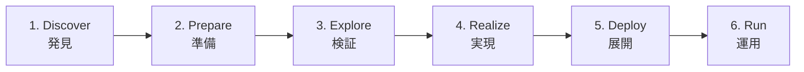
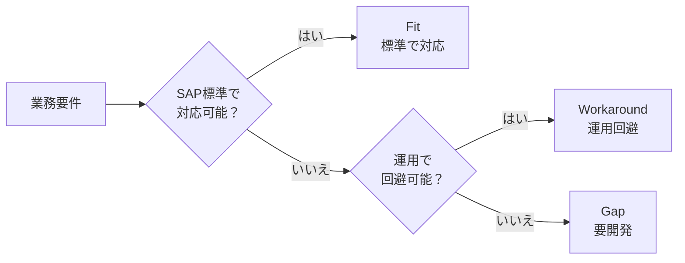

## はじめに

**SAP Activate**とは、SAPが公式に提供するS/4HANA導入プロジェクトの方法論です。かつてのSAP導入では**ASAP（Accelerated SAP）**と呼ばれるウォーターフォール型の方法論が主流でしたが、S/4HANAの登場とクラウド化の流れを受けて、SAP Activateに置き換わりました。

**なぜ方法論が変わったのか（why so）**：従来のASAPはウォーターフォール型で、要件定義から本番稼働まで一方向に進む手法でした。しかしS/4HANAでは、SAP標準のベストプラクティス（事前設定済みの業務プロセス）をベースに導入を進めるため、「ゼロから要件を積み上げる」のではなく「標準に合わせる」発想が必要になります。さらにクラウド版では四半期ごとのアップデートに追従する必要があり、大規模なカスタマイズは運用コストを増大させます。こうした背景から、アジャイル（反復型）で標準活用を前提とした新しい方法論が求められました。

**読者への示唆（so what）**：SAP Activateを理解しておくことは、SAPプロジェクトに関わるすべての人にとって必須です。コンサルタントはもちろん、ユーザー部門の担当者も「どのフェーズで何が求められるか」を把握しておくことで、プロジェクトへの貢献度が大きく変わります。

---

## SAP Activateとは

SAP Activateは、以下の**3つの柱**で構成されています。

| 柱 | 内容 |
|---|---|
| **SAP Best Practices** | SAPが業種・業務ごとに用意したプリセット設定。導入の出発点として使う |
| **Guided Configuration** | Best Practicesをベースに、画面のガイドに従って設定を進めるツール |
| **SAP Activate Methodology** | プロジェクト全体の進め方を定義した方法論（本記事の主題） |

この3つが連携することで、「まず標準で動かし、必要なところだけ調整する」というアプローチが実現します。

### ASAPからの変化

従来のASAPとSAP Activateの根本的な違いは、**プロジェクトの出発点**です。

- **ASAP**：白紙の状態から業務要件を定義し、それに合わせてSAPを設定・開発する（ボトムアップ）
- **SAP Activate**：SAP Best Practices（標準プロセス）を出発点とし、自社業務との差分だけを調整する（トップダウン）

この違いが、導入期間の短縮とカスタマイズの抑制に直結します。ASAPでは要件定義だけで数ヶ月かかることも珍しくありませんでしたが、Activateでは標準プロセスを「まず見て、試して、差分を議論する」ため、合意形成のスピードが格段に上がります。

---

## SAP Activateの6フェーズ

SAP Activateは、以下の6つのフェーズで構成されます。

  凡例
  <strong>→</strong> フェーズの進行順序
  <strong>[ ]</strong> 各フェーズ（番号・英語名・日本語名）

以下、各フェーズを詳しく見ていきます。

---

### フェーズ1：Discover（発見）

**目的**：SAP Best Practicesと自社の業務プロセスを照らし合わせ、導入の方向性を決める。

| 項目 | 内容 |
|---|---|
| 主な活動 | Fit-to-Standard分析、業務プロセスの棚卸し、導入スコープの策定 |
| 成果物 | Fit-to-Standard分析結果、導入スコープ定義書、概算見積り |

**Fit-to-Standard分析**とは、SAP標準の業務プロセス（Best Practices）を実際にデモで確認し、「自社の業務がSAP標準でどこまで対応できるか」を評価する手法です。詳細は後述の「Fit-to-Standardアプローチ」セクションで解説します。

**なぜ重要か（why so）**：Discoverフェーズでの判断が、プロジェクト全体のコストとスケジュールを左右します。ここで「標準でいける」と判断した範囲が広いほど、後続の開発工数が減ります。逆に、このフェーズを軽視して曖昧なまま進めると、Realizeフェーズで「やはり標準では対応できない」と判明し、大幅な手戻りが発生します。

**読者への示唆（so what）**：ユーザー部門は、このフェーズで「現行業務のやり方に固執しない」姿勢が重要です。「今こうやっているから」ではなく「なぜこのやり方なのか」を問い直すことで、SAP標準への適合度が高まります。

---

### フェーズ2：Prepare（準備）

**目的**：プロジェクトの体制・計画・環境を整える。

| 項目 | 内容 |
|---|---|
| 主な活動 | プロジェクト計画策定、チーム編成、システム環境構築、ガバナンスルール策定 |
| 成果物 | プロジェクト計画書、体制図、コミュニケーション計画、環境準備完了 |

**なぜ重要か（why so）**：プロジェクトの成否は体制で決まるといっても過言ではありません。特にSAPプロジェクトでは、ユーザー部門のキーユーザー（業務知識を持つ担当者）の参画が不可欠です。キーユーザーが兼務で十分な時間を割けない場合、後続フェーズでの意思決定が遅れ、プロジェクト全体が停滞します。

**読者への示唆（so what）**：プロジェクトマネージャーは、キーユーザーの**専任化**を経営層に交渉すべきです。「通常業務との兼務で大丈夫」という楽観的な見積りが、多くのSAPプロジェクトの遅延原因になっています。

---

### フェーズ3：Explore（検証）

**目的**：Discoverフェーズのフィット・ギャップ分析を詳細化し、業務要件を確定する。

| 項目 | 内容 |
|---|---|
| 主な活動 | Fit-to-Standardワークショップ、要件の詳細化、スプリント形式での検証 |
| 成果物 | 詳細フィット・ギャップ一覧、バックログ（対応事項の優先順位付きリスト）、プロトタイプ |

ここで言う**スプリント**とは、アジャイル開発の手法で「1〜4週間の短い期間に区切って、計画・実行・振り返りを繰り返す」進め方です。SAP Activateでは、業務領域ごとにスプリントを組み、キーユーザーと一緒にSAP標準プロセスを確認・検証します。

**なぜ重要か（why so）**：従来のウォーターフォール型では、分厚い要件定義書を作っても、実際にシステムを触るのはテストフェーズになってからでした。そのため「想像と違う」という問題が後半で噴出していました。スプリント形式なら、早い段階で実機を触りながら確認できるため、認識のズレを早期に発見できます。

**読者への示唆（so what）**：キーユーザーは、このフェーズで「実際にSAPを触って確認する」ことが求められます。ドキュメントを読むだけでなく、自らシステム上で業務シナリオを試すことで、的確なフィードバックが可能になります。

---

### フェーズ4：Realize（実現）

**目的**：設定・開発・テストを実施し、本番稼働可能なシステムを構築する。

| 項目 | 内容 |
|---|---|
| 主な活動 | システム設定、ギャップ対応の開発、単体テスト → 結合テスト → UAT（ユーザー受入テスト） |
| 成果物 | 設定済みシステム、開発成果物、テスト結果報告書、移行計画 |

**UAT（User Acceptance Test）** とは、実際の業務担当者がシステムを使って業務シナリオを実行し、要件を満たしているか確認するテストです。

このフェーズもスプリント形式で反復的に進めます。設定→テスト→フィードバック→修正のサイクルを短い周期で回すことで、品質を段階的に高めていきます。

**なぜ重要か（why so）**：このフェーズが最も工数がかかり、プロジェクト全体の6割程度を占めることもあります。Exploreフェーズでフィット・ギャップ分析が甘いと、Realizeフェーズで追加要件が次々と発生し、スケジュールが大幅に遅延します。

**読者への示唆（so what）**：テストは「動くことの確認」ではなく「業務が回ることの確認」です。UATでは、日常業務だけでなく月次処理・年次処理・例外パターンも含めて検証することが重要です。テストシナリオの網羅性がGo-Live後のトラブルを防ぎます。

---

### フェーズ5：Deploy（展開）

**目的**：本番稼働に向けた最終準備を行い、Go-Live（本番切替）を実施する。

| 項目 | 内容 |
|---|---|
| 主な活動 | データ移行の本番実行、エンドユーザー教育、本番切替リハーサル、Go-Live判定 |
| 成果物 | 移行済みデータ、教育資料、切替手順書、Go-Live判定結果 |

**なぜ重要か（why so）**：データ移行は多くのプロジェクトで最大のリスク要因です。マスタデータ（品目・取引先など）の品質が低いと、Go-Live直後に業務が止まります。また、エンドユーザーが新しいシステムの操作に慣れていないと、業務効率がかえって低下する「導入直後の谷」が深くなります。

**読者への示唆（so what）**：データ移行は「一発勝負」ではなく、事前に複数回のリハーサルを行うべきです。また、ユーザー教育は座学だけでなく、実機を使ったハンズオン形式で実施することで定着率が大幅に向上します。

---

### フェーズ6：Run（運用）

**目的**：本番稼働後の安定運用と継続的な改善を行う。

| 項目 | 内容 |
|---|---|
| 主な活動 | ハイパーケア（集中サポート）、問題対応、運用最適化、継続改善 |
| 成果物 | 運用手順書、インシデント対応記録、改善提案一覧 |

**ハイパーケア**とは、Go-Live直後の一定期間（通常1〜3ヶ月）、プロジェクトチームが通常より手厚いサポート体制を敷く期間です。

**なぜ重要か（why so）**：Go-Liveはゴールではなくスタートです。本番稼働後に初めて発覚する問題は必ずあります。月次決算や四半期処理など、Go-Live時点ではまだ経験していない業務サイクルが残っているためです。

**読者への示唆（so what）**：プロジェクト予算と体制は、Go-Liveで終わりではなくハイパーケア期間まで含めて計画すべきです。ハイパーケア期間中にプロジェクトメンバーが離脱すると、問題対応が遅れて業務に深刻な影響を及ぼします。

---

## Fit-to-Standardアプローチ

SAP Activateの中核をなすのが**Fit-to-Standard**というアプローチです。従来の「要件をすべて洗い出してからシステムを作る」手法とは逆に、**SAP標準プロセスを出発点として、自社業務との差分（ギャップ）だけを対応する**という考え方です。

### なぜFit-to-Standardなのか（why so）

SAP標準から大きく外れたカスタマイズ（アドオン開発）は、以下のリスクを生みます。

- **アップグレードコストの増大**：S/4HANAのバージョンアップ時に、カスタマイズ部分の改修が必要になる
- **サポート範囲の縮小**：SAP標準から外れた部分はSAPのサポート対象外になることがある
- **属人化**：カスタマイズの仕様を理解している人が退職すると、保守が困難になる

### ギャップの分類と判断基準

Fit-to-Standard分析で発見されたギャップは、以下の3種類に分類して対応を判断します。

  凡例
  <strong>→</strong> 判断の流れ
  <strong>{ }</strong> 判断ポイント（Yes/Noで分岐）
  <strong>[ ]</strong> 対応方針

| 分類 | 説明 | 対応方針 |
|---|---|---|
| **Fit（標準で対応）** | SAP標準機能で業務要件を満たせる | そのまま標準を採用する |
| **Workaround（運用回避）** | SAP標準では完全に一致しないが、業務運用の工夫で対応可能 | 業務プロセスを調整して標準機能を活用する |
| **Gap（要開発）** | SAP標準では対応できず、開発（アドオン）が必要 | 開発の費用対効果を慎重に検討した上で実施する |

**読者への示唆（so what）**：ギャップが見つかったとき、最初に検討すべきは「業務側を変えられないか」です。「今の業務のやり方」が本当にビジネス上の必須要件なのか、それとも単なる慣習なのかを見極めることが、プロジェクトコストを大きく左右します。

---

## ASAP方法論との比較

ASAPとSAP Activateの違いを整理します。

| 比較項目 | ASAP | SAP Activate |
|---|---|---|
| **開発アプローチ** | ウォーターフォール（順次型） | アジャイル／イテレーティブ（反復型） |
| **出発点** | 白紙から要件定義 | SAP Best Practices（標準プロセス） |
| **フェーズ数** | 5フェーズ | 6フェーズ（Discoverが追加） |
| **要件定義の進め方** | 大量のドキュメント作成 | Fit-to-Standardワークショップ |
| **設定・開発** | 長期の一括開発 | スプリント形式で段階的に構築 |
| **テスト** | 後半にまとめて実施 | 各スプリント内でテストを繰り返す |
| **カスタマイズ方針** | 業務に合わせてカスタマイズ | 標準に合わせ、カスタマイズを最小化 |
| **対象システム** | ECC（旧バージョン） | S/4HANA（クラウド・オンプレミス） |

ASAPからActivateへの最大の変化は「思想」です。ASAPが「業務をシステムに実装する」という発想だったのに対し、Activateは「標準プロセスに業務を合わせる」という逆の発想をとります。この思想転換ができないプロジェクトでは、Activateを採用しても実態はウォーターフォールのまま、ということが起こりがちです。

---

## よくある疑問（FAQ）

### Q1. SAP Activateはクラウド版だけの方法論ですか？

**いいえ。** SAP Activateは、S/4HANA Cloud（パブリッククラウド）だけでなく、S/4HANA Cloud Private Edition（プライベートクラウド）やS/4HANAオンプレミス版の導入にも適用できます。ただし、クラウド版ではFit-to-Standardが「必須」であるのに対し、オンプレミス版では従来型のカスタマイズも許容されるため、適用の厳密さに差があります。

### Q2. SAP Activateでもウォーターフォール型で進められますか？

**ハイブリッドアプローチが一般的です。** 理論上はアジャイル／スプリント形式が推奨されていますが、実際のプロジェクトでは完全なアジャイルが難しい場面もあります（例：大規模な組織では頻繁な方針転換が困難）。多くのプロジェクトでは、全体のマイルストーンはウォーターフォール的に管理しつつ、各フェーズ内の作業はスプリント形式で進める**ハイブリッド型**を採用しています。

### Q3. SAP Activateプロジェクトの期間はどのくらいですか？

**プロジェクトの規模やスコープにより大きく異なります。** 目安として、以下が一般的です。

| パターン | 導入スコープ | 期間の目安 |
|---|---|---|
| クラウド・小規模 | 1〜2モジュール、単一拠点 | 4〜6ヶ月 |
| クラウド・中規模 | 3〜5モジュール、複数拠点 | 8〜12ヶ月 |
| オンプレミス・大規模 | 全モジュール、グローバル展開 | 18〜36ヶ月 |

Fit-to-Standardを徹底し、カスタマイズを最小化できたプロジェクトほど短期間で完了する傾向があります。

---

## まとめ

- **SAP Activate**は、S/4HANA導入の標準方法論。SAP Best Practices・Guided Configuration・Activate Methodologyの3つの柱で構成される
- **6つのフェーズ**（Discover → Prepare → Explore → Realize → Deploy → Run）で段階的にプロジェクトを進める
- 最大の特徴は**Fit-to-Standardアプローチ**：SAP標準プロセスを出発点とし、カスタマイズを最小限に抑える
- ギャップは**Fit（標準対応）・Workaround（運用回避）・Gap（要開発）**の3段階で判断し、「本当に開発が必要か」を慎重に見極める
- 従来のASAPとの最大の違いは**思想の転換**：「業務に合わせてシステムを作る」から「標準に業務を合わせる」へ
- スプリント形式の反復的な進め方により、問題の早期発見と手戻りの削減を実現する
- Go-Liveはゴールではなくスタート。**ハイパーケア期間**を含めたプロジェクト計画が重要
