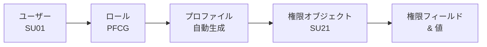
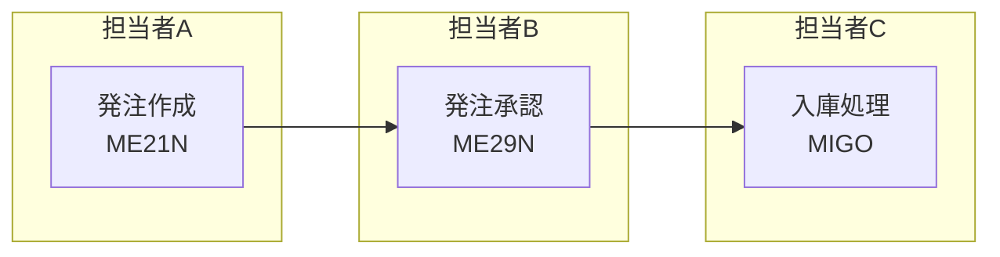

## はじめに

SAPシステムにおける**権限管理（Authorization Management）**とは、「誰が・どのデータに・どの操作をできるか」をコントロールする仕組みです。

### なぜ権限管理が重要なのか（why so）

企業の基幹システムであるSAPには、財務データ・顧客情報・購買価格など機密性の高い情報が集約されています。権限管理が適切でない場合、以下のようなリスクが発生します。

- **不正操作のリスク** ― 誰でも仕訳伝票を転記できる状態では、不正な会計処理を防げない
- **マスタデータの破損** ― 権限のない担当者が品目マスタや仕入先マスタを変更し、業務が停止する
- **監査・コンプライアンス違反** ― J-SOXや内部統制の観点で、職務分掌（SoD）が確保されていないと監査指摘を受ける

### だから何をすべきか（so what）

権限管理は「セキュリティ担当だけの仕事」ではありません。**業務設計の段階から、誰にどの操作を許可するかを明確にする**ことが、安全で監査に耐えるシステム運用の第一歩です。本記事では、SAPの権限管理の基本構造から実務で使うトランザクションコード、ロール設計の考え方までを解説します。

---

## 権限の仕組み ― 5つの階層構造

SAPの権限管理は、以下の5つの要素が階層的に組み合わさって動作します。上位から順に見ていきましょう。

### 1. ユーザー（User）

SAPにログインするための個人アカウントです。トランザクションコード **SU01** で作成・管理します。ユーザーには1つ以上の「ロール」を割り当てることで、操作権限が付与されます。

### 2. ロール（Role）

ロールとは、「この業務担当者にはこれらの操作を許可する」という権限のセットです。トランザクションコード **PFCG** で作成・管理します。

ロールには2種類あります。

| 種類 | 説明 | 使い分け |
|---|---|---|
| **単一ロール（Single Role）** | 特定の業務権限をまとめたもの | 「購買発注の作成」「会計伝票の照会」など機能単位で作成 |
| **複合ロール（Composite Role）** | 複数の単一ロールを束ねたもの | 「購買担当者」のように職務単位で単一ロールをまとめる |

### 3. プロファイル（Profile）

ロールを保存すると、SAPが**自動的にプロファイルを生成**します。プロファイルはシステム内部で権限チェックに使われる技術的な要素であり、通常は手動で操作しません。ロールとプロファイルの関係は「ロールが設計図、プロファイルが実行ファイル」と考えるとわかりやすいでしょう。

### 4. 権限オブジェクト（Authorization Object）

権限オブジェクトは、「何に対する権限か」を定義するSAPの仕組みです。トランザクションコード **SU21** で一覧を確認できます。

例えば、財務会計（FI）モジュールには以下のような権限オブジェクトがあります。

| 権限オブジェクト | 用途 |
|---|---|
| `F_BKPF_BUK` | 会計伝票の会社コード別アクセス制御 |
| `F_BKPF_BLA` | 会計伝票の伝票タイプ別アクセス制御 |
| `M_BEST_BSA` | 購買発注の発注タイプ別アクセス制御 |

### 5. 権限フィールドと値（Authorization Field & Value）

権限オブジェクトの中には、1つ以上の**権限フィールド**が含まれます。各フィールドに具体的な値を設定することで、「会社コード1000の会計伝票のみ照会可能」といった細かい制御が実現できます。

例えば `F_BKPF_BUK` の場合：

| フィールド | 設定例 | 意味 |
|---|---|---|
| `BUKRS`（会社コード） | `1000` | 会社コード1000のみ対象 |
| `ACTVT`（活動） | `03` | 照会のみ許可（01=登録, 02=変更, 03=照会） |

### 階層構造の全体像

以下の図は、ユーザーから権限フィールドまでの階層関係を示しています。



<div style="font-size: 0.8rem; color: #666; margin-top: 0.5rem; padding: 0.4rem 0.75rem; background: #f8f8f8; border-radius: 4px; display: flex; flex-wrap: wrap; gap: 0.25rem 1.5rem;">
  <span>凡例</span>
  <span><strong>→</strong> 上位から下位への包含関係</span>
  <span><strong>[ ]</strong> 各構成要素（下段はTコードまたは補足）</span>
  <span><strong>英数字コード</strong> = Tコード（SAPの操作コマンド）</span>
</div>

---

## 主要トランザクションコード

権限管理で日常的に使うトランザクションコードを以下にまとめます。

| Tコード | 機能 | 主な用途 |
|---|---|---|
| **SU01** | ユーザー管理 | ユーザーの作成・変更・ロック・ロール割当 |
| **PFCG** | ロール管理 | 単一ロール・複合ロールの作成・権限設定 |
| **SU53** | 権限エラー分析 | 直前の権限エラーの原因を特定する |
| **SU21** | 権限オブジェクト一覧 | システムに存在する権限オブジェクトの確認 |
| **SUIM** | 権限情報検索 | 「このユーザーにどのロールが割り当たっているか」等の横断検索 |
| **SU10** | ユーザー一括管理 | 複数ユーザーへのロール一括割当・ロック・アンロック |

> **ポイント**: SU53とSUIMは、権限に関するトラブルシューティングで最も頻繁に使うTコードです。Basisチーム以外の業務コンサルタントも覚えておくと、問い合わせ対応がスムーズになります。

---

## ロール設計のベストプラクティス

### 職務分掌（SoD: Segregation of Duties）

職務分掌とは、**不正やミスを防ぐために、関連する業務を異なる担当者に分離する**という内部統制の原則です。

例えば「発注を作成する人」と「発注を承認する人」が同一人物だった場合、架空発注による不正が容易に行えてしまいます。SAPの権限設計では、こうした競合する権限を同一ユーザーに付与しないようにロールを分離します。



<div style="font-size: 0.8rem; color: #666; margin-top: 0.5rem; padding: 0.4rem 0.75rem; background: #f8f8f8; border-radius: 4px; display: flex; flex-wrap: wrap; gap: 0.25rem 1.5rem;">
  <span>凡例</span>
  <span><strong>→</strong> 業務の流れ（前工程から後工程へ）</span>
  <span><strong>[ ]</strong> 業務操作（下段はTコード）</span>
  <span><strong>subgraph</strong> = 担当者の分離（職務分掌）</span>
  <span><strong>英数字コード</strong> = Tコード（SAPの操作コマンド）</span>
</div>

上図のように、発注の作成・承認・入庫をそれぞれ別の担当者に分離することで、不正リスクを低減できます。もし1人の担当者がすべてを実行できる状態であれば、監査で指摘される可能性が高いです。

### 単一ロール vs 複合ロールの使い分け

| 方針 | 説明 |
|---|---|
| **単一ロールは機能単位で作る** | 「購買発注の作成」「購買発注の照会」のように、1つの業務機能に対して1つのロールを作成する |
| **複合ロールは職務単位で束ねる** | 「購買担当者」ロールの中に、必要な単一ロールをまとめる。担当者の異動時は複合ロールの付け替えだけで済む |
| **複合ロールに直接権限を入れない** | 複合ロールは単一ロールの「入れ物」に徹する。直接権限を設定すると管理が複雑化する |

### 命名規則の重要性

ロールが数百件に増えたとき、命名規則がないと管理が破綻します。以下は一般的な命名パターンです。

```
Z:<モジュール>:<業務>:<権限レベル>
```

例：
- `Z:MM:PO_CREATE:FULL` ― MMモジュール、購買発注作成、フル権限
- `Z:FI:DOC_DISPLAY:READ` ― FIモジュール、会計伝票照会、読取権限
- `Z:COMP:MM_BUYER` ― 複合ロール、MM購買担当者

> **なぜ命名規則が必要か（why so）**: ロールが数百〜数千件になると、名前だけで中身を推測できなければ、ロール割当のたびにPFCGで中身を確認する手間が発生します。**だから（so what）**、プロジェクト初期の段階で命名規則を策定し、ドキュメントとして残しておくことが重要です。

---

## 権限エラーの調査方法

ユーザーから「操作しようとしたらエラーになった」と問い合わせを受けたとき、まず確認すべきは権限不足かどうかです。

### SU53 ― 権限エラー分析（最初に使う）

1. エラーが発生したユーザーのセッションで **SU53** を実行する（または管理者が `SU53` > 他ユーザー指定で確認）
2. 画面に「不足している権限オブジェクト」「不足しているフィールド値」が表示される
3. 表示された権限オブジェクトとフィールドを確認し、該当ユーザーのロールに不足している権限を追加する

**SU53のメリット**: 直前に発生した権限エラーの原因を即座に特定できます。まずSU53を確認し、それでも原因が不明な場合に次のST01を使います。

### ST01 ― 権限トレース（詳細調査用）

SU53で特定できない場合や、複数の権限チェックが連続して発生するケースでは、**ST01（システムトレース）** を使います。

1. ST01を起動し、「権限チェック」にチェックを入れてトレースを開始
2. 対象ユーザーに操作を再現してもらう
3. トレースを停止し、結果を分析する

ST01はシステム負荷がかかるため、**本番環境での長時間トレースは避ける**べきです。必要な操作のみをピンポイントでトレースしましょう。

---

## よくある疑問（FAQ）

### Q1. ロールを割り当てたのに権限が反映されません

**A.** ロールを割り当てた後、ユーザーの**プロファイルの比較・生成が必要**です。PFCGでロールを変更した場合、「ユーザー比較」を実行してプロファイルを最新化してください。また、ユーザーが一度ログアウトして再ログインする必要がある場合もあります。

### Q2. 本番環境で権限テストをしても大丈夫ですか？

**A.** 本番環境での権限テストは**推奨しません**。テスト用のサンドボックス環境や品質保証（QA）環境で検証してから、本番環境に移送（トランスポート）するのが安全な手順です。ロールはトランスポートリクエストに載せて環境間を移送できます。

### Q3. 退職者のアカウントはどう処理すべきですか？

**A.** 退職者のアカウントは**削除ではなくロック**するのがベストプラクティスです。SU01でユーザーをロックすれば、ログインはできなくなりますが、過去の伝票に記録された「登録者」「変更者」の情報は保持されます。監査証跡の観点から、ユーザーの削除は避けてください。

---

## まとめ

- SAPの権限管理は「ユーザー → ロール → プロファイル → 権限オブジェクト → 権限フィールド/値」の**5層構造**で成り立っている
- ロール設計では**職務分掌（SoD）** を意識し、競合する操作権限を同一ユーザーに集中させない
- 単一ロールは機能単位、複合ロールは職務単位で設計し、**命名規則を初期段階で策定**する
- 権限エラーの調査は**SU53を最初に確認**し、詳細調査が必要な場合のみST01を使う
- ユーザーの退職時は削除ではなく**ロック**で対応し、監査証跡を保持する
