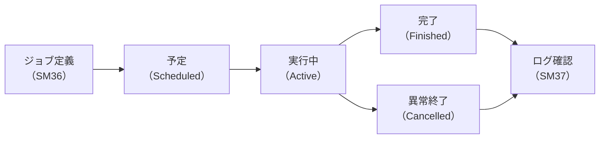

## はじめに

SAPでは、MRP（資材所要量計画）の実行、支払処理、月次決算処理など、大量のデータを扱う処理が日常的に発生します。これらの処理をオンライン（対話型）で実行すると、処理が完了するまで画面が占有されるだけでなく、タイムアウトで中断したり、他のユーザーの操作に影響を与えたりするリスクがあります。

こうした問題を解決するのが**バックグラウンドジョブ**です。バックグラウンドジョブとは、ユーザーの画面操作とは独立してサーバー側で実行されるバッチ処理のことです。事前にスケジュールを設定しておけば、夜間や休日に自動で処理を実行でき、業務時間中のシステム負荷を抑えられます。

**この記事を読むと何ができるようになるか（so what）：**
- SM36でジョブを正しく定義・スケジュールできるようになる
- SM37で実行結果を監視し、異常発生時に適切な対応がとれるようになる
- ジョブの命名規則やスケジューリングなど、運用設計の基本方針を立てられるようになる

---

## バックグラウンドジョブとは

### オンライン処理 vs バックグラウンド処理

SAPの処理は大きく2種類に分かれます。それぞれの特徴を理解することで、適切な処理方式を選択できます。

| 比較項目 | オンライン処理 | バックグラウンド処理 |
|---------|-------------|-----------------|
| **実行方法** | ユーザーが画面から直接実行 | サーバー側で自動実行 |
| **画面の占有** | 処理中は画面がロックされる | 画面を占有しない |
| **実行時間の制限** | タイムアウトあり（通常600秒） | 制限なし（長時間処理が可能） |
| **実行タイミング** | ユーザーが操作した瞬間 | スケジュール設定に従う |
| **向いている処理** | 少量データの即時処理 | 大量データ・定期実行処理 |

**なぜバックグラウンド処理が必要か（why so）：** オンライン処理にはタイムアウト制限があり、MRPのような数万件のデータを処理する場面では途中で中断されてしまいます。また、処理中はそのユーザーのセッションが占有されるため、他の業務ができなくなります。バックグラウンド処理を使えば、こうした制約から解放され、効率的にシステムリソースを活用できます。

### ジョブのステータス

バックグラウンドジョブには、以下の4つのステータスがあります。ジョブがどの段階にあるかを正しく把握することが、運用監視の第一歩です。

| ステータス | 英語表記 | 意味 | アイコン色 |
|----------|---------|------|----------|
| **予定** | Scheduled | ジョブが定義済みで、開始条件の到来を待っている状態 | 灰色 |
| **実行中** | Active | 現在処理が実行されている状態 | 黄色 |
| **完了** | Finished | 処理が正常に終了した状態 | 緑色 |
| **異常終了** | Cancelled | エラーにより処理が中断された状態 | 赤色 |

**so what：** SM37でジョブを監視する際、まず確認すべきはこのステータスです。「完了」以外のステータスが想定外のタイミングで表示されている場合は、何らかの対応が必要になります。特に「異常終了」のジョブは、ジョブログを確認してエラー原因を特定する必要があります。

  凡例
  <strong>→</strong> ジョブのステータス遷移（必須フロー）
  <strong>[ ]</strong> 各ステータスまたは操作
  <strong>SM36 / SM37</strong> = Tコード（SAPの操作コマンド）

---

## ジョブの定義（SM36）

SM36（ジョブ定義）は、バックグラウンドジョブを作成するためのトランザクションです。ジョブの定義は「ジョブヘッダ」「ステップ」「開始条件」の3つの要素で構成されます。

### ジョブヘッダ：ジョブ名とジョブクラス

ジョブヘッダでは、ジョブの基本情報を設定します。

**ジョブ名：** ジョブを識別するための名前です。後述の命名規則に従い、何の処理かが一目でわかる名前をつけることが重要です。

**ジョブクラス（優先度）：** ジョブの実行優先度を3段階で指定します。サーバーのリソースが逼迫した際、ジョブクラスの高いジョブが優先的にワークプロセスを割り当てられます。

| ジョブクラス | 優先度 | 用途 |
|-----------|-------|------|
| **A（高）** | 最優先 | 業務上クリティカルな処理（月次決算、本番移行など） |
| **B（中）** | 中間 | 重要だが多少の遅延が許容される処理 |
| **C（低）** | 通常 | 日常的な定期処理（レポート出力など） |

**why so：** ジョブクラスの設定を誤ると、重要な処理がリソース不足で待たされる一方、優先度の低い処理がシステムリソースを占有してしまうことがあります。特に月末・期末など処理が集中する時期には、ジョブクラスの適切な設定がシステム安定運用の鍵になります。

### ステップ定義：何を実行するか

1つのジョブには、1つ以上の**ステップ**を定義できます。ステップとは「そのジョブで実際に実行する処理」のことです。

| ステップの種類 | 説明 | 使用例 |
|-------------|------|-------|
| **ABAPプログラム** | SAPに登録されたABAPプログラムを実行 | MRP実行（RM61MARP）、支払処理（RFZALI20）など |
| **外部コマンド** | OSレベルのコマンドを実行 | ファイル転送、バックアップスクリプトなど |
| **外部プログラム** | 外部実行ファイルを実行 | 連携先システムとのインターフェース処理 |

ABAPプログラムを指定する場合は、**バリアント**（実行時のパラメータセット）も合わせて設定します。バリアントを使うことで、同じプログラムを異なる条件で実行する複数のジョブを作成できます。

**so what：** ステップ定義で重要なのは、バリアントの設定漏れに注意することです。バリアントを指定せずにジョブを実行すると、プログラムのデフォルト値で処理されるか、選択画面で停止してジョブが完了しないケースがあります。ジョブ定義時には必ずバリアントの有無を確認してください。

### 開始条件：いつ実行するか

ジョブの開始条件は以下の4種類から選択します。業務要件に合わせて適切な方式を選ぶことが重要です。

| 開始条件 | 説明 | 使用例 |
|---------|------|-------|
| **即時実行** | 定義後すぐに実行開始 | テスト実行、緊急のデータ修正 |
| **日時指定** | 特定の日時に実行 | 月末処理、四半期レポート |
| **周期実行** | 一定間隔で繰り返し実行 | 毎日夜間のバッチ処理、毎時のインターフェース処理 |
| **イベント** | 特定のイベント発生時に実行 | 前のジョブ完了後、システム起動後 |

**why so：** 開始条件の設定ミスは、処理漏れやシステム負荷の原因になります。例えば、周期実行の間隔を短くしすぎると前のジョブが完了する前に次のジョブが起動し、同じデータを二重に処理するリスクがあります。逆に間隔が長すぎると、データの鮮度が低下し業務に支障をきたします。

---

## ジョブの監視（SM37）

SM37（ジョブ監視）は、定義済みのバックグラウンドジョブの実行状況を確認・管理するためのトランザクションです。日常的なジョブ運用において、最も頻繁に使用するトランザクションの1つです。

### ジョブの検索・フィルタリング

SM37の初期画面では、以下の条件でジョブを絞り込むことができます。

| フィルタ条件 | 説明 |
|-----------|------|
| **ジョブ名** | ジョブ名の完全一致または`*`によるワイルドカード検索 |
| **ユーザー名** | ジョブを定義したユーザーID |
| **ジョブステータス** | 予定・実行中・完了・異常終了のチェックボックス |
| **日時範囲** | 開始日時〜終了日時の範囲指定 |

**so what：** 日常監視では、まず「異常終了」ステータスのジョブをフィルタリングして確認するのが基本です。朝の業務開始時に、前夜の夜間バッチで異常終了したジョブがないかを確認するのが、Basis運用担当者の典型的なルーティンです。

### ジョブログ・スプールの確認方法

ジョブの実行結果を詳しく調べるには、**ジョブログ**と**スプール**の2つを確認します。

**ジョブログ：** ジョブの実行過程が時系列で記録されたログです。ジョブ一覧画面でジョブを選択し「ジョブログ」ボタンを押すと表示されます。正常完了時は処理件数などの情報が、異常終了時はエラーメッセージが記録されています。

**スプール：** ジョブが出力した帳票や一覧データです。「スプール一覧」ボタンから確認できます。スプールはSP01トランザクションからも管理できます。

### 異常終了時の対応手順

ジョブが異常終了した場合は、以下の手順で対応します。

1. **SM37でジョブログを確認する** — エラーメッセージとエラー発生箇所を特定する
2. **エラー原因を分類する** — 大きく以下の3つに分けられる
   - **データエラー：** 入力データの不備（マスタ未登録、必須項目の欠落など）
   - **権限エラー：** ジョブ実行ユーザーに必要な権限が不足している
   - **システムエラー：** ワークプロセス不足、メモリ不足、DB接続エラーなど
3. **原因を解消し、ジョブを再実行する** — SM37からジョブを選択し「再実行」するか、SM36で同じジョブを再度スケジュールする

**why so：** 異常終了を放置すると、後続のジョブチェーン全体が停止し、業務処理が滞留します。特に、MRP → 購買依頼自動作成のようなチェーンでは、上流のジョブが失敗すると下流の処理が実行されず、調達計画全体に影響を及ぼします。

---

## 主要トランザクションコード

バックグラウンドジョブの管理に使用する主なトランザクションコードを以下にまとめます。SM36とSM37が基本ですが、状況に応じて他のトランザクションも活用すると運用効率が上がります。

| Tコード | 名称 | 用途 |
|--------|------|------|
| **SM36** | ジョブ定義 | バックグラウンドジョブの新規作成・スケジュール設定 |
| **SM37** | ジョブ監視 | ジョブの実行状況確認・ログ表示・再実行 |
| **SM36WIZ** | ジョブウィザード | ウィザード形式の簡易ジョブ定義。初心者向け |
| **SM39** | ジョブ分析 | ジョブの実行統計・パフォーマンス分析 |
| **SMX** | 自分のジョブ一覧 | ログインユーザーのジョブだけを一覧表示 |
| **SP01** | スプール管理 | ジョブが出力したスプール（帳票）の確認・印刷・削除 |

**so what：** 日常的に使うのはSM36とSM37ですが、SMXは「自分が定義したジョブだけを素早く確認したい」ときに便利です。また、SM36WIZはウィザード形式でジョブ定義の流れを順番に案内してくれるため、ジョブ定義に慣れていないユーザーが最初に使うツールとして適しています。

---

## 運用のベストプラクティス

### ジョブチェーン（前のジョブ完了後に次を実行）

複数の処理に依存関係がある場合、**ジョブチェーン**を使って順序を制御します。ジョブチェーンとは、前のジョブが正常完了したことをイベントとして、次のジョブの開始条件にする仕組みです。

例えば、MRP実行の結果を受けて購買依頼を自動作成するようなケースでは、以下のようなジョブチェーンを構成します。

  凡例
  <strong>→</strong> ジョブチェーン（前ジョブ完了後に次を実行）
  <strong>[ ]</strong> 各バッチ処理ステップ
  <strong>MD01</strong> = Tコード（SAPの操作コマンド）

**why so：** ジョブチェーンを使わず個別に時間指定で実行すると、前のジョブが想定より長くかかった場合に、処理順序が前後してデータ不整合が発生するリスクがあります。ジョブチェーンを使うことで、前のジョブが確実に完了してから次のジョブが開始されるため、依存関係のある処理を安全に実行できます。

### ピーク時間帯を避けたスケジューリング

バックグラウンドジョブはサーバーリソースを消費するため、ユーザーがオンライン操作を行う業務時間帯（例：9:00〜18:00）に大量のジョブを実行すると、画面操作のレスポンスが低下します。

**推奨スケジュール例：**

| 時間帯 | 推奨する処理 |
|-------|-----------|
| **0:00〜6:00** | 大量データ処理（MRP、月次バッチ、データ移行） |
| **6:00〜9:00** | 朝の準備処理（レポート生成、マスタ同期） |
| **9:00〜18:00** | 軽量な周期処理のみ（インターフェース連携など） |
| **18:00〜0:00** | 日次締め処理、バックアップ |

### ジョブクラスの適切な設定

ジョブクラスAを安易に設定すると、クラスAのジョブが増えすぎて優先度の意味がなくなります。以下を目安にしてください。

- **クラスA：** 業務停止に直結する処理のみ（月次決算、給与計算など）
- **クラスB：** 遅延すると業務に影響があるが、数時間の猶予がある処理
- **クラスC：** 日常的なレポート出力・データ同期など

**so what：** クラスAのジョブが全体の10%以下になるよう運用ルールを定めるのが一般的です。すべてのジョブをクラスAにしてしまうと、本当に優先すべき処理とそうでない処理の区別がつかなくなり、結果としてクリティカルな処理が遅延するリスクが高まります。

### 命名規則

ジョブ名に一貫した命名規則を設けることで、SM37での検索・フィルタリングが格段に楽になります。

**推奨フォーマット例：** `Z_<モジュール>_<処理名>_<頻度>`

| 命名例 | 意味 |
|-------|------|
| `Z_MM_MRP_DAILY` | MM領域のMRP実行（日次） |
| `Z_FI_PAYMENT_MONTHLY` | FI領域の支払処理（月次） |
| `Z_SD_BILLING_DAILY` | SD領域の請求処理（日次） |
| `Z_IF_VENDOR_HOURLY` | インターフェースの仕入先同期（毎時） |

**why so：** 命名規則がないと、「BATCH1」「TEST_JOB」のような名前のジョブが乱立し、どのジョブが何の処理を行っているのかがわからなくなります。担当者の異動や退職時に引き継ぎが困難になり、不要なジョブが残り続けてシステムリソースを無駄に消費する原因にもなります。

---

## よくある疑問

### Q1. ジョブが「実行中（Active）」のまま何時間も終わらない場合はどうする？

まずSM37でジョブの開始時刻を確認し、通常の処理時間と比較してください。明らかに想定以上の時間がかかっている場合は、以下の順で対応します。

1. **SM50（ワークプロセス一覧）** で該当ジョブのワークプロセス状態を確認する
2. 処理がループに入っている場合やデッドロックが発生している場合は、Basisチームに連絡してワークプロセスの中断を依頼する
3. ジョブ自体をSM37からキャンセルする（ただし、データの中間状態に注意が必要）

安易にジョブをキャンセルすると、処理途中のデータが不整合な状態で残る可能性があります。キャンセル前に影響範囲を確認することが重要です。

### Q2. SM36とSM36WIZのどちらを使うべき？

結論としては、**基本はSM36を使い、初めてジョブを定義する場合のみSM36WIZを利用する**のがおすすめです。SM36WIZはウィザード形式で手順を案内してくれますが、設定できる項目が限定されています。イベント起動やジョブチェーンなどの高度な設定はSM36でしか行えません。

### Q3. 周期実行のジョブを一時的に止めたい場合は？

SM37でジョブを検索し、ステータスが「予定（Scheduled）」のジョブを選択して「削除」します。ただし、周期実行のジョブを削除すると次回以降の実行もすべてキャンセルされます。一時的に止めたいだけの場合は、次回の開始日時を将来の日付に変更することで実質的に停止できます。再開時は元の周期設定でジョブを再定義してください。

---

## まとめ

- **バックグラウンドジョブ**は、大量データ処理や定期実行処理をユーザー操作とは独立して実行するための仕組みである
- **SM36**でジョブを定義する際は、ジョブ名（命名規則に従う）・ジョブクラス（優先度A/B/C）・ステップ（実行プログラムとバリアント）・開始条件（即時/日時指定/周期/イベント）の4つを正しく設定する
- **SM37**での日常監視では、異常終了ジョブの早期発見とジョブログに基づく原因特定が最も重要な業務である
- 依存関係のある処理は**ジョブチェーン**で順序を制御し、時間指定による順序制御は避ける
- **命名規則**と**ジョブクラスの適切な運用**を定めることで、ジョブ数が増えても管理可能な状態を維持できる
