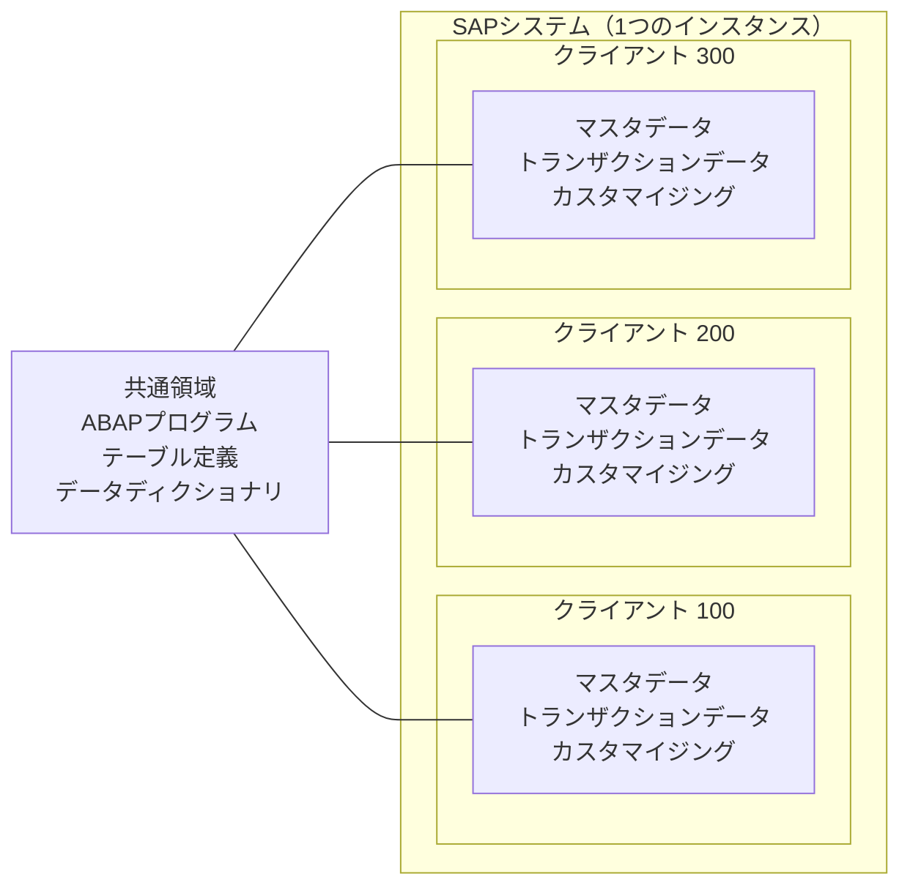
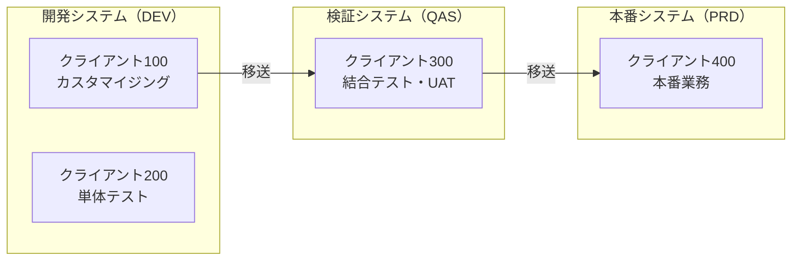

## はじめに

SAPにログインするとき、ユーザーIDとパスワードに加えて**「クライアント」**という3桁の番号を入力する画面を見たことがあるでしょうか。この「クライアント」は、SAP特有の重要な概念です。

本記事では、以下の観点でクライアントを解説します。

1. **クライアントとは何か** — SAPにおけるクライアントの定義と役割
2. **なぜクライアントを分けるのか** — 分離する目的と、分けないとどうなるか
3. **誰が・いつ設計するのか** — プロジェクトのどのフェーズで誰が決めるか
4. **典型的な分離パターン** — 実務でよく見るクライアント設計の事例

---

## クライアントとは何か

### 一言で言うと

クライアントとは、**1つのSAPシステム内でデータを完全に分離するための論理的な区画**です。3桁の数字（例：100、200、300）で識別されます。

身近な例で考えると、**マンションの部屋**に近いイメージです。

- マンション（= SAPシステム）は1棟だが、中には複数の部屋（= クライアント）がある
- 各部屋は壁で完全に仕切られており、別の部屋の中身は見えない
- 部屋に入るにはその部屋の鍵（= クライアント番号 + ユーザーID + パスワード）が必要
- 建物の共用設備（エレベーター、配管）は全部屋で共有する

  凡例
  <strong>[ ]</strong> 各クライアント/共通領域の内容
  <strong>---</strong> 共有関係（全クライアントが同一プログラムを使用）
  <strong>subgraph</strong> = クライアントの境界

### クライアント依存データとクライアント非依存データ

SAPのデータは、**クライアント依存**と**クライアント非依存**の2種類に分かれます。この区別がクライアントの仕組みを理解する鍵です。

| 分類 | 説明 | 具体例 |
|------|------|--------|
| **クライアント依存** | クライアントごとに独立して存在するデータ。別のクライアントからは参照できない | マスタデータ（得意先、品目、仕入先）、トランザクションデータ（伝票）、カスタマイジング設定 |
| **クライアント非依存** | 全クライアントで共有されるデータ。どのクライアントからログインしても同じものが見える | ABAPプログラム、テーブル定義（データディクショナリ）、Tコード定義 |

**なぜこの区別が重要なのか（why so）**：クライアント依存データはクライアント間で完全に隔離されるため、あるクライアントでデータを作成・変更しても**別のクライアントには一切影響しません**。一方、クライアント非依存データ（ABAPプログラムなど）を変更すると、**全クライアントに即座に影響します**。この違いを理解していないと、「テスト用クライアントでプログラムを修正したら、本番クライアントの動作も変わってしまった」という事故につながります。

---

## なぜクライアントを分けるのか

### 目的は「環境の分離」

クライアントを分ける最大の目的は、**用途の異なるデータ環境を安全に共存させること**です。

SAPの運用では、以下のように目的が異なる作業が同時に行われます。

- 業務部門が**本番データ**で日常業務を行っている
- コンサルタントが**カスタマイジング設定**をテストしている
- 開発者が**テストデータ**でプログラムの動作確認をしている
- トレーナーが**研修用データ**で教育を実施している

これらを同じデータ空間で行うと、テストデータが本番に混入したり、設定変更が業務に影響したりするリスクがあります。クライアントを分けることで、**データレベルで完全に隔離された環境**をSAPシステム内に作れます。

### クライアントを分けないとどうなるか

仮にクライアントを1つしか持たない場合、以下のような問題が起きます。

- コンサルタントがカスタマイジングをテスト変更したところ、**業務部門の画面表示や処理ロジックが変わってしまった**
- 開発者がテスト用に作成した架空の伝票が、**本番のレポートに集計されてしまった**
- 研修で受講者が練習で作った発注データに対して、**仕入先に実際の発注書が送信されてしまった**

**読者への示唆（so what）**：クライアント分離は「あった方が便利」ではなく、**本番環境の安全性を守るために必須の設計**です。特にSAPのように企業の基幹業務を支えるシステムでは、テストや設定変更の影響が本番に波及することは絶対に避けなければなりません。

---

## クライアントとシステムランドスケープの関係

クライアントの話をする前に、SAPの**システムランドスケープ**（システム構成全体）を理解しておく必要があります。クライアントはシステムランドスケープの中で使われる仕組みだからです。

### 典型的な3システム構成

多くのSAP導入プロジェクトでは、以下の**3つのシステム**を用意します。

| システム | 略称 | 主な用途 |
|---------|------|---------|
| 開発システム | DEV | カスタマイジング設定、ABAPプログラム開発 |
| 検証システム | QAS | 結合テスト、ユーザー受入テスト（UAT） |
| 本番システム | PRD | 業務部門が日常業務で使用する本番環境 |

  凡例
  <strong>→</strong> 移送の流れ（設定・プログラムの反映経路）
  <strong>[ ]</strong> 各クライアントの用途
  <strong>subgraph</strong> = SAPシステム（物理的に別サーバー）

**システムとクライアントの違い**：

- **システム**はハードウェア・OS・データベースを含む**物理的に別の環境**。システム間のデータは完全に独立している
- **クライアント**は1つのシステム内の**論理的な区画**。同じデータベースを共有するが、クライアント依存データは隔離される
- 設定やプログラムをシステム間で反映するには**移送（Transport）** という仕組みを使う

**なぜシステムもクライアントも両方必要なのか（why so）**：クライアントはデータを分離できますが、ABAPプログラムやテーブル定義などの**クライアント非依存データは共有**されます。開発中のプログラムを本番クライアントと同じシステム内に置くと、不完全なプログラムが本番に影響するリスクがあります。そのため、開発・検証・本番をシステムレベルで分離し、その中でさらにクライアントを使ってデータを分離するという**二重の分離構造**を取ります。

---

## 誰が・いつクライアント設計を行うのか

### 設計する人

クライアント設計は、主に以下の担当者が行います。

| 担当者 | 役割 |
|--------|------|
| **Basisコンサルタント** | システムランドスケープ全体の設計とクライアントの作成・設定を実施する主担当 |
| **プロジェクトマネージャー** | プロジェクトの体制・フェーズに基づいて、必要なクライアントの要件を定義する |
| **ファンクショナルコンサルタント** | 各クライアントの用途（カスタマイジング用、テスト用など）の要件を伝える |

### 設計するフェーズ

クライアント設計は、プロジェクトの**早い段階で決定**する必要があります。

| フェーズ | クライアントに関する活動 |
|---------|----------------------|
| **Prepare（準備）** | システムランドスケープ設計の一環として、必要なシステム数とクライアント数を決定。プロジェクト体制（開発チーム数、テストフェーズの計画）に基づいて要件を整理する。SAP Activateの各フェーズの詳細は[SAP Activateとは？S/4HANA導入の標準方法論を6フェーズで解説](/blog/sap-activate-methodology/)を参照 |
| **Explore（探索）** | 設計に基づきクライアントを作成。Basisチームがクライアントのコピーや初期設定を実施。カスタマイジング用・テスト用など各クライアントの設定（変更可否など）を行う |
| **Realize（実現）** | 各チームが割り当てられたクライアントで作業を開始。必要に応じてクライアントの追加やリフレッシュ（データの再コピー）を実施する |
| **Deploy（展開）** | 本番クライアントの最終設定。本番移行後はクライアント設定を**変更不可（ロック）**にして保護する |

**なぜ早い段階で決めるのか（why so）**：クライアント設計が遅れると、開発チームやテストチームが作業を開始できません。また、後からクライアント構成を変更するにはデータのコピーや移送ルートの再設定が必要になり、大きな手戻りが発生します。特に複数チームが並行して作業するプロジェクトでは、**作業の衝突を防ぐクライアント分離**が初期設計時点で必要です。

---

## 典型的なクライアント分離パターン

### パターン1：標準構成（小〜中規模プロジェクト）

最もシンプルな構成です。各システムに最低限のクライアントを配置します。

| システム | クライアント | 用途 |
|---------|------------|------|
| DEV | 100 | カスタマイジング（ゴールドクライアント） |
| DEV | 200 | 開発者の単体テスト |
| QAS | 300 | 結合テスト・UAT |
| PRD | 400 | 本番 |

**ゴールドクライアントとは**：カスタマイジング設定の**正本（マスター）** となるクライアントです。すべてのカスタマイジング変更はまずここで行い、移送によって他のシステムに反映します。ゴールドクライアントには原則としてトランザクションデータ（伝票など）を作成せず、**設定だけを管理する**運用にします。

**なぜゴールドクライアントを分けるのか（why so）**：カスタマイジングとテストデータを同じクライアントに混在させると、「この設定変更のせいで動かないのか、テストデータが不正なのか」の切り分けが困難になります。ゴールドクライアントを設定専用にすることで、**設定の正本を常にクリーンな状態で維持**できます。

### パターン2：チーム並行開発（大規模プロジェクト）

複数のチームが同時にカスタマイジングや開発を行う大規模プロジェクトでは、クライアントを増やして衝突を防ぎます。

| システム | クライアント | 用途 |
|---------|------------|------|
| DEV | 100 | ゴールドクライアント（設定の正本） |
| DEV | 200 | チームA（MM/SD領域）のカスタマイジング・テスト |
| DEV | 210 | チームB（FI/CO領域）のカスタマイジング・テスト |
| DEV | 220 | チームC（PP/QM領域）のカスタマイジング・テスト |
| QAS | 300 | 結合テスト |
| QAS | 310 | ユーザー受入テスト（UAT） |
| PRD | 400 | 本番 |

**なぜチームごとにクライアントを分けるのか（why so）**：複数チームが同じクライアントでカスタマイジングを同時に行うと、あるチームの設定変更が別チームのテスト結果に影響する場合があります。たとえばMMチームが購買組織の設定を変更した結果、SDチームの出荷テストが動かなくなるといった事態です。チームごとにクライアントを分離すれば、各チームが**互いに干渉せずに作業**できます。

### パターン3：研修・デモ環境あり

導入プロジェクトでは、業務部門向けの研修やステークホルダー向けのデモが必要になることがあります。

| システム | クライアント | 用途 |
|---------|------------|------|
| DEV | 100 | ゴールドクライアント |
| DEV | 200 | 開発・単体テスト |
| QAS | 300 | 結合テスト・UAT |
| QAS | 350 | 研修用（受講者が自由に操作できる環境） |
| PRD | 400 | 本番 |

**研修用クライアントのポイント**：研修用クライアントでは受講者が伝票を作成したりマスタデータを変更したりするため、データが汚れていきます。研修のたびに**クライアントコピー**でデータをリフレッシュし、初期状態に戻す運用が一般的です。

---

## クライアントの設定項目

クライアントを作成した後、各クライアントに**変更可否の設定**を行います。これにより、意図しない変更を防ぎます。

| 設定項目 | 選択肢の例 | 説明 |
|---------|-----------|------|
| **カスタマイジング変更** | 変更可 / 変更不可 | そのクライアントでカスタマイジング設定の変更を許可するかどうか |
| **クライアント間コピー** | 許可 / 禁止 | 他のクライアントからのデータコピーを許可するかどうか |
| **クライアント依存の移送** | 許可 / 禁止 | カスタマイジング設定を移送で反映することを許可するかどうか |

**読者への示唆（so what）**：本番クライアント（PRD）は原則として**カスタマイジング変更を「変更不可」**に設定します。本番の設定変更はすべて移送経由で行い、直接変更を禁止することで**変更履歴の追跡と品質管理**を担保します。逆に、ゴールドクライアントは「変更可」に設定し、ここでカスタマイジングを行って移送する運用にします。

---

## よくある疑問

### Q1. クライアント番号の「000」「001」「066」は何ですか？

SAPシステムをインストールすると、以下の初期クライアントが自動的に作成されます。

| クライアント | 用途 |
|------------|------|
| **000** | SAPの初期設定が入ったリファレンスクライアント。直接使用せず、新しいクライアントのコピー元として使う |
| **001** | 000のコピーとして作成されるサンプルクライアント |
| **066** | SAP社のサポート用クライアント（EarlyWatch）。SAP社のサポートサービスが使用する |

通常のプロジェクトでは、**000をコピー元にして新しいクライアント（100、200など）を作成**して使用します。000や066を直接業務に使うことはありません。

### Q2. クライアントを後から追加できますか？

はい、プロジェクトの途中でもクライアントを追加できます。既存のクライアントを**コピー元**として新しいクライアントを作成するのが一般的です（Tコード：**SCC4** でクライアント定義、**SCCL** でクライアントコピーを実行）。ただし、クライアントコピーには数時間かかることもあるため、事前にBasisチームと調整が必要です。

### Q3. クライアントが違えばユーザーIDも別ですか？

はい。クライアント依存データにはユーザーマスタも含まれるため、**クライアントごとにユーザーIDとパスワードは独立**しています。同じユーザーID「TANAKA」をクライアント100と200の両方に作成できますが、それぞれ別のユーザーとして管理されます。権限ロールの割り当ても個別です。権限管理の仕組みについては[SAP権限管理の基本 ― ロール設計から権限エラー調査まで](/blog/sap-authorization-basics/)で解説しています。

### Q4. 「クライアント」と「会社コード」は何が違うのですか？

混同されやすいですが、まったく異なる概念です。

| 項目 | クライアント | 会社コード |
|------|-----------|-----------|
| 目的 | システム環境の分離（開発/テスト/本番） | 法人・事業体の分離（財務報告単位） |
| レベル | システム基盤レベル（Basis管理） | 業務レベル（FI組織構造） |
| データの関係 | クライアント間のデータは完全に独立 | 同一クライアント内に複数の会社コードが共存 |
| 設定者 | Basisコンサルタント | ファンクショナルコンサルタント |

1つのクライアント内に複数の会社コードを持つことは一般的です。たとえば本番クライアント400の中に、会社コード1000（日本法人）と会社コード2000（米国法人）が存在するといった構成です。会社コード・プラント・販売組織など、SAPの組織単位の詳細は[SAPの組織構造を理解する](/blog/sap-org-structure/)で解説しています。

---

## まとめ

- **クライアントはSAPシステム内の論理的な区画**。3桁の番号で識別され、クライアント依存データ（マスタ・伝票・カスタマイジング）はクライアント間で完全に隔離される
- **ABAPプログラムやテーブル定義はクライアント非依存**で全クライアントに共通。そのため、開発・検証・本番はシステムレベルで分離し、さらにクライアントでデータを分離する二重構造を取る
- **クライアント設計はプロジェクト初期（Prepareフェーズ）にBasisコンサルタントが主導**して行う。後からの変更はコストが高いため、チーム体制・テスト計画を踏まえて早期に決定する
- **ゴールドクライアント（設定の正本）を分離し、本番クライアントは変更不可にする**のが基本原則。すべての設定変更は移送経由で行い、直接変更を禁止することで品質と追跡性を担保する
