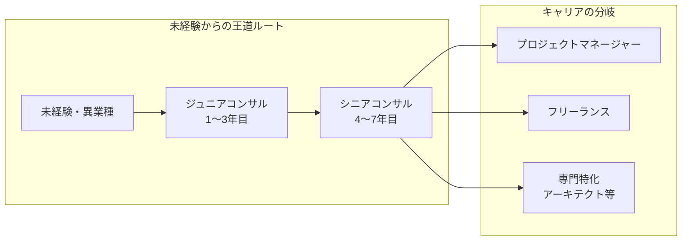

## はじめに

SAPコンサルタントとは、企業の基幹業務システムであるSAPの**導入・運用・改善を支援する専門職**です。購買・販売・会計・生産管理といった企業の中核業務をSAPでどう実現するかを設計し、顧客企業と一緒に作り上げていく仕事です。

### なぜ今SAPコンサルタントの需要が高いのか（why so）

SAPの主力製品であるECC（ERP Central Component）は2027年末にサポートが終了し、後継の**S/4HANAへの移行が全世界で急務**になっています。日本国内でも、大企業を中心にS/4HANA移行プロジェクトが相次いで立ち上がっており、SAPコンサルタントの人材不足が深刻化しています。

この状況は裏を返せば、**SAPコンサルタントとしてキャリアを築くには絶好のタイミング**であるということです。移行プロジェクトは新規導入と異なり既存業務の理解が必要なため、経験者だけでなく「業務知識を持つ未経験者」にも門戸が開かれています。

### この記事で分かること（so what）

本記事では、SAPコンサルタントの種類やモジュール別の特徴、具体的なキャリアパス、必要なスキル、年収相場までを網羅的に解説します。SAPコンサルタントへの転職を検討している方や、すでにSAP業務に携わっている方がキャリアの全体像を把握し、**次の一歩を具体的にイメージできる**ことを目指しています。

---

## SAPコンサルタントの種類

SAPコンサルタントは大きく4つのタイプに分類できます。自分の強みや志向に合った領域を選ぶことが、長期的なキャリア形成の第一歩です。

| 区分 | 主な業務内容 | 求められるスキル | 向いている人 |
|------|-------------|----------------|-------------|
| **業務コンサルタント（機能コンサル）** | 業務要件のヒアリング、Fit/Gap分析、SAPの設定（コンフィギュレーション）、ユーザー教育 | 担当モジュールの業務知識、SAPの標準機能理解、顧客折衝力 | 業務プロセスの設計に興味がある人、顧客と対話しながら仕事を進めたい人 |
| **技術コンサルタント（Basis）** | SAPシステムの構築・運用・監視、パフォーマンスチューニング、移送管理、ユーザー管理 | OS・DB・ネットワークの知識、SAP Basisの管理スキル、障害対応力 | インフラ・ミドルウェアの技術が好きな人、安定運用を支えることにやりがいを感じる人 |
| **開発コンサルタント（ABAP）** | アドオン開発、標準機能の拡張（Enhancement）、インターフェース開発、帳票開発 | ABAPプログラミング、SAP標準テーブル・BAPIの知識、要件定義力 | プログラミングが得意な人、他言語での開発経験を活かしたい人 |
| **S/4HANA / Cloudコンサルタント** | S/4HANA移行計画の策定、Fiori UI設計、SAP BTP活用、クラウド環境設計 | S/4HANAの新機能理解、SAP Activateの概念理解、クラウドアーキテクチャ知識 | 最新技術に関心がある人、従来のSAPの枠を超えた提案をしたい人 |

### 業務コンサルタントが最も多い

SAPコンサルタントの中で最も人数が多いのが業務コンサルタントです。MM（購買管理）、SD（販売管理）、FI（財務会計）、CO（管理会計）、PP（生産計画）など、**特定のモジュールを専門領域**として持つのが一般的です。

なぜ専門領域を持つ必要があるのかというと、SAPの各モジュールは対応する業務領域の深い知識が求められるためです。たとえばMMコンサルタントであれば、購買業務のプロセス（購買依頼 → 発注 → 入庫 → 請求書照合 → 支払）を業務的に理解した上で、SAPの設定に落とし込む必要があります。

### S/4HANA / CloudコンサルタントとSAP Activate

S/4HANA / Cloudコンサルタントに求められるスキルの中で、**SAP Activateの概念理解**は特に重要です。

SAP Activateとは、SAPが公式に推奨する導入方法論で、Discover → Prepare → Explore → Realize → Deploy → Runの各フェーズで構成されています。正直なところ、**日本のSAP導入プロジェクトではActivateがそのまま採用されるケースは少ない**のが実情です。日本企業の商習慣や意思決定プロセスに合わせて、ウォーターフォール型の独自方法論を採用するSIerが多いためです。

しかし、だからといってActivateを知らなくてよいわけではありません。**SAPが提供するツール、ドキュメント、ベストプラクティスはすべてActivateの思想に沿って設計されている**からです。たとえば、Fit-to-Standardワークショップのテンプレート、SAP Best Practices、SAP Solution Managerのプロジェクト管理機能、S/4HANA移行ツール（Migration Cockpit等）はいずれもActivateのフェーズ体系を前提としています。

つまり、Activateをプロジェクト方法論としてそのまま使うかどうかは別として、**SAPのエコシステムを効率的に活用するためには、Activateの概念を理解しておくことがSAPコンサルタントの必須教養**と言えます。Activateの各フェーズで何をすべきかを理解していれば、SAPが用意しているツールやドキュメントを的確に見つけて活用でき、プロジェクトの品質と効率を高められます。

---

## モジュール別の特徴とキャリア

業務コンサルタントとしてどのモジュールを専門にするかは、キャリアに大きく影響します。各モジュールの特徴を把握した上で、自分の強み・経験と照らし合わせて選ぶことが重要です。

### MM（購買管理）/ SD（販売管理）― 案件数が最も多い

**MM**と**SD**はSAPプロジェクトで最も需要が高いモジュールです。ほぼすべての業種でこの2つは導入対象になるため、案件を選びやすいというメリットがあります。

一方で、購買・販売は企業ごとに業務プロセスの差が大きく、業務知識の深さが成果を左右します。「SAPの設定ができる」だけでなく、「なぜこの業務フローにすべきか」を顧客に説明できるレベルの業務理解が求められます。

**向いている人**：商社・メーカーでの購買・販売業務経験がある人、幅広い業種の案件に携わりたい人

### FI（財務会計）/ CO（管理会計）― 会計知識が武器になる

**FI/CO**は会計の専門知識がそのまま武器になるモジュールです。簿記・会計の知識があれば、SAPの仕組みを理解するスピードが格段に速くなります。経理部門での実務経験者がSAPコンサルに転身するケースも多く見られます。

FIは他のすべてのモジュールと連携するため（購買すれば買掛金が立ち、販売すれば売掛金が立つ）、システム全体を俯瞰する視点も身につきます。ただし、会計基準の変更（IFRS対応など）にも追従する必要があり、**継続的な学習が不可欠**です。

**向いている人**：経理・財務の実務経験者、簿記2級以上の知識がある人

### PP（生産計画）/ QM（品質管理）― 製造業特化

**PP/QM**は製造業に特化したモジュールです。案件数はMM/SDほど多くないものの、**製造業の基幹業務に直結するため単価が高い**傾向があります。工場での生産管理経験や品質管理経験があると、業務要件の理解が圧倒的に有利です。

注意点として、PP/QMは他モジュール（MM、SD、FI/CO）との連携が複雑なため、自分のモジュールだけでなく周辺モジュールの基礎知識も求められます。

**向いている人**：製造業での生産管理・品質管理経験者、製造業に長く携わりたい人

### Basis ― インフラ寄りの安定需要

**Basis**はSAPシステムそのものの構築・運用を担う領域です。導入プロジェクトだけでなく、**運用保守フェーズでも継続的に需要がある**ため、キャリアの安定性が高いのが特徴です。

OS・データベース・ネットワークといったインフラ知識が基盤となるため、インフラエンジニアからの転身がスムーズです。一方で、業務コンサルと比べると顧客との直接的なやり取りは少なめです。

**向いている人**：インフラエンジニア経験者、システムの安定稼働に責任を持ちたい人

### ABAP ― 開発スキルで差別化

**ABAP**はSAPの独自プログラミング言語による開発を担当する領域です。Java・Python・COBOLなど他言語での開発経験がある人の転職先として人気があります。

S/4HANAではABAPの記述方法も変化しており（ABAP for HANA、CDS Viewなど）、**従来のABAPスキルだけでなく新しい開発手法の習得も必要**です。開発スキルを持ちながら業務理解も深めると、「要件定義から実装まで一人でできる」希少な人材になれます。

**向いている人**：プログラミング経験者、技術的な問題解決が好きな人

---

## キャリアパスの例

SAPコンサルタントのキャリアは一本道ではありません。自分の経験や志向に応じて、複数のルートが存在します。

  凡例
  <strong>→</strong> キャリアの進行方向
  <strong>[ ]</strong> キャリアステージ
  <strong>subgraph</strong> キャリアフェーズの区分

### 未経験 → ジュニアコンサル → シニアコンサル → PM

最もオーソドックスなキャリアパスです。大手SIerやSAPパートナー企業に入社し、先輩コンサルタントの下でプロジェクト経験を積んでいきます。

- **ジュニア（1〜3年目）**：設定書の作成、テストの実施、議事録作成などを担当。まずは1つのモジュールの基礎を固める時期
- **シニア（4〜7年目）**：要件定義からカットオーバーまでを主導。顧客への提案や後輩指導も担う
- **PM（8年目〜）**：プロジェクト全体のスコープ・スケジュール・品質・コストを管理。複数モジュールの知識が求められる

### 社内SE → SAPコンサル転身

企業の情報システム部門でSAPの運用保守を担当した後、コンサルティングファームやSAPパートナーに転職するパターンです。**ユーザー側の視点を持っている**ことが強みになります。

ただし、社内SEとコンサルタントでは求められるスキルが異なります。社内SEは「自社の業務」に詳しければよいのに対し、コンサルタントは「複数企業の業務パターン」を知っている必要があります。転身の際は、自社の経験を一般化して説明できるように準備しておくことが大切です。

### ABAP開発 → 業務コンサルへの転向

ABAP開発者が業務知識を身につけて業務コンサルに転向するケースもあります。開発経験があるコンサルタントは、**「この要件はアドオンなしで実現できるか」「標準機能の拡張で対応すべきか」を技術的根拠を持って判断できる**ため、顧客からの信頼を得やすい傾向があります。

### フリーランスという選択肢

SAPコンサルタントはフリーランスとしても活動しやすい職種です。特にS/4HANA移行需要の高まりにより、フリーランスの案件単価は上昇傾向にあります。

ただし、フリーランスには注意点もあります。

- **案件の切れ目リスク**：プロジェクトが終了すると次の案件を探す必要がある
- **スキルアップの自己責任**：会社の研修や資格取得支援がないため、自分で学習機会を確保する必要がある
- **最低でも5年以上の実務経験**がないと、案件獲得が難しい

フリーランスを目指す場合は、まず正社員として十分な実務経験を積み、複数のプロジェクトを完遂した実績を作ってからの独立をおすすめします。

---

## 必要なスキルと学習方法

### SAP認定資格の位置づけ

SAPには**SAP Certified Associate**（アソシエイト認定）をはじめとする公式資格があります。モジュールごとに認定試験が用意されており、合格すると一定の知識レベルを証明できます。

資格の価値について正直に言うと、**資格だけで即戦力とは見なされません**。しかし、以下の場面で有効です。

- **未経験からの転職活動**：SAPの基礎知識があることを客観的に証明できる
- **プロジェクトへのアサイン**：顧客企業が資格保有者を条件にすることがある
- **自己学習の指標**：体系的にモジュールの知識を整理するきっかけになる

つまり、資格は「あれば有利だが、なくても実務経験があれば問題ない」という位置づけです。未経験者は取得する価値がありますが、経験者が無理に取得する必要はありません。

### 学習リソース

| リソース | 特徴 | 費用 |
|---------|------|------|
| **SAP Learning Hub** | SAPの公式学習プラットフォーム。コース・ハンズオン環境あり | 有料（サブスクリプション） |
| **openSAP** | SAPが提供する無料のオンライン講座。英語中心だが質が高い | 無料 |
| **SAP Community** | 技術的な質疑応答やブログ。実務で困ったときに役立つ | 無料 |
| **SAP Help Portal** | SAPの公式ドキュメント。設定や機能の詳細を調べる際に必須 | 無料 |
| **書籍** | 日本語のSAP解説書。体系的に学べるが情報が古い場合もある | 書籍代 |

### 実務経験の重要性

SAPコンサルタントとして最も重要なのは**実務経験**です。どれだけ資格を取得しても、実際のプロジェクトで顧客の要件をヒアリングし、設定を行い、テストを実施し、トラブルに対応する経験に勝るものはありません。

特に以下の経験は市場価値を大きく高めます。

- **新規導入プロジェクトの完遂経験**：要件定義からカットオーバーまで一貫して携わった経験
- **S/4HANA移行プロジェクトの経験**：現在最も需要が高い領域
- **複数業種での導入経験**：製造業・流通業・サービス業など、業種をまたいだ経験があると対応力が上がる
- **グローバルロールアウトの経験**：海外拠点への展開経験は、グローバル案件で高く評価される

---

## 年収・市場動向

### 年収の目安

SAPコンサルタントの年収は経験年数・スキル・雇用形態によって幅があります。以下は日本国内の一般的な目安です。

| キャリアステージ | 年収目安（正社員） | 備考 |
|----------------|-------------------|------|
| ジュニア（1〜3年目） | 450万〜600万円 | 研修期間は低め。経験を積むと急上昇する時期 |
| ミドル（4〜7年目） | 600万〜900万円 | 一人でモジュールを担当できるレベル |
| シニア（8年目〜） | 800万〜1,200万円 | 複数モジュール・PM経験で上振れ |
| フリーランス | 月額100万〜180万円 | S/4HANA関連は高単価。ただし稼働率100%は現実的でない |

注意点として、上記はあくまで目安です。所属企業の規模、担当モジュール、地域、英語力の有無などによって大きく変動します。

### S/4HANA移行需要による市場の活況

2025年〜2027年はECCのサポート終了に向けた**S/4HANA移行のピーク期**にあたります。この期間は以下の傾向が顕著です。

- **SAPコンサルタントの需要が供給を大幅に上回っている**：特にFI/CO、MM、SD領域
- **未経験者の採用枠が拡大**：大手SIerが研修付きでの採用を積極化
- **フリーランスの単価上昇**：経験者の争奪戦により単価が高騰

ただし、**移行ピークが過ぎた後は需要が一定程度落ち着く**ことも想定しておくべきです。移行後の運用保守需要は継続しますが、新規導入ほどの爆発的な需要は見込めません。長期的なキャリアを考えるなら、S/4HANAの新機能やクラウド関連のスキルも並行して身につけておくことが賢明です。

---

## よくある疑問（FAQ）

### Q1. 未経験からSAPコンサルになれますか？

**結論：なれます。ただし、条件があります。**

未経験からSAPコンサルタントに転身する人は実際に多くいます。特に以下のようなバックグラウンドを持つ人は有利です。

- 経理・購買・販売・生産管理などの**業務経験**がある人（業務コンサル向き）
- インフラエンジニアやサーバー管理の**技術経験**がある人（Basis向き）
- Java・Python・COBOLなどの**開発経験**がある人（ABAP向き）

「完全な未経験」（業務経験もIT経験もない）の場合は、まず研修制度の充実した大手SIerへの入社を目指すのが現実的です。独学でSAP認定資格を取得してから転職活動をすると、本気度を示すことができます。

### Q2. 英語力は必須ですか？

**結論：必須ではないが、あると大きな武器になります。**

日本国内のプロジェクトであれば、日本語だけでも業務は成立します。しかし、以下の場面では英語力が求められます。

- **SAPの公式ドキュメントやSAP Noteの読解**：重要な技術情報は英語で提供されることが多い
- **グローバルプロジェクトへの参画**：海外拠点への展開案件は英語が必須
- **SAP本社やグローバルチームとの連携**：S/4HANA Cloudの最新情報は英語が先行

英語力があるとアサインされる案件の幅が広がり、結果として年収にも好影響があります。TOEIC 700点以上を目安に、まずはSAPの英語ドキュメントを抵抗なく読めるレベルを目指すとよいでしょう。

### Q3. どのモジュールが一番おすすめですか？

**結論：自分の経験・強みに合ったモジュールが最もおすすめです。**

「どのモジュールが一番稼げるか」という観点だけで選ぶのはおすすめしません。理由は2つあります。

1. **業務知識の深さが差を生む**：どのモジュールでも、業務を深く理解しているコンサルタントは高く評価されます。自分の業務経験と親和性の高いモジュールを選んだ方が、知識の深さで差別化しやすい
2. **案件との相性**：案件数が多いMM/SDは競合も多く、案件数が少ないPP/QMは競合が少ない。需要と供給の両面で考える必要がある

迷った場合の判断基準は以下の通りです。

- 業務経験がある領域 → そのモジュール（最も有利）
- IT経験のみ → MM or SD（案件数が多く経験を積みやすい）
- 会計知識がある → FI/CO（知識がそのまま活きる）
- 製造業志向 → PP/QM（専門性で差別化）

---

## まとめ

- SAPコンサルタントは**業務コンサル・技術コンサル（Basis）・開発コンサル（ABAP）・S/4HANA/Cloudコンサル**の4種類に大別される
- モジュール選びは「案件数の多さ」だけでなく、**自分の業務経験との親和性**を重視すべき
- キャリアパスは一本道ではなく、**PM・フリーランス・専門特化など複数の分岐**がある
- SAP認定資格は有効だが、**実務経験に勝る武器はない**。資格はあくまで補助的な位置づけ
- SAP Activateは日本のプロジェクトでそのまま採用されることは少ないが、**SAPのツール・ドキュメントはActivateの思想がベース**であるため、概念を理解しておくことはSAPコンサルタントの必須教養
- S/4HANA移行需要により市場は活況だが、**ピーク後を見据えた長期的なスキル形成**も意識すべき
- 未経験からの転身は可能。**業務経験・IT経験を棚卸しし、最も活かせるモジュール・領域を選ぶ**ことが成功の鍵
