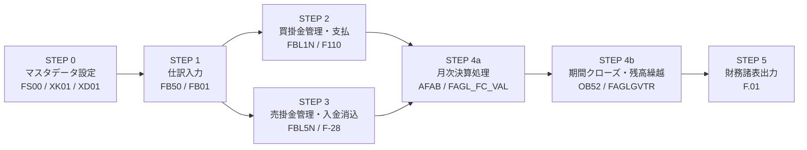
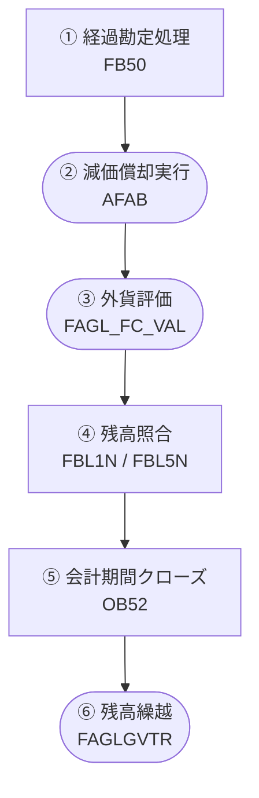
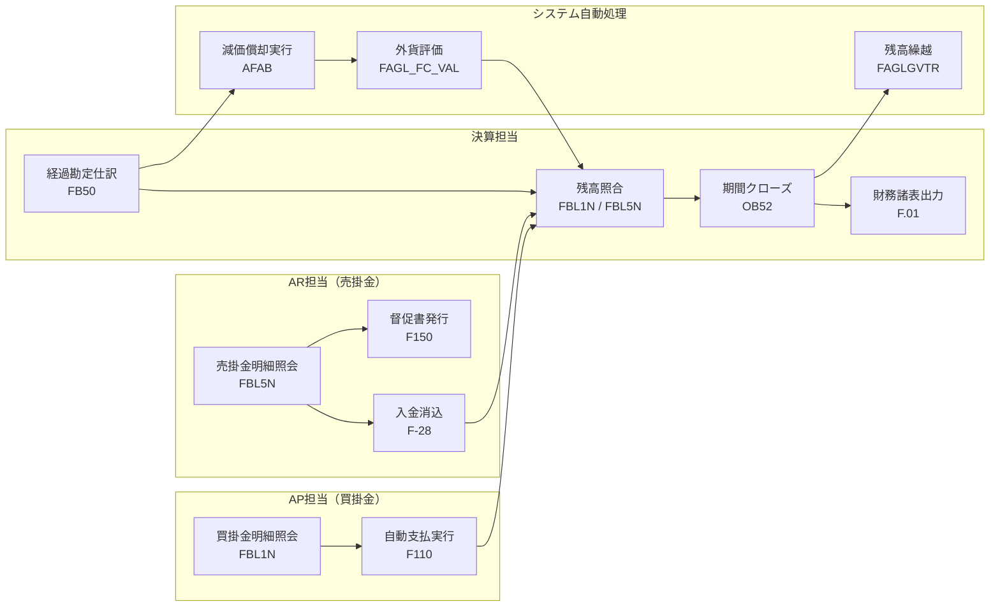
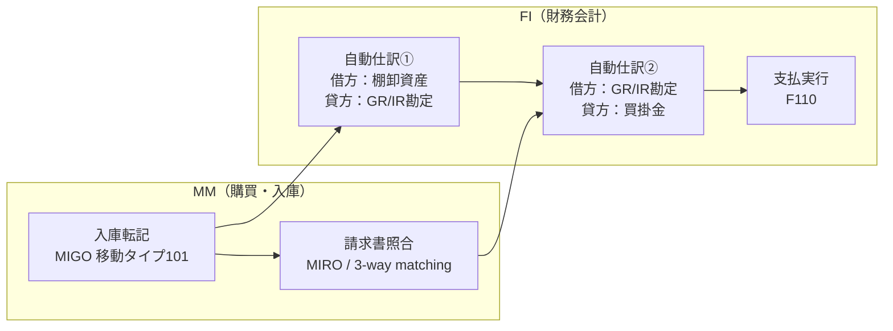

## はじめに

SAPのFIモジュール（Financial Accounting：財務会計）は、企業の「お金の動きをすべて記録する」業務全体をカバーするモジュールです。日々の仕訳入力から買掛金・売掛金の管理、月次決算処理、最終的な財務諸表（貸借対照表・損益計算書）の出力まで、企業の会計業務を一元管理します。

この記事では、**Record-to-Report（取引記録から報告まで）** と呼ばれる一連の業務フローを、「なぜその業務が必要なのか」というビジネス観点と、「SAPではどのトランザクションで操作するか」を対応付けながら解説します。

---

  凡例
  <strong>→</strong> 必須フロー
  <strong>[ ]</strong> 手動操作
  <strong>英数字コード</strong> = Tコード（SAPの操作コマンド）

## FIモジュールが管理する業務の全体像

FIモジュールが担う業務は大きく以下の4領域に分かれます。

| 業務領域 | 内容 | 主なSAP機能 |
|---------|------|------------|
| **総勘定元帳（GL）** | すべての取引を勘定科目ごとに記録・管理 | 仕訳入力、元帳照会 |
| **買掛金管理（AP）** | 仕入先への支払い義務（買掛金）を管理 | 請求書処理、支払実行 |
| **売掛金管理（AR）** | 顧客からの入金権利（売掛金）を管理 | 入金消込、督促 |
| **固定資産管理（AA）** | 設備・建物などの固定資産の取得・減価償却を管理 | 資産登録、減価償却 |

本記事では、このうち**総勘定元帳・買掛金管理・売掛金管理**とその後の**月次決算プロセス**を中心に解説します。

---

## STEP 0：マスタデータの設定

FIの業務フローを始める前に、SAPには2つの重要なマスタデータが必要です。

### 勘定科目マスタ（GL Account Master）

**業務的な意味：**
勘定科目マスタとは、仕訳に使用するすべての勘定科目（現金・売掛金・売上高・費用など）を定義したデータです。どの科目が貸借対照表科目か損益計算書科目か、どのコード体系で管理するかなど、会計の「骨格」となる情報が登録されています。

勘定科目マスタが正しく設定されていないと、他のモジュール（MMのMIRO・SDのVF01）からの自動仕訳が正しく起票できません。

| トランザクション | 操作内容 |
|----------------|---------|
| **FS00** | 勘定科目マスタの作成・変更・照会 |
| **FSP0** | 勘定科目マスタの会社コードへの追加 |
| **FSS0** | 勘定科目マスタのオペレーショナルチャートへの設定 |

### 仕入先マスタ・得意先マスタ（Vendor / Customer Master）

**業務的な意味：**
FIモジュールにおける仕入先・得意先マスタは、MMやSDのマスタと共通です（XK01 / XD01）。ただし、FI視点では「支払条件」「銀行口座」「調整勘定」の設定が特に重要です。

**調整勘定（Reconciliation Account）とは：**
FIでは、個々の得意先・仕入先の残高を「補助元帳（Subledger）」で管理しつつ、総勘定元帳の「売掛金」「買掛金」勘定に自動的に集計する仕組みがあります。この集計先となる勘定科目を調整勘定と呼びます。補助元帳と総勘定元帳を自動で一致させることで、残高照合の手間を省いています。

---

## STEP 1：仕訳の入力（Journal Entry）

### 業務的な意味

仕訳入力とは、**企業で発生したすべての経済的取引を「借方・貸方」の形式でSAPに記録するプロセス**です。

購買・販売などの業務取引はMMやSDモジュールが自動的に仕訳を生成しますが、それ以外にも「経費の支払い」「引当金の計上」「月次決算の調整」など、手動で仕訳を入力する場面は多くあります。

**仕訳が必要な理由：**
- 法的要件：会社法・税法・会計基準に基づき、すべての取引を帳簿に記録する義務がある
- 財務管理：経営者が正確な財務状況を把握するための基礎データになる
- 内部統制：取引の記録と承認のプロセスを分離することで不正を防止する

### SAPでの操作

| トランザクション | 操作内容 |
|----------------|---------|
| **FB50** | GL仕訳の入力（費用・収益など） |
| **FB01** | 全般的な仕訳入力（明細ベース） |
| **FBV0** | 仮転記仕訳の入力（承認後に本転記） |
| **FB08** | 仕訳の個別取消 |
| **FB03** | 仕訳伝票の照会 |

**FB50で入力する主な項目：**

| 入力項目 | 内容 |
|---------|------|
| 伝票日付 | 取引が実際に発生した日付 |
| 転記日付 | SAPの帳簿に計上する日付（会計期間を決定） |
| 伝票タイプ | SA（GL仕訳）、KR（仕入先請求書）など |
| 勘定番号 | 借方・貸方それぞれの勘定科目 |
| 金額 | 借方・貸方の金額（合計が一致する必要がある） |
| 原価センタ | 費用の帰属先（費用科目の場合） |

> **ポイント：転記日付と会計期間**
> 伝票日付（取引日）と転記日付（帳簿計上日）は異なります。転記日付が属する月の会計期間に仕訳が計上されるため、月次決算締め後は前月への転記が制限されます。この制御をSAPでは「会計期間管理（OB52）」で行います。

---

## STEP 2：買掛金管理（Accounts Payable）

### 業務的な意味

買掛金管理とは、**仕入先に対する支払い義務（買掛金）を記録・管理し、正しいタイミングで支払いを実行するプロセス**です。

MMモジュールで請求書照合（MIRO）が完了すると、FIの買掛金（仕入先への未払い）が自動的に記録されます。FI担当者は、この買掛金残高を管理しながら支払期日に合わせて支払処理を行います。

**買掛金管理が重要な理由：**
- キャッシュフロー管理：支払期日を管理することで、資金繰りを最適化できる
- 早期支払割引の活用：支払条件によっては早期支払いで割引を受けられる
- 重複支払いの防止：同じ請求書を二重に支払うミスを防ぐ

### SAPでの操作

| トランザクション | 操作内容 |
|----------------|---------|
| **FBL1N** | 仕入先別の買掛金明細照会 |
| **FK10N** | 仕入先の残高照会（月次サマリ） |
| **F110** | 自動支払プログラム（一括支払処理） |
| **F-53** | 手動支払入力 |
| **F-44** | 買掛金の手動消込 |

**F110（自動支払プログラム）の重要性：**

多数の仕入先への支払いを毎回手動で処理するのは非効率であり、ミスも発生しやすくなります。F110は支払期日・支払条件・銀行口座情報をもとに、支払可能な請求書を自動的に抽出し、銀行振込データまで一括生成します。

---

## STEP 3：売掛金管理（Accounts Receivable）

### 業務的な意味

売掛金管理とは、**顧客に対する入金権利（売掛金）を記録・管理し、確実に代金を回収するプロセス**です。

SDモジュールで請求書（VF01）が発行されると、FIの売掛金（顧客からの未収金）が自動的に記録されます。FI担当者は、この売掛金残高を監視しながら、支払期日を過ぎても入金がない顧客に督促を行います。

**売掛金管理が重要な理由：**
- 収益の確保：売上を計上しても回収できなければ実質的な損失になる
- 与信管理との連携：回収遅延が続く顧客の与信枠を見直すトリガーになる
- キャッシュフロー管理：いつ・いくら入金される予定かを把握し、資金計画を立てる

### SAPでの操作

| トランザクション | 操作内容 |
|----------------|---------|
| **FBL5N** | 得意先別の売掛金明細照会 |
| **FD10N** | 得意先の残高照会（月次サマリ） |
| **F-28** | 入金の手動消込 |
| **F-32** | 売掛金の個別消込 |
| **F150** | 督促書の自動発行 |

---

## STEP 4：月次決算（Period-End Closing）

### 業務的な意味

月次決算とは、**月末時点での財務状態を正確に確定させるための一連の処理**です。日々の取引記録は「暫定的な数字」に過ぎず、月次決算処理を経て初めて「確定した財務数字」になります。

**月次決算が必要な理由：**
- 経営報告：月次の損益・バランスシートを経営者・投資家に報告する義務がある
- 税務申告：正確な利益を確定させることで、法人税などの申告に使用できる
- 次月への引継ぎ：確定した期末残高を翌月の期首残高として繰越し、数字の連続性を担保する

### 月次決算の主な処理ステップ

| ステップ | 処理内容 | トランザクション |
|---------|---------|--------------|
| 1. 経過勘定処理 | 前払費用・未払費用など期間帰属調整の仕訳入力 | FB50 |
| 2. 減価償却実行 | 固定資産の月次償却費を自動計算・起票 | AFAB |
| 3. 外貨評価 | 月末レートで外貨建て残高を再評価（外貨取引がある企業のみ） | FAGL_FC_VAL |
| 4. 残高照合 | 補助元帳と総勘定元帳の残高一致確認 | FBL1N / FBL5N |
| 5. 会計期間クローズ | 前月の転記を締め切り（修正転記を禁止） | OB52 |
| 6. 残高繰越 | 期末残高を翌期の期首残高として繰越 | FAGLGVTR |

  凡例
  <strong>→</strong> 必須フロー
  <strong>[ ]</strong> 手動操作
  <strong>([ ])</strong> システム自動処理
  <strong>英数字コード</strong> = Tコード（SAPの操作コマンド）

> **ポイント：外貨評価（FAGL_FC_VAL）**
> 外貨建ての売掛金・買掛金は、月末時点の為替レートで再評価する必要があります。たとえば「1ドル=150円のときに発生した売掛金」が月末に「1ドル=155円」になっていれば、差額5円分を為替差損益として計上します。この評価をしないと、期中の為替変動が財務諸表に反映されず、資産・負債の実態が正確に表示されません。

> **ポイント：AFAB（減価償却実行）**
> 固定資産の月次償却はAFABで自動計算・起票されます。固定資産マスタ（AS01）に登録された耐用年数・償却方法をもとに計算され、FIに仕訳が自動転記されます。AFABを実行しないと、固定資産費用が月次損益に反映されず、財務諸表が不正確になります。

---

## STEP 5：財務諸表の出力（Financial Statements）

### 業務的な意味

財務諸表の出力とは、**月次決算が完了した後に、貸借対照表（BS）・損益計算書（PL）を生成して経営報告や外部開示に使用するプロセス**です。

SAPに蓄積されたすべての仕訳データが集計され、財務諸表として可視化されます。経営者はこれを見て「今月の売上はいくらか」「資産・負債のバランスはどうか」を判断します。

| トランザクション | 操作内容 |
|----------------|---------|
| **F.01** | 財務諸表の出力（BS / PL） |
| **S_ALR_87012284** | 勘定科目別残高一覧の表示 |
| **FBL3N** | GL勘定の明細照会 |
| **FAGLB03** | 新GL元帳の残高照会 |

---

## R2Rサイクル全体のまとめ

ここまで解説したフローを整理します。

| ステップ | 業務内容 | 主なトランザクション | 担当部門 |
|---------|---------|-------------------|---------|
| 0 | 勘定科目・仕入先・得意先マスタ設定 | FS00 / XK01 / XD01 | FI・マスタ管理 |
| 1 | 仕訳入力（取引の記録） | FB50 | 経理 |
| 2 | 買掛金管理・支払実行 | FBL1N / F110 | 経理（AP担当） |
| 3 | 売掛金管理・入金消込 | FBL5N / F-28 | 経理（AR担当） |
| 4-a | 月次決算処理（経過勘定・減価償却・外貨評価） | FB50 / AFAB / FAGL_FC_VAL | 経理 |
| 4-b | 会計期間クローズ・残高繰越 | OB52 / FAGLGVTR | システム管理・経理 |
| 5 | 財務諸表出力（BS・PL） | F.01 | 経理・経営企画 |

  凡例
  <strong>→</strong> 必須フロー
  <strong>[ ]</strong> 手動操作
  <strong>英数字コード</strong> = Tコード（SAPの操作コマンド）
  <strong>枠（subgraph）</strong> = 担当部門 or モジュール区分

---

## FIと他モジュールの自動連携

FIモジュールの特徴の一つは、**他のモジュールが業務処理を行うと、FIに仕訳が自動起票される点**です。この連携がなければ、SAPの業務担当者が手動で仕訳を入力しなければなりません。

| 発生元モジュール | 業務処理 | FIで自動起票される仕訳 |
|--------------|--------|-------------------|
| MM（MIGO） | 入庫処理 | 借方：棚卸資産 / 貸方：GR/IR勘定 |
| MM（MIRO） | 請求書照合 | 借方：GR/IR勘定 / 貸方：買掛金 |
| SD（VF01） | 請求書発行 | 借方：売掛金 / 貸方：売上高 |
| SD（VL02N） | 出庫転記 | 借方：売上原価 / 貸方：棚卸資産 |

> **GR/IR勘定（Goods Receipt / Invoice Receipt）とは：**
> 入庫（GR）と請求書照合（IR）の間に存在する「中間勘定」です。商品が届いた時点では「請求書はまだ来ていない」、請求書が来た時点では「入庫済みかどうかを照合中」という状態があります。GR/IR勘定はこの時間的なズレを吸収するクリアリング勘定で、入庫と請求書照合が両方完了したタイミングで自動消込されます。

  凡例
  <strong>→</strong> 必須フロー
  <strong>[ ]</strong> 手動操作
  <strong>英数字コード</strong> = Tコード（SAPの操作コマンド）
  <strong>枠（subgraph）</strong> = 担当部門 or モジュール区分

この自動連携を「リアルタイム統合」と呼び、「操作した瞬間に会計帳簿にも反映される」ことがSAPの大きな強みです。各部門が業務処理をするだけで財務数字が最新化されるため、月末に経理担当が大量の仕訳を手入力する必要がありません。

---

## よくある疑問

**Q. 仕訳を間違えたらどうすればよいですか？**
A. SAPでは一度転記した仕訳を上書き修正できません。代わりに「取消（Reversal）」処理でマイナス仕訳を起票し、正しい仕訳を新たに入力します（FB08）。これにより、修正の証跡が常に残り、監査対応も容易になります。

**Q. 月次決算の締め後に仕訳が必要になった場合は？**
A. OB52で会計期間の制御を変更することで、締め後の修正転記が可能です。ただしこの操作は権限を持つシステム管理者のみが実行でき、修正した記録が残ります。内部統制上、むやみに期間を開放すべきではありません。

**Q. FIとCO（管理会計）の違いは何ですか？**
A. FIは外部報告（財務諸表・税務申告）のための会計で、法律・会計基準に準拠した記録が主目的です。CO（Controlling）は内部管理のための会計で、部門別・製品別のコスト分析など経営判断に使います。SAPではFIの仕訳がCOにも自動連携されるため、同じ取引を「外部用」と「内部用」の両面で管理できます。

---

## まとめ

FIモジュールの業務フローを整理すると、核心は「**企業のすべての経済的取引を正確に記録し、経営と外部ステークホルダーが信頼できる財務情報を提供する**」ことです。

- **仕訳入力**：取引の財務的記録（FB50）
- **買掛金管理**：支払い義務の管理と適時支払い（FBL1N / F110）
- **売掛金管理**：回収権利の管理と確実な回収（FBL5N / F-28）
- **月次決算**：期末残高の確定と翌期への繰越（AFAB / OB52 / FAGLGVTR）
- **財務諸表**：確定数字の可視化と報告（F.01）

SAPのFIモジュールは、MMやSDなど業務モジュールとのリアルタイム連携により、業務担当者が操作するだけで財務数字が最新化される仕組みを実現しています。これにより、経理部門は「データ入力」ではなく「財務分析と意思決定支援」に集中できます。

各トランザクションの詳細操作については、個別の記事でさらに詳しく解説予定です。
