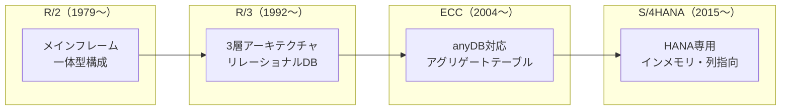
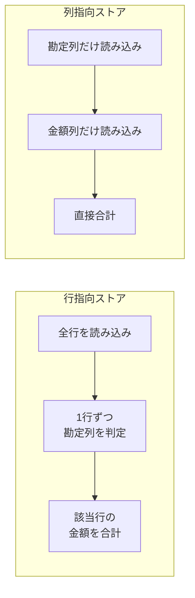
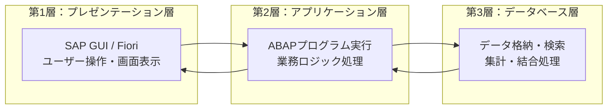
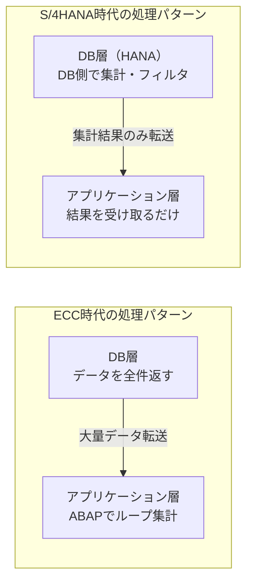

## はじめに

S/4HANAの「HANA」とは、SAPが開発したインメモリデータベース **SAP HANA** のことです。S/4HANAはこのHANA上でのみ動作するように設計されており、従来のSAP ECC（ERP Central Component）とは根本的にデータの持ち方・処理の仕方が異なります。

本記事では、以下の3つを軸にSAP HANAの仕組みを解説します。

1. **SAPデータベースの歴史変遷**（R/2 → R/3 → ECC → S/4HANA）
2. **インメモリデータベースとは何か**（列指向ストアと高速化の仕組み）
3. **コードプッシュダウンとは何か**（3層アーキテクチャとDB層活用の考え方）

**なぜこの知識が必要か（why so）**：S/4HANAの導入・開発に関わるなら、「なぜHANAでなければならないのか」を説明できる必要があります。単に「速い」と言うだけでは不十分で、**なぜ速いのか・従来と何が違うのか**を構造的に理解しておくことが、設計判断やパフォーマンス問題への対処に直結します。

---

## SAPデータベースの歴史変遷

S/4HANAのインメモリデータベースがなぜ画期的なのかを理解するには、SAPがこれまでどのようなデータベース基盤の上で動いてきたかを知ることが重要です。

### R/2時代（1979年〜）：メインフレーム

SAPの最初の主力製品であるR/2は、**メインフレーム**（大型汎用機）上で動作するERPシステムでした。

- データベース、アプリケーション、画面表示がすべて**1台のメインフレーム内**で完結
- データベースはメインフレームベンダー固有の仕組みに依存（IBM DB2など）
- 処理能力はメインフレームのスペックに完全に制約され、拡張するにはハードウェアごと入れ替える必要があった

**この時代の限界**：メインフレームは高価かつ柔軟性が低く、業務拡大に伴うスケールアップが困難でした。また、端末からの操作はテキストベースの画面に限られ、ユーザビリティにも制約がありました。

### R/3時代（1992年〜）：クライアント/サーバーと3層アーキテクチャの登場

R/3は、SAPの歴史における最大の転換点の一つです。メインフレームの一枚岩構成から、**3層アーキテクチャ**（後述）に移行しました。

- **リレーショナルデータベース**（Oracle、DB2、Informixなど）を採用
- プレゼンテーション層・アプリケーション層・データベース層を分離
- 各層を別々のサーバーに配置でき、**個別にスケールアウト**が可能に

**なぜ3層に分けたのか（why so）**：1台のマシンにすべてを載せると、画面表示の負荷・業務ロジックの負荷・データ読み書きの負荷が互いに干渉します。層を分離することで、ボトルネックになっている層だけを増強できるようになりました。

### ECC時代（2004年〜）：anyDBとアグリゲートテーブルの時代

SAP ECC（ERP Central Component）は、R/3の後継として登場しました。

- **anyDB**と呼ばれるアプローチで、複数のデータベースベンダー（Oracle、IBM DB2、Microsoft SQL Server、SAP MaxDBなど）に対応
- データベースに依存しない設計のため、**データベース固有の高速化機能は使えない**という制約があった
- ディスクベースのデータベースの速度限界を補うため、**アグリゲートテーブル**（集計済みテーブル）を大量に保持していた

**アグリゲートテーブルとは**：元データから事前に集計した結果を別テーブルに格納しておく仕組みです。たとえばFIモジュールでは、個別の仕訳伝票テーブル（BSEG）とは別に、勘定残高の集計テーブル（GLT0など）を持っていました。レポート表示のたびに何万件もの伝票を集計すると遅いため、あらかじめ集計結果を別に持っておくという考え方です。FIモジュールの業務フロー全体像については[SAP FIモジュール 業務フロー完全解説｜仕訳から財務諸表まで](/blog/sap-fi-business-flow/)で解説しています。

**この設計の問題点（so what）**：

- 同じデータが元テーブルと集計テーブルの**両方に存在する（データの冗長性）**
- 元データと集計データの**整合性を維持する負荷**がかかる
- テーブル数が膨大になり、データモデルが**複雑化**する（ECCのFI領域だけでも数十の集計テーブルが存在）

### S/4HANA時代（2015年〜）：HANA専用とデータモデルの簡素化

S/4HANAは、**SAP HANAデータベース上でのみ動作する**という大きな決断をしました。anyDBの互換性を捨てた代わりに、HANAの能力を最大限に活用する設計に切り替えたのです。

- インメモリ＋列指向ストアにより、**リアルタイム集計が実用的な速度**で可能に
- アグリゲートテーブルを大幅に削減（FI領域では複数のテーブルが**ACDOCA**という1つのテーブルに統合）
- テーブル数の削減により、データモデルが大幅に**簡素化**



<div style="font-size: 0.8rem; color: #666; margin-top: 0.5rem; padding: 0.4rem 0.75rem; background: #f8f8f8; border-radius: 4px; display: flex; flex-wrap: wrap; gap: 0.25rem 1.5rem;">
  <span>凡例</span>
  <span><strong>→</strong> 世代の移行</span>
  <span><strong>[ ]</strong> 各世代の特徴</span>
</div>

**読者への示唆（so what）**：S/4HANAがHANA専用になった理由は「速いから」だけではありません。HANAの能力を前提にすることで、**データモデルそのものを再設計**できたことが最大の意義です。ECCからS/4HANAへの移行で「テーブル構造が変わる」と言われるのは、このアグリゲートテーブル削減が大きな要因です。

---

## インメモリデータベースとは何か

### ディスクベース vs インメモリ

従来のデータベース（Oracle、SQL Serverなど）は、データを**ディスク（HDD/SSD）**に格納し、必要なときにメモリに読み込んで処理します。

インメモリデータベースは、データを**常にメモリ（RAM）上に保持**し、ディスクはバックアップ・永続化の目的でのみ使用します。

| 項目 | ディスクベースDB | インメモリDB（HANA） |
|------|-----------------|-------------------|
| データの主な格納先 | ディスク（HDD/SSD） | メモリ（RAM） |
| データ読み込み | ディスク → メモリに都度読み込み | すでにメモリ上にある |
| 速度のボトルネック | ディスクI/O（物理的な読み書き） | メモリ帯域幅（非常に高速） |
| 大量データの集計 | 事前集計テーブルで対応 | リアルタイム集計が可能 |

**なぜメモリ上だと速いのか（why so）**：ディスクからデータを読む速度とメモリからデータを読む速度には、桁違いの差があります。HDDの場合は約10ミリ秒、SSDでも約0.1ミリ秒かかるのに対し、メモリは約0.0001ミリ秒（100ナノ秒）でアクセスできます。つまり、**HDDと比べて約10万倍、SSDと比べても約1,000倍高速**です。

### 列指向ストア（カラムストア）：HANAの高速化のもう一つの柱

インメモリであることに加え、SAP HANAが高速な理由がもう一つあります。それが**列指向ストア（カラムストア）** です。

#### 行指向 vs 列指向

従来のデータベースは**行指向ストア**です。1件のレコード（行）をまとめて格納します。

```
行指向（従来のDB）：
  行1: [伝票番号: 001, 勘定: 売上, 金額: 10,000, 日付: 2026-01-15]
  行2: [伝票番号: 002, 勘定: 仕入, 金額: 5,000,  日付: 2026-01-16]
  行3: [伝票番号: 003, 勘定: 売上, 金額: 8,000,  日付: 2026-01-17]
```

一方、列指向ストアは**列（カラム）単位でデータをまとめて格納**します。

```
列指向（HANA）：
  伝票番号列: [001, 002, 003]
  勘定列:     [売上, 仕入, 売上]
  金額列:     [10,000, 5,000, 8,000]
  日付列:     [2026-01-15, 2026-01-16, 2026-01-17]
```

#### なぜ列指向だと集計が速いのか

「売上勘定の金額合計を出してほしい」というクエリを考えてみましょう。

**行指向の場合**：全行を1件ずつ読み込み、勘定列を確認し、売上であれば金額を加算します。100万件あれば100万行すべてにアクセスする必要があります。各行には不要な列（伝票番号、日付など）も含まれるため、**読み込むデータ量が多くなります**。

**列指向の場合**：勘定列と金額列の**2列だけ**を読み込めば済みます。伝票番号や日付の列にはアクセスする必要がありません。さらに、同じ列内のデータは型が同じなので**圧縮効率が非常に高く**、メモリ上のデータ量自体も少なくなります。



<div style="font-size: 0.8rem; color: #666; margin-top: 0.5rem; padding: 0.4rem 0.75rem; background: #f8f8f8; border-radius: 4px; display: flex; flex-wrap: wrap; gap: 0.25rem 1.5rem;">
  <span>凡例</span>
  <span><strong>→</strong> 処理の流れ</span>
  <span><strong>[ ]</strong> 各処理ステップ</span>
</div>

**読者への示唆（so what）**：列指向ストアは、**少数の列に対する大量行の集計**（＝分析・レポート系のクエリ）で圧倒的に有利です。SAPのレポート処理（残高照会、在庫集計、売上分析など）はまさにこのパターンに該当するため、HANAの列指向ストアと非常に相性が良いのです。逆に、1件のレコードを丸ごと取得するような処理（個別伝票の表示など）では、行指向との差は小さくなります。

#### 列指向ストアの圧縮効率

列指向ストアにはもう一つ大きなメリットがあります。**データ圧縮の効率が極めて高い**ことです。

同じ列には同じデータ型の値が並ぶため、パターンの繰り返しが多くなります。たとえば「勘定」列に「売上」「仕入」「給与」の3種類しかなければ、それぞれを数値コード（1, 2, 3）に置き換える**辞書圧縮**が非常に効果的に機能します。

実務上、SAPのデータは同一列内の値パターンが限られるケースが多い（勘定コード、プラント、会社コードなど）ため、HANAでは元データの**数分の1〜10分の1程度**にまで圧縮されるケースもあります。これにより、メモリ使用量を抑えつつ高速処理が実現できます。

---

## 3層アーキテクチャとコードプッシュダウン

### SAPの3層アーキテクチャ

R/3以降のSAPシステムは、以下の**3層アーキテクチャ**で構成されています。

| 層 | 名称 | 役割 | 主なリソース |
|----|------|------|-------------|
| 第1層 | プレゼンテーション層 | ユーザーの画面表示・入力操作 | SAP GUI / Fiori |
| 第2層 | アプリケーション層 | 業務ロジックの実行（ABAPプログラムの実行環境） | CPU・メモリ |
| 第3層 | データベース層 | データの格納・読み書き | ディスク・メモリ |



<div style="font-size: 0.8rem; color: #666; margin-top: 0.5rem; padding: 0.4rem 0.75rem; background: #f8f8f8; border-radius: 4px; display: flex; flex-wrap: wrap; gap: 0.25rem 1.5rem;">
  <span>凡例</span>
  <span><strong>→</strong> データの流れ（リクエストとレスポンス）</span>
  <span><strong>[ ]</strong> 各層の役割</span>
</div>

### ECC時代の問題：アプリケーション層への負荷集中

ECC時代のanyDB環境では、データベースは「データを取ってくるだけ」の役割に留まることが多く、**集計・フィルタリング・結合などの処理をアプリケーション層（ABAPプログラム側）で行う**設計が一般的でした。

典型的な処理の流れを見てみましょう。

**例：「今月の売上合計を勘定コード別に集計したい」**

1. ABAPプログラムがデータベースに対して「仕訳伝票データを全件取得せよ」と指示
2. データベースが**何十万件ものデータ**をアプリケーション層に転送
3. アプリケーション層のABAPプログラムがデータを受け取り、**ループ処理で1件ずつ集計**
4. 集計結果を画面に表示

**なぜこれが問題なのか（why so）**：

- **データ転送量が膨大**：DB層からアプリケーション層へ大量のデータを送る必要がある。ネットワーク帯域を消費し、転送だけで時間がかかる
- **アプリケーション層のメモリは限られている**：アプリケーションサーバーは複数ユーザーの処理を同時に実行しており、1つのプログラムが使えるメモリには制約がある。大量データをアプリケーション層に持ってきて処理すること自体がボトルネックになる
- **データベースの能力を活かしきれていない**：集計や結合はデータベースが最も得意とする処理であるにもかかわらず、アプリケーション層でやり直している



<div style="font-size: 0.8rem; color: #666; margin-top: 0.5rem; padding: 0.4rem 0.75rem; background: #f8f8f8; border-radius: 4px; display: flex; flex-wrap: wrap; gap: 0.25rem 1.5rem;">
  <span>凡例</span>
  <span><strong>→</strong> データの流れ（矢印の太さが転送量の違いを示す）</span>
  <span><strong>[ ]</strong> 各層の処理内容</span>
</div>

### コードプッシュダウンとは

**コードプッシュダウン（Code Pushdown）** とは、従来アプリケーション層で行っていた集計・計算・フィルタリングなどの処理を、**データベース層に押し下げて実行させる**設計思想です。

先ほどの「今月の売上合計を勘定コード別に集計したい」という例で比較します。

| 項目 | ECC時代（プッシュダウンなし） | S/4HANA（プッシュダウンあり） |
|------|--------------------------|--------------------------|
| DBへの指示 | 「仕訳データを全件くれ」 | 「今月の仕訳を勘定コード別に集計して、結果だけくれ」 |
| DB→APへの転送データ | 数十万件の生データ | 勘定コード数分の集計済み数行 |
| アプリケーション層の処理 | ループで1件ずつ集計 | 受け取った結果を表示するだけ |
| 処理時間 | 数十秒〜数分 | 数秒以内 |

**なぜDB層で処理すべきなのか（why so）**：

- **データに最も近い場所で処理する**のが最も効率的。DB層にはすべてのデータがあるので、集計・フィルタリングをその場で行い、結果だけを返すのが理にかなっている
- **HANAはインメモリ＋列指向**であり、集計処理がそもそも得意。この能力を活かさないのはもったいない
- **アプリケーション層のメモリを節約**できる。大量の生データを保持する必要がなくなるため、同時に処理できるユーザー数が増える

### コードプッシュダウンの実現手段

S/4HANA環境でコードプッシュダウンを実現するための主な手段は以下の通りです。

| 手段 | 概要 |
|------|------|
| **Open SQL の活用** | ABAPのSQLで`GROUP BY`、`SUM`、`CASE`などの集計・演算をDB側で実行させる |
| **CDS View（Core Data Services）** | データモデルと集計ロジックをDB層に定義し、アプリケーション層からはビューとしてアクセスする |
| **AMDP（ABAP Managed Database Procedures）** | ABAP内からHANAのストアドプロシージャを呼び出し、複雑な計算ロジックをDB層で実行する |

**読者への示唆（so what）**：コードプッシュダウンは「新しいプログラミング技法」ではなく、**3層アーキテクチャにおける処理配置の最適化**です。HANAのインメモリ＋列指向という特性があるからこそ、DB層に処理を寄せることで劇的なパフォーマンス向上が得られます。逆に言えば、S/4HANA環境でECC時代と同じ「全件取得してABAPでループ」という書き方をすると、HANAの能力をまったく活かせません。ABAPプログラムのパフォーマンス改善の具体的な手法については[ABAPパフォーマンスチューニング入門（SE30の使い方・Gross/Netの違い・内部テーブル最適化）](/blog/sap-abap-performance-tuning/)で解説しています。

---

## 全体サマリ

| 項目 | 内容 |
|------|------|
| SAP HANAとは | SAP製のインメモリ・列指向データベース |
| インメモリの意味 | データを常にRAM上に保持。ディスクI/Oのボトルネックを排除 |
| 列指向ストアの効果 | 必要な列だけ読み込むため、集計・分析クエリが高速。圧縮効率も高い |
| S/4HANAがHANA専用の理由 | HANAの能力を前提にデータモデルを再設計（アグリゲートテーブルの廃止） |
| 3層アーキテクチャ | プレゼンテーション層・アプリケーション層・データベース層の分離構成 |
| コードプッシュダウン | 集計・計算処理をアプリケーション層からDB層に移し、HANAの処理能力を活用する設計思想 |

---

## よくある疑問

### Q1. インメモリということは、サーバーの電源が落ちたらデータが消えるのでは？

いいえ。SAP HANAはインメモリで動作しますが、**定期的にディスクへの永続化（セーブポイント）** を行っています。また、すべてのデータ変更は**ログ（トランザクションログ）** にも書き込まれます。万が一の障害時には、最後のセーブポイント＋ログから完全にデータを復元できます。「インメモリ＝揮発性で危険」というのは誤解です。

### Q2. 列指向が集計に強いなら、1件のレコードを取得する処理は遅くなる？

理論上、1件の行をまるごと取得する場合は行指向の方が有利です。しかし、SAP HANAは**行指向ストア（ローストア）も併用**できます。頻繁に単一行アクセスされるテーブルにはローストアを使い、分析・集計用途にはカラムストアを使うという使い分けが可能です。実際には、HANAのカラムストアは十分に最適化されているため、単一行の取得でも実用上問題になることはほとんどありません。

### Q3. ECCでもSAP HANAを使えると聞いたが、S/4HANAとの違いは？

ECCのデータベースをHANAに入れ替えること（**Suite on HANA**）は可能です。これによりデータベースアクセスは高速化されます。しかし、ECCのデータモデル（アグリゲートテーブル構造）はそのまま残るため、**テーブル簡素化やコードプッシュダウンの恩恵は限定的**です。S/4HANAはHANA前提でデータモデルそのものを再設計しているため、HANAの能力を最大限に活かせるのはS/4HANAだけです。

### Q4. コードプッシュダウンは既存のABAPプログラムにも影響する？

はい。ECCからS/4HANAに移行する際、既存のABAPプログラムが非推奨のテーブルや構文を使っていると、**修正が必要**になります。具体的には、S/4HANAで廃止・統合されたテーブル（集計テーブルなど）を参照しているプログラムや、`SELECT *`で全列を取得してアプリケーション層で加工するような非効率なコードは、CDS ViewやOpen SQLの集計構文を活用した書き方に変更することが推奨されます。

---

## まとめ

- **SAPのデータベースはR/2のメインフレームからS/4HANAのインメモリまで、4世代の変遷を経ている**。各世代でアーキテクチャの制約と工夫が異なる
- **インメモリデータベースはデータをRAM上に保持する**ことで、ディスクI/Oのボトルネックを排除する。HANAはこれに加え、列指向ストアによって集計・分析クエリをさらに高速化している
- **列指向ストアは必要な列だけを読み込む**ため、「少数の列 × 大量の行」という集計パターンで圧倒的に有利。SAPのレポート処理と非常に相性が良い
- **3層アーキテクチャにおいて、アプリケーション層はメモリが限られている**。大量データの集計処理はデータに近いDB層で行うのが効率的であり、これがコードプッシュダウンの根拠となる
- **コードプッシュダウンはHANAの能力を活かす設計思想**。DB層で集計・フィルタリングを完了させ、アプリケーション層には結果だけを返すことで、パフォーマンスとリソース効率の両方を改善する
