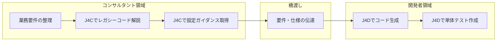

## はじめに

SAP Jouleは、SAPが提供するAIコパイロットブランドです。「Joule」と一口に言っても、実は**対象ユーザーごとに異なる製品**が用意されています。本記事で取り上げるのは、以下の2つです。

- **Joule for Developers（J4D）**：ABAP開発者・SAP Build開発者向け
- **Joule for Consultants（J4C）**：ファンクショナルコンサルタント・ソリューションアーキテクト向け

**なぜ2つに分かれているのか（why so）**：SAPプロジェクトでは、業務要件を設計する**ファンクショナルコンサルタント**と、それを実装する**テクニカル開発者**の両方が必要です。この2つのロールは求めるAI支援の内容がまったく異なります。コンサルタントは「正しい設定方法」や「ベストプラクティスに沿った設計」を知りたいのに対し、開発者は「コードの生成・テスト・リファクタリング」を求めます。1つのツールで両方をカバーしようとすると、どちらにとっても中途半端になってしまいます。

**読者への示唆（so what）**：自分の役割に合ったJouleを選ばないと、期待する支援が得られません。本記事を通じて「どちらを使うべきか」「両者をどう連携させるか」を明確にしてください。

---

## Jouleとは

SAP Jouleは、SAP全体に組み込まれたAIコパイロットの**統一ブランド**です。大きく分けると以下の3つのバリエーションがあります。

| バリエーション | 対象ユーザー | 主な用途 |
|---|---|---|
| **Joule for Business Users** | 一般業務ユーザー | SAP GUI/Fioriでの業務操作支援 |
| **Joule for Developers（J4D）** | ABAP開発者・SAP Build開発者 | コード生成・テスト・リファクタリング |
| **Joule for Consultants（J4C）** | ファンクショナルコンサルタント | 設計・設定ガイダンス・コード理解 |

本記事では**J4DとJ4C**に焦点を当て、それぞれの機能と違いを解説します。

---

## Joule for Developers（J4D）の概要と主な機能

### 対象ユーザーと利用環境

J4Dは**ABAP開発者およびSAP Build開発者**を対象としたAIコパイロットです。以下の開発環境に組み込まれています。

| 開発環境 | 状況 |
|---|---|
| Eclipse ADT（ABAP Development Tools） | 利用可能 |
| VS Code（ABAP MCP Server経由） | 2026年Q2提供予定 |
| SAP Build Code | 利用可能 |

**なぜIDEに組み込まれているのか（why so）**：開発者にとってAIの価値は「コーディング中にリアルタイムで支援を受けられること」にあります。別画面のWebツールに切り替える必要があると、コンテキストが途切れて生産性が落ちます。そのためJ4DはIDEにネイティブに統合されています。

### 主な機能

| 機能 | 説明 |
|---|---|
| **ABAPコード生成** | 自然言語で意図を記述すると、CDS View・RAP Business Logic・サービス定義などを自動生成 |
| **コード補完** | コーディング中に文脈を理解して候補を提示 |
| **コード解説** | レガシーABAPコードの処理内容を自然言語で説明 |
| **単体テスト生成** | ABAPおよびCDSの単体テストを自動作成 |
| **コードレビュー・リファクタリング提案** | コード品質の改善ポイントを指摘 |
| **RAP Business Logic予測** | Validation・Determinationのロジックを予測して生成 |
| **フルスタックアプリ生成** | CAP（Cloud Application Programming Model）でのアプリケーション生成 |
| **自動化** | プロセス・フォーム・ビジネスルールの要約・生成 |

J4Dの基盤モデルは、SAPが**3億行のABAPコード**と**3,000万行のCDSコード**でファインチューニングした専用モデルです。汎用的なコード生成AIとは異なり、SAPの命名規則・設計パターン・ベストプラクティスを理解した上でコードを生成します。

### 2026年ロードマップ：Agentic AIへの進化

J4Dは「コードスニペットを生成するアシスタント」から「**自律的に協働するAgentic AI**」への進化を目指しています。単にコードの断片を提示するのではなく、開発タスク全体を理解し、複数のステップを自律的に実行するコパイロットへと変わっていく方向です。

**読者への示唆（so what）**：現時点でJ4Dを使い始めておくと、Agentic AIへの移行時にスムーズに適応できます。また、**2026年9月まで無償のプロモーション期間**が延長されているため、試すコストは低いです。

---

## Joule for Consultants（J4C）の概要と主な機能

### 対象ユーザーと利用環境

J4Cは**ファンクショナルコンサルタント・ソリューションアーキテクト・システムインテグレーター**を対象としたAIコパイロットです。

J4DがIDEに組み込まれているのに対し、J4Cは**Webベースのスタンドアロン画面**として提供されます（SAP BTP上で動作）。

| 項目 | 内容 |
|---|---|
| 提供形態 | SAP Business AI内のスタンドアロン機能 |
| アクセス方法 | Webブラウザ |
| 利用可能リージョン | EU10、EU11、US10 |
| 認証要件 | S-userによるゲートコンテンツアクセス |

### 知識基盤

J4Cの最大の強みは、**9TB以上のSAP専有ナレッジ**をベースにした回答能力です。

| ナレッジソース | 内容 |
|---|---|
| SAP認定試験コンテンツ | 100以上の認定試験相当の知識 |
| 非公開ドキュメント | 300万件以上の内部技術文書 |
| SAP Notes・KBA | 障害対応・設定ガイダンスの蓄積 |
| ベストプラクティス | Fit-to-Standardに準拠した推奨設定 |

**なぜ9TBものデータが必要なのか（why so）**：SAPコンサルタントが日常的に直面する問題は、公開ドキュメントだけでは解決できないケースが多くあります。SAP Notesや非公開KBA（Knowledge Base Articles）には、特定バージョン・特定業種に固有の設定ノウハウが蓄積されています。汎用AIモデルにはこれらの情報がないため、SAP固有の質問に対して正確な回答ができません。

### 主な機能

| 機能 | 説明 |
|---|---|
| **エキスパートQ&A** | SAP専有ナレッジに基づいた高精度な質問応答 |
| **ABAPコード解説** | レガシーコードの処理内容を非開発者にもわかる言葉で説明 |
| **簡易コードスニペット生成** | コンサルタントが開発者と連携するための基本的なコード断片 |
| **ステップバイステップの設定ガイダンス** | カスタマイジングの手順を段階的に案内 |
| **ベストプラクティス推奨** | Fit-to-Standardに整合した設計提案 |
| **SAP Activateネイティブ対応** | Activateフェーズ・Fit-to-Standard構成を理解した上でのガイダンス |

**読者への示唆（so what）**：J4Cのコード解説機能は、ABAPが書けないコンサルタントにとって特に価値があります。レガシーシステムのカスタムコードを読み解く作業は、従来は開発者に依頼する必要がありましたが、J4Cを使えばコンサルタント自身がコードの意図を理解できます。これにより、開発者への依頼内容が具体化し、プロジェクト全体のコミュニケーションコストが下がります。

### 2026年ロードマップ：Agentic Consulting Copilotへ

J4Cも「対話型アシスタント」から「**Agentic Consulting Copilot**」への進化を目指しています。具体的には、SAP Activateの成果物作成の自動ガイダンスや、設計の妥当性を事前に検証するプロアクティブな支援が計画されています。

なお、J4Cはすでに**Deloitte**がSAPプロジェクトの迅速化に採用しており、実プロジェクトでの活用が進んでいます。

---

## J4DとJ4Cの違い（比較表）

| 比較軸 | Joule for Developers（J4D） | Joule for Consultants（J4C） |
|---|---|---|
| **対象ユーザー** | ABAP開発者・SAP Build開発者 | ファンクショナルコンサルタント |
| **主な目的** | コードを書く・生成する・テストする | 設計・設定を導く・コードを理解する |
| **利用環境** | IDE（Eclipse ADT / VS Code / SAP Build Code） | Webベースのスタンドアロン画面 |
| **コード機能** | フル生成・補完・単体テスト・リファクタリング | コード解説 + 簡易スニペット生成 |
| **知識ソース** | ABAPモデル + 現在のコードコンテキスト | 9TB以上のSAPドキュメント・Notes・KBA |
| **SAP方法論** | 直接的な対応なし | SAP Activate・Fit-to-Standardをネイティブ理解 |
| **ライセンス** | 2026年9月まで無償プロモーション | SAP Business AIサブスクリプションが必要 |
| **2026年の方向性** | Agentic AI（自律的コーディング協働） | Agentic Consulting Copilot（設計検証・成果物ガイダンス） |

**要点**：J4Dは「**コードを書く**」ためのツール、J4Cは「**設計・設定を導く**」ためのツールです。両者は補完関係にあり、競合するものではありません。

---

## 両者の連携：ファンクショナル・テクニカルの橋渡し

SAPプロジェクトでは、コンサルタントと開発者の間に**コミュニケーションギャップ**が生じることが少なくありません。コンサルタントは業務要件を理解していてもコードが読めず、開発者はコードは書けても業務的な背景がわからないという構図です。

J4CとJ4Dを組み合わせることで、このギャップを縮小できます。

  凡例
  <strong>→</strong> 業務の流れ（必須フロー）
  <strong>[ ]</strong> 手動操作・判断
  <strong>subgraph</strong> 担当ロールの区分

**なぜ連携が重要なのか（why so）**：従来のSAPプロジェクトでは、コンサルタントが「この業務ロジックをカスタマイズしてほしい」と開発者に伝える際、レガシーコードの意図を正確に説明できないことが多くありました。これが手戻りや認識齟齬の原因となり、プロジェクトの遅延につながります。

**読者への示唆（so what）**：J4Cでレガシーコードの意図を理解し、その上で開発者に「このロジックをこう変えてほしい」と具体的に伝える。開発者はJ4Dでその要件に基づくコードを生成し、テストまで自動化する。この流れにより、**ファンクショナルとテクニカルの往復コスト**が大幅に削減されます。

---

## よくある疑問（FAQ）

### Q: ABAPが書けないコンサルタントでもJ4Cは使えますか？

**A: はい、むしろそれがJ4Cの主要な価値です。** J4Cのコード解説機能は、ABAPの知識がないコンサルタントがレガシーコードの処理内容を理解するために設計されています。コードを読める必要はなく、J4Cに「このプログラムは何をしているのか」と聞けば、業務的な観点で説明してくれます。ただし、J4Cはフルスケールのコード生成ツールではないため、本格的な開発作業にはJ4Dが必要です。

### Q: J4DとJ4Cは同じライセンスですか？

**A: いいえ、ライセンス体系は異なります。** J4Dは2026年9月まで無償プロモーション期間が設定されており、SAP BTPアカウントがあれば追加費用なく利用できます。一方、J4CはSAP Business AIサブスクリプションが必要です。導入を検討する際は、それぞれのライセンス条件を確認してください。

### Q: オンプレミスのSAPでもJouleは使えますか？

**A: 利用可能な範囲が異なります。** J4DはS/4HANA Cloud Private Edition（旧オンプレミス環境のクラウド移行版）でも利用できます。J4CはSAP BTP上で動作するWebサービスのため、オンプレミス環境そのものには依存しませんが、利用にはBTP環境とS-userが必要です。完全なオンプレミス環境（ECC等）のみの場合は、まずBTP接続の整備が前提となります。

---

## まとめ

- **SAP Jouleは1つのブランドだが、対象ユーザーごとに異なる製品がある**。開発者向けの**J4D**とコンサルタント向けの**J4C**を正しく区別することが重要
- **J4Dは「コードを書く」ツール**。ABAP生成・コード補完・単体テスト・リファクタリングなど、開発作業を直接支援する。IDEに統合されており、コーディング中にリアルタイムで利用できる
- **J4Cは「設計・設定を導く」ツール**。9TB以上のSAP専有ナレッジを基盤に、設定ガイダンス・コード解説・ベストプラクティス推奨を提供する。SAP ActivateやFit-to-Standardを理解した上での回答が特徴
- **両者は競合ではなく補完関係**。J4Cでレガシーコードを理解し、J4Dで実装する流れにより、ファンクショナルとテクニカルのコミュニケーションギャップを縮小できる
- **2026年は両者ともAgentic AIへ進化**する過渡期。早期に使い始めることで、自律的AIコパイロットへの移行にスムーズに対応できる
