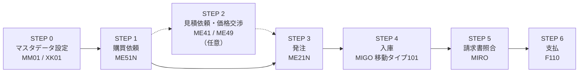
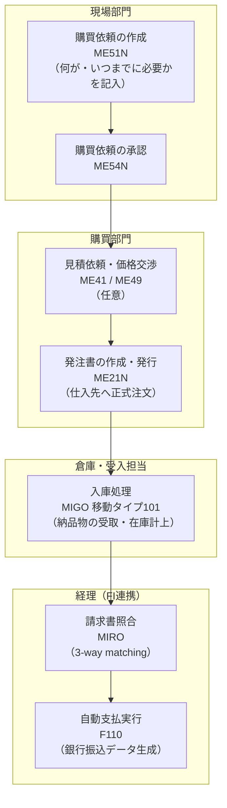

## はじめに

SAPのMMモジュール（Materials Management：資材管理）は、企業の「モノを買う」業務全体をカバーするモジュールです。原材料の調達から在庫管理、仕入先への支払いまで、企業の購買サイクルを一元管理します。

この記事では、**Purchase-to-Pay（購買から支払まで）** と呼ばれる一連の業務フローを、「なぜその業務が必要なのか」というビジネス観点と、「SAPではどのトランザクションで操作するか」を対応付けながら解説します。

---


<div style="font-size: 0.8rem; color: #666; margin-top: 0.5rem; padding: 0.4rem 0.75rem; background: #f8f8f8; border-radius: 4px; display: flex; flex-wrap: wrap; gap: 0.25rem 1.5rem;">
  <span>凡例</span>
  <span><strong>→</strong> 必須フロー</span>
  <span><strong>-.-></strong> 省略可能なステップ</span>
  <span><strong>[ ]</strong> 手動操作</span>
  <span><strong>英数字コード</strong> = Tコード（SAPの操作コマンド）</span>
</div>

## MMモジュールが管理する業務の全体像

MMモジュールが担う業務は大きく以下の4領域に分かれます。

| 業務領域 | 内容 | 主なSAP機能 |
|---------|------|------------|
| **購買管理** | 必要なモノを仕入先から購入するプロセス全体 | 購買依頼、発注、入庫 |
| **在庫管理** | 倉庫にあるモノの数量・場所・金額を管理 | 在庫照会、在庫移動 |
| **請求書照合** | 仕入先からの請求書と発注・入庫の内容を照合 | MIRO |
| **MRP（所要量計画）** | 生産・販売計画をもとに必要な資材量を計算 | MD01N、MD04 |

本記事では、このうち**購買管理と請求書照合**（P2Pサイクル）を中心に解説し、在庫管理・MRPについても触れます。

---

## STEP 0：マスタデータの設定

業務フローを始める前に、SAPには2つの重要なマスタデータが必要です。

### 資材マスタ（Material Master）

**業務的な意味：**
資材マスタとは、社内で取り扱うすべての「モノ」の情報を登録したデータです。品目番号・名称・単位・価格設定・在庫管理方法など、そのモノに関するあらゆる属性が登録されています。資材マスタがないと、SAPで購買依頼も発注もできません。

資材マスタは「ビュー」という概念で管理されており、購買担当・在庫担当・会計担当それぞれが必要な情報を入力します。

| トランザクション | 操作内容 |
|----------------|---------|
| **MM01** | 資材マスタの新規作成 |
| **MM02** | 資材マスタの変更 |
| **MM03** | 資材マスタの照会（参照のみ） |
| **MM60** | 資材リストの一覧表示 |


### 仕入先マスタ（Vendor Master）

**業務的な意味：**
仕入先マスタとは、商品を購入する取引先（仕入先）の情報を登録したデータです。会社名・住所・銀行口座・支払条件など、取引に必要な情報が集約されています。仕入先マスタが登録されていないと、その仕入先への発注ができません。

| トランザクション | 操作内容 |
|----------------|---------|
| **XK01** | 仕入先マスタの新規作成 |
| **XK02** | 仕入先マスタの変更 |
| **XK03** | 仕入先マスタの照会（参照のみ） |
| **XK99** | 仕入先マスタの一括変更 |

---

## STEP 1：購買依頼（Purchase Requisition）

### 業務的な意味

購買依頼とは、**現場の各部門が「このモノが必要です」と購買部門に依頼するための社内書類**です。

たとえば、製造現場が「来月の生産に原材料Aが100個必要」と判断したとき、勝手に外部に発注するのではなく、まず購買部門に依頼書を提出します。購買部門はその依頼内容を確認・承認し、仕入先への正式な発注へと進めます。

**購買依頼が必要な理由：**
- 予算管理：各部門の購買金額を予算内に収めるため
- 内部統制：不正な購買を防止するため
- 一元管理：購買部門が全社の調達を集約管理するため

### SAPでの操作

| トランザクション | 操作内容 |
|----------------|---------|
| **ME51N** | 購買依頼の新規作成 |
| **ME52N** | 購買依頼の変更 |
| **ME53N** | 購買依頼の照会 |
| **ME54N** | 購買依頼の承認（個別） |
| **ME55** | 購買依頼の一括承認 |

**ME51Nで入力する主な項目：**

| 入力項目 | 内容 |
|---------|------|
| 品目番号 | 資材マスタに登録されたモノのID |
| 数量・単位 | 必要な量と単位（個、kg、箱など） |
| 希望納期 | いつまでに必要か |
| プラント | どの工場・拠点で必要か |
| 勘定コード | 費用をどの予算科目に計上するか |


> **ポイント：承認ワークフロー**
> 企業によっては購買依頼に承認フローが設定されており、上長の承認を得てから発注に進む運用になっています。承認ステータスはME53Nで確認できます。

---

## STEP 2：見積依頼・価格交渉（任意）

### 業務的な意味

購買依頼が承認されたら、必ずしもすぐに発注するわけではありません。高額な購買や新規取引先からの購入の場合、複数の仕入先に**見積を依頼して価格を比較・交渉する**ステップが入ります。

| トランザクション | 操作内容 |
|----------------|---------|
| **ME41** | 見積依頼書（RFQ）の作成 |
| **ME47** | 見積の入力（仕入先からの回答を入力） |
| **ME49** | 見積の比較・評価 |


---

## STEP 3：発注（Purchase Order）

### 業務的な意味

発注とは、**仕入先に対して正式に「このモノをこの価格でこの日までに納品してほしい」と依頼する法的文書（注文書）を発行するプロセス**です。

購買依頼が「社内の依頼書」であるのに対し、発注書（PO：Purchase Order）は「社外に向けた正式な注文書」です。発注書を発行した時点で、企業と仕入先の間に法的な契約関係が生まれます。

**発注書に含まれる主な情報：**
- 品目・数量・単価
- 納期・納入場所（入荷プラント）
- 支払条件（例：納品後30日払い）
- 税区分

### SAPでの操作

| トランザクション | 操作内容 |
|----------------|---------|
| **ME21N** | 発注書の新規作成 |
| **ME22N** | 発注書の変更 |
| **ME23N** | 発注書の照会 |
| **ME2N** | 発注書一覧の表示 |
| **ME9F** | 発注書の印刷・出力 |

**ME21Nで入力する主な項目：**

| 入力項目 | 内容 |
|---------|------|
| 仕入先 | 発注する取引先の番号 |
| 発注タイプ | NB（標準発注）、UB（在庫移送発注）など |
| 品目番号 | 注文するモノ |
| 数量・単価 | 発注数量と単価 |
| 納期 | 希望納品日 |
| プラント / 保管場所 | 入荷先の工場・倉庫 |


> **ポイント：購買依頼からの参照発注**
> ME21Nで発注を作成する際、購買依頼番号を参照すると、依頼内容が自動的に発注明細に転記されます。これにより入力ミスを防ぎ、購買依頼と発注の紐付き管理ができます。

---

## STEP 4：入庫（Goods Receipt）

### 業務的な意味

入庫とは、**発注した商品が仕入先から届いたことをSAPに記録するプロセス**です。

物理的に商品が到着しただけでは在庫数は増えません。SAPで入庫処理をして初めて、その品目の在庫として計上されます。また、入庫処理を行うことで「発注書のうち何個納品されたか」を管理でき、後工程の請求書照合にも使用されます。

**入庫処理の重要性：**
- 在庫の正確な数量管理
- 未入荷分の追跡（発注残管理）
- 3-way matching（発注書・入庫・請求書の金額照合）の基礎データになる

### SAPでの操作

入庫処理はMIGO（Goods Movement）というトランザクションで行います。MIGOは在庫に関するあらゆる動きを処理する汎用トランザクションです。

| トランザクション | 操作内容 |
|----------------|---------|
| **MIGO** | 在庫移動（入庫・出庫・移動などすべて対応） |

**入庫時のMIGOの設定：**

| 設定項目 | 入庫時の値 |
|---------|----------|
| アクション | 入庫（Goods Receipt） |
| 参照伝票 | 発注（Purchase Order） |
| 移動タイプ | **101**（発注に対する入庫） |

**移動タイプとは：** 在庫移動の種類を示すコードです。入庫・出庫・移送・廃棄など、それぞれ異なる移動タイプが割り当てられています。

| 移動タイプ | 意味 |
|-----------|------|
| 101 | 発注書に対する入庫 |
| 122 | 入庫取消（仕入先への返品） |
| 201 | 原価センタへの出庫 |
| 261 | 製造オーダへの出庫 |
| 301 | プラント間移送 |


> **ポイント：入庫伝票番号の発行**
> MIGO登録後に「材料伝票番号」が発行されます。この番号が後工程の請求書照合（MIRO）で参照されます。

---

## STEP 5：請求書照合（Invoice Verification）

### 業務的な意味

請求書照合とは、**仕入先から届いた請求書の内容（品目・数量・金額）を、発注書と入庫記録と照合して支払いの可否を確認するプロセス**です。

この照合を「3-way matching（3点照合）」と呼びます。

```
発注書（何を、いくらで注文したか）
　　×
入庫記録（実際に何個届いたか）
　　×
請求書（仕入先が請求している金額）
　　↓
3つが一致 → 支払い承認
```

3-way matchingにより、「注文していないのに請求されている」「届いていないのに代金を払う」といった不正・ミスを防止できます。

### SAPでの操作

| トランザクション | 操作内容 |
|----------------|---------|
| **MIRO** | 仕入先請求書の入力・照合 |
| **MIR4** | 請求書伝票の照会 |
| **MIR6** | 請求書概要の一覧表示 |
| **MRBR** | ブロック済み請求書の解除 |

**MIROで入力する主な項目：**

| 入力項目 | 内容 |
|---------|------|
| 請求書日付 | 仕入先の請求書に記載された日付 |
| 転記日付 | SAPで仕訳が起きる日付 |
| 金額 | 請求書の合計税抜金額 |
| 税コード | 消費税区分 |
| 参照発注番号 | 照合対象の発注書番号 |


> **ポイント：許容差異（Tolerance）**
> 発注金額と請求金額が完全に一致しなくても、企業が設定した許容範囲内であれば自動照合（ポスティング）されます。許容差異を超えた場合は、請求書がブロックされ、担当者の確認が必要になります。

---

## STEP 6：支払（Payment）

### 業務的な意味

請求書照合が完了すると、FIモジュール（財務会計）と連携し、仕入先への支払処理が行われます。支払処理はFIモジュールの領域ですが、MMの3-way matchingが完了していることが前提条件です。

| トランザクション | 操作内容 |
|----------------|---------|
| **F110** | 自動支払プログラム（一括支払処理） |
| **F-53** | 手動支払入力 |

---

## 在庫管理：在庫の可視化と移動

P2Pサイクルとは別に、MMモジュールでは日常的な在庫管理業務も行います。

### 在庫照会

| トランザクション | 操作内容 |
|----------------|---------|
| **MMBE** | 品目別在庫照会（プラント・保管場所別） |
| **MB52** | 倉庫在庫一覧（全品目の在庫サマリ） |
| **MB51** | 材料伝票一覧（在庫の動きの履歴） |

**業務的な使い方：**
- MMBE：「この品目の在庫は今何個あるか？」を確認したいとき
- MB52：「倉庫全体でどんな品目が何個あるか」を一覧で確認したいとき
- MB51：「この品目はいつ何個入庫・出庫されたか」の履歴を確認したいとき


### 在庫移動（移送・廃棄など）

倉庫間の移動や廃棄処理もMIGOで実施します。

| 移動タイプ | 業務内容 |
|-----------|---------|
| 311 | 同一プラント内の保管場所間移送 |
| 301 | 別プラントへの移送（在庫転送） |
| 551 | スクラップへの廃棄 |
| 561 | 初期在庫登録（最初の在庫投入） |

---

## MRP（所要量計画）：必要な資材量を自動計算

### 業務的な意味

MRP（Material Requirements Planning：所要量計画）とは、**生産計画・販売計画・現在在庫をもとに「いつ・何を・いくつ」調達すればよいかを自動計算する機能**です。

手動で「来月の生産に何個の原材料が必要か」を計算するのは非常に手間がかかります。MRPを使えば、製品の構成情報（BOM：部品表）と生産計画を組み合わせて、必要な調達量と時期を自動で割り出してくれます。

| トランザクション | 操作内容 |
|----------------|---------|
| **MD01N** | MRPの実行（全体計画） |
| **MD02** | 単品MRPの実行 |
| **MD04** | 所要量・在庫状況の照会（MRPリスト） |
| **MD06** | MRP例外メッセージ一覧 |


> **ポイント：MRPと購買依頼の連携**
> MRPを実行すると、必要と判断された品目に対して自動的に購買依頼（またはオーダー）が生成されます。この自動生成された購買依頼をME57などで確認・承認し、発注（ME21N）へと進める流れが一般的です。

---

## P2Pサイクル全体のまとめ

ここまで解説したフローを整理します。

| ステップ | 業務内容 | 主なトランザクション | 担当部門 |
|---------|---------|-------------------|---------|
| 0 | 資材マスタ・仕入先マスタ設定 | MM01 / XK01 | 購買・マスタ管理 |
| 1 | 購買依頼（内部依頼書の作成） | ME51N | 現場・購買 |
| 2 | 見積依頼・価格交渉（任意） | ME41 / ME49 | 購買 |
| 3 | 発注（注文書の発行） | ME21N | 購買 |
| 4 | 入庫（納品の受取記録） | MIGO（移動タイプ101） | 倉庫・受入 |
| 5 | 請求書照合（3-way matching） | MIRO | 経理・購買 |
| 6 | 支払 | F110 | 経理（FI） |


<div style="font-size: 0.8rem; color: #666; margin-top: 0.5rem; padding: 0.4rem 0.75rem; background: #f8f8f8; border-radius: 4px; display: flex; flex-wrap: wrap; gap: 0.25rem 1.5rem;">
  <span>凡例</span>
  <span><strong>→</strong> 必須フロー</span>
  <span><strong>[ ]</strong> 手動操作</span>
  <span><strong>英数字コード</strong> = Tコード（SAPの操作コマンド）</span>
  <span><strong>枠（subgraph）</strong> = 担当部門 or モジュール区分</span>
</div>

---

## よくある疑問

**Q. 購買依頼を作らずに直接発注できますか？**
A. SAPの設定次第ですが、内部統制の観点から、ほとんどの企業では購買依頼を必須にしています。小額や緊急購買のみ直接発注を許可する運用もあります。

**Q. 入庫前に請求書照合できますか？**
A. 設定によっては可能ですが、一般的には入庫後に請求書照合を行います。入庫なしで照合すると「未着品の代金を払う」リスクがあるため、多くの企業で入庫を必須条件にしています。

**Q. 発注書を変更したら入庫や請求書はどうなりますか？**
A. 入庫済み・請求書照合済みの数量を下回る変更はできません。発注変更には購買担当者による確認と、場合によっては承認が必要です。

---

## まとめ

MMモジュールの業務フローを整理すると、核心は「**モノを買う際の社内管理と外部取引を正確に記録する**」ことです。

- **購買依頼**：社内の承認・予算管理のための依頼書（ME51N）
- **発注**：仕入先への法的な注文書（ME21N）
- **入庫**：モノの受取記録＝在庫計上（MIGO / 移動タイプ101）
- **請求書照合**：3-way matchingによる支払い前の最終確認（MIRO）

SAPのMMモジュールは、この業務フローを一気通貫で管理することで、企業の購買コスト削減・不正防止・在庫最適化を実現します。

各トランザクションの詳細操作については、個別の記事でさらに詳しく解説予定です。
