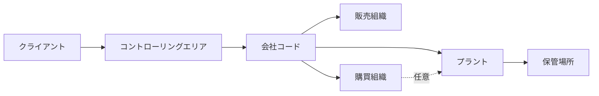
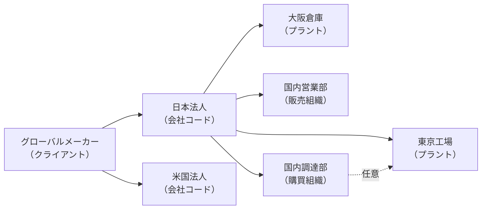

## はじめに

SAPを初めて使う人が最初に戸惑うのが「組織エレメント」です。発注書を作ろうとすると「購買組織」を入力させられ、売上を計上しようとすると「販売組織」を聞かれる。「これは何を指しているのか？」という疑問を持つのは当然のことです。

**組織エレメントとは、SAPが業務処理を「どの会社の・どの拠点で・どの部門が行ったか」を記録するための単位です。**

なぜ必要かというと、SAPは複数の法人・工場・部門を1つのシステムで統合管理するERPだからです。「どこ」の処理かを明確にしないと、在庫数量も会計仕訳もどこに属するかが分からなくなります。組織エレメントを押さえることで、SAPの全体像が一気にクリアになります。

---

## 組織エレメントの全体像

SAPの主要な組織エレメントは以下の7つです。

| 組織エレメント | 英語名 | 主な用途 |
|---|---|---|
| クライアント | Client | システム最上位。グループ全体を包む |
| コントローリングエリア | Controlling Area | 管理会計の範囲を定義 |
| 会社コード | Company Code | 財務会計上の法人単位 |
| プラント | Plant | 製造・在庫・購買の拠点 |
| 保管場所 | Storage Location | プラント内の棚・エリア |
| 販売組織 | Sales Organization | 販売・売上計上の単位 |
| 購買組織 | Purchasing Organization | 購買・発注の単位 |

これらの包含関係・紐付き関係を図にするとこのようになります。

  凡例
  <strong>→</strong> 上位から下位への包含関係
  <strong>-.-></strong> 任意の紐付け（プラント別購買の場合）

---

## 各組織エレメントの解説

### クライアント（Client）

SAPシステムの最上位単位です。同じシステムを使うすべての法人・部門・工場が1つのクライアントに収まります。

**重要なポイント：** クライアントが異なると、データは完全に分離されます。同じSAPシステムでも「本番環境」「テスト環境」をクライアントで分けることが一般的です。テスト環境でどれだけ操作しても、本番のデータには一切影響しません。

---

### コントローリングエリア（Controlling Area）

管理会計（CO）の範囲を定義する単位です。コスト分析・予算管理・損益管理をどの範囲で行うかを決めます。

1つのコントローリングエリアに複数の会社コードを束ねることができます。

**例：** 日本法人・米国法人・欧州法人という3つの異なる法人（会社コード）を、1つの「グローバル管理会計エリア」で横断的にコスト管理する、といった使い方です。グループ会社で一元的に採算を把握したい場合に有効です。

---

### 会社コード（Company Code）

財務会計（FI）の基本単位です。**貸借対照表（B/S）と損益計算書（P/L）が作成される法人単位**がこれに当たります。日本法人・米国法人のように、実際の法的な会社に1つずつ対応させます。

**なぜ重要か：** 税務申告・法定決算は法人単位で行う義務があります。SAPも同様に、会社コード単位で財務諸表を生成します。会社コードが正しく設定されていないと、「どの法人の会計か」が判断できず、法的に問題となります。

---

### プラント（Plant）

製造・在庫管理・購買において中心的な役割を持つ組織単位です。**在庫の数量はプラント単位で管理されます。**

工場・倉庫・配送センター・営業拠点など、物理的な事業拠点に1対1で対応させることが多いです。1つの会社コードに複数のプラントを持てます（逆は不可）。

**なぜ重要か：** SAPで在庫を確認するとき、必ずプラントを指定します。「全社の在庫合計」ではなく、「東京工場の在庫」「大阪倉庫の在庫」という単位で管理できることがSAPの強みです。プラントが分かれていれば、どの拠点に在庫が偏っているかがリアルタイムで把握できます。

---

### 保管場所（Storage Location）

プラントの中をさらに細かく区切った在庫場所です。「原材料置き場」「完成品エリア」「不良品保管棚」のように、倉庫内の棚・ゾーン単位で区別できます。

在庫移動（入庫・出庫・社内移動）はすべて保管場所まで指定して記録されるため、「工場のどの棚にいくつあるか」まで把握可能です。

---

### 販売組織（Sales Organization）

販売・流通（SD）の基本単位です。**売上の計上・価格決定・顧客との取引条件の管理**に使われます。

1つの会社コードに複数の販売組織を持てます。「国内販売」「輸出販売」「ECサイト」のように、販売チャネルや地域ごとに販売組織を分けることもあります。

**なぜ重要か：** 販売組織ごとに価格リスト・割引条件・与信管理ルールを設定できます。同じ商品でも国内と輸出で価格体系が異なる場合、販売組織を分けることで、チャネルごとの売上分析も明確になります。

---

### 購買組織（Purchasing Organization）

購買（MM）の基本単位です。**仕入先との価格交渉・契約締結・発注**を行う単位です。

購買組織には運用パターンが3つあります。

| パターン | 概要 | 向いている場面 |
|---|---|---|
| 会社横断購買組織 | 複数の会社コードをまたいで購買 | グループ一括購買でコスト削減したい場合 |
| 会社別購買組織 | 会社コードに1対1で紐付く | 法人ごとに独立した購買管理が必要な場合 |
| プラント購買組織 | プラントに1対1で紐付く | 工場単位で購買担当を分けたい場合 |

「どのパターンを採用するか」はSAP導入プロジェクトの重要な設計判断のひとつです。

---

## 実際の企業への当てはめ例

抽象的な説明だけでは分かりにくいため、グローバルメーカーへの当てはめ例を示します。

  凡例
  <strong>→</strong> 上位から下位への包含関係
  <strong>-.-></strong> 任意の紐付け（プラント別購買の場合）

日本法人（会社コード）に対して、東京工場・大阪倉庫という2つのプラントが存在します。国内営業部（販売組織）と国内調達部（購買組織）も日本法人に紐付いています。米国法人は独立した会社コードとして、別途プラントや販売組織を持ちます。

---

## よくある疑問

### Q. プラントと工場は同じですか？

**A. 必ずしも同じではありません。** プラントはSAP上の管理単位であり、物理的な工場だけでなく、倉庫・配送センター・店舗・サービス拠点にも使われます。「1つの物理的な工場を複数のプラントに分けて管理する」こともあれば、「複数の倉庫を1プラントでまとめる」こともあります。

### Q. 小さな会社でもこんなに設定が必要ですか？

**A. ミニマム構成で十分です。** 会社コード1つ・プラント1つ・販売組織1つ・購買組織1つからスタートできます。業務が複雑になるにつれて組織エレメントを追加するのが現実的な進め方です。

### Q. 組織エレメントは後から変更できますか？

**A. 変更は非常に困難です。** 一度本番稼働した後に会社コードやプラントの構成を変えると、過去のデータとの整合性が崩れるリスクがあります。**導入前の設計段階で十分に検討することが重要です。** これがSAP導入プロジェクトで組織設計に多くの時間をかける理由です。

---

## まとめ

- **クライアント**：SAPシステムの最上位。グループ全体を包む
- **コントローリングエリア**：管理会計の範囲。複数の会社コードを束ねられる
- **会社コード**：財務諸表（B/S・P/L）が作られる法人単位
- **プラント**：在庫・製造・購買の拠点単位。在庫管理の基本
- **保管場所**：プラント内の棚・エリア単位
- **販売組織**：売上計上・価格管理の単位
- **購買組織**：発注・仕入先管理の単位。3つの運用パターンがある

組織エレメントはSAPのすべての業務に関わる「土台」です。発注書・請求書・在庫移動・売上計上——あらゆるトランザクションはこれらのエレメントと紐付いて記録されます。「どこで・誰が・何をしたか」を正確に記録できるのも、この仕組みがあるからです。
