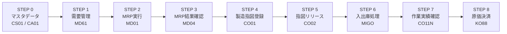
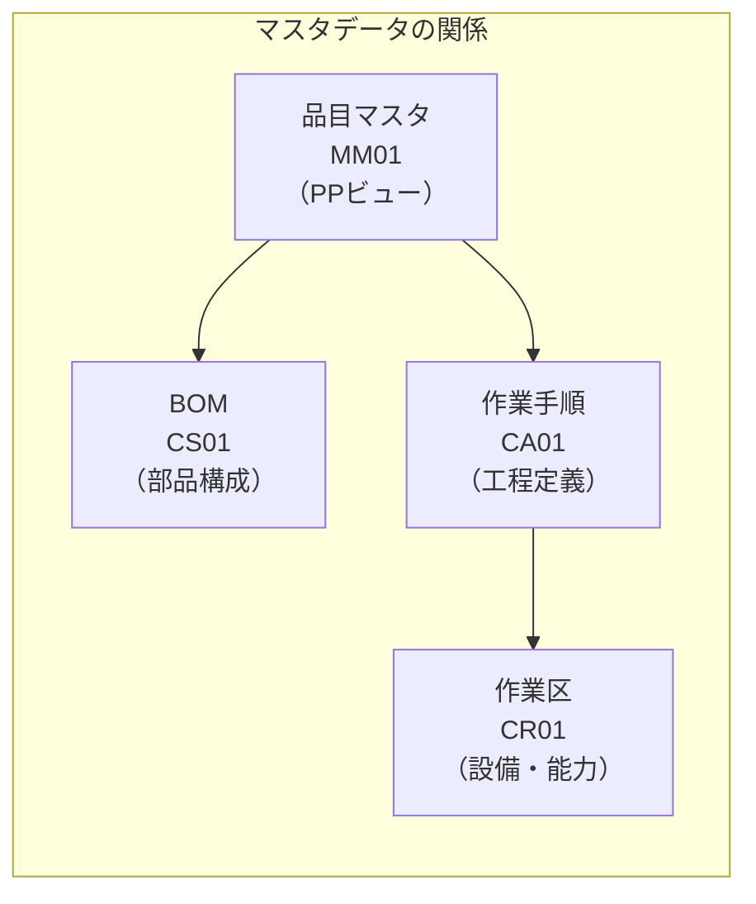
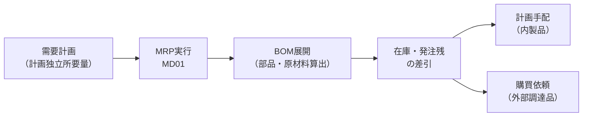
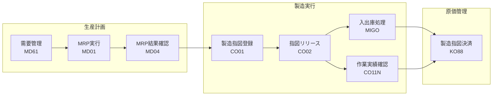

## はじめに

SAPのPPモジュール（Production Planning：生産計画・管理）は、企業の「モノを作る」業務全体をカバーするモジュールです。「何をいつまでにいくつ作るか」という計画から、実際の製造、完成品の入庫、製造原価の決済まで、生産活動の一連のサイクルを一元管理します。

この記事では、**Plan to Produce（計画から製造まで）** と呼ばれる一連の業務フローを、「なぜその業務が必要なのか」というビジネス観点と、「SAPではどのトランザクションで操作するか」を対応付けながら解説します。

**生産計画がなぜ重要か：**

- 計画なしに生産すると、原材料の過剰在庫や欠品が発生し、コスト増・納期遅延につながる
- 製造指図なしに製造現場が動くと、誰が何をいつ作ったのか追跡できず、品質管理も原価管理も破綻する
- 実績を記録しなければ、計画と実績の差異分析ができず、次回の計画精度も改善できない

つまり、PPモジュールは「作りすぎ・作り足りない」を防ぎ、製造コストを見える化するための仕組みです。

---

  凡例
  <strong>→</strong> 必須フロー
  <strong>[ ]</strong> 手動操作
  <strong>英数字コード</strong> = Tコード（SAPの操作コマンド）

## PPモジュールが管理する業務の全体像

PPモジュールが担う業務は大きく以下の5領域に分かれます。

| 業務領域 | 内容 | 主なSAP機能 |
|---------|------|------------|
| **需要管理** | 販売計画・需要予測をもとに「何をいくつ作るか」を決定 | 計画独立所要量（MD61） |
| **MRP（資材所要量計画）** | 需要から逆算して、必要な原材料・半製品の量とタイミングを計算 | MRP実行（MD01/MD02）、所要量一覧（MD04） |
| **製造指図管理** | 製造現場への作業指示書を作成・管理 | 製造指図登録（CO01）、リリース（CO02） |
| **製造実行** | 原材料の出庫、完成品の入庫、作業実績の記録 | 入出庫（MIGO）、実績確認（CO11N） |
| **製造原価管理** | 製造指図に集計された原価をCO（管理会計）モジュールへ決済 | 指図決済（KO88） |

本記事では、これらすべてのステップを順番に解説します。

---

## STEP 0：マスタデータの設定

製造業務を開始する前に、SAPには4種類の重要なマスタデータが必要です。これらは「モノの作り方」をシステムに教えるためのデータであり、すべてのステップの基盤となります。

### BOM（部品表 / Bill of Materials）

**業務的な意味：**
BOM（部品表）とは、**ある製品を1つ作るために必要な原材料・部品の一覧表**です。たとえば「製品Aを1個作るには、部品Bが3個、部品Cが2個、原材料Dが0.5kg必要」という情報を登録します。

BOMがないと、MRP（後述）が「何をどれだけ調達すべきか」を計算できません。つまり、BOMは生産計画の出発点です。

| トランザクション | 操作内容 |
|----------------|---------|
| **CS01** | BOMの新規作成 |
| **CS02** | BOMの変更 |
| **CS03** | BOMの照会 |

### 作業手順（Routing）

**業務的な意味：**
作業手順とは、**製品を作るための工程・手順とその所要時間を定義したデータ**です。「工程1：切断（10分）→ 工程2：組立（20分）→ 工程3：検査（5分）」のように、製造の流れを登録します。

作業手順がないと、製造指図に工程情報が載らず、作業時間の計画も実績管理もできません。また、製造原価のうち加工費（労務費・設備費）の計算にも作業手順が使われます。

| トランザクション | 操作内容 |
|----------------|---------|
| **CA01** | 作業手順の新規作成 |
| **CA02** | 作業手順の変更 |
| **CA03** | 作業手順の照会 |

### 作業区（Work Center）

**業務的な意味：**
作業区とは、**実際に製造作業を行う場所・設備・人員グループを定義したデータ**です。「溶接ライン」「組立ステーション1」「検査室」などが作業区にあたります。

作業区には、その設備の稼働時間（能力）や1時間あたりのコスト（活動単価）が設定されています。作業手順の各工程は作業区に紐付けられており、「この工程はどの設備で、どれくらいのコストで行われるか」を決定します。

| トランザクション | 操作内容 |
|----------------|---------|
| **CR01** | 作業区の新規作成 |
| **CR02** | 作業区の変更 |
| **CR03** | 作業区の照会 |

### 品目マスタ（PPビュー）

**業務的な意味：**
品目マスタ（MM01で作成）には、PPモジュール固有のビューがあります。ここでは、MRPの計算方法（ロットサイズ、安全在庫、計画サイクルなど）や、製造に関する基本情報（内製/外注区分、生産スケジューラなど）を設定します。

PPビューが未設定の品目は、MRPの対象にならず、製造指図も作成できません。

| トランザクション | 操作内容 |
|----------------|---------|
| **MM01** | 品目マスタの新規作成（MRP・生産計画ビュー） |
| **MM02** | 品目マスタの変更 |
| **MM03** | 品目マスタの照会 |

  凡例
  <strong>→</strong> 参照・紐付け関係
  <strong>[ ]</strong> マスタデータ
  <strong>英数字コード</strong> = Tコード（SAPの操作コマンド）

---

## STEP 1：需要管理（Demand Management）

### 業務的な意味

需要管理とは、**「この製品をいつまでにいくつ作る必要があるか」を計画として登録するプロセス**です。

販売部門の需要予測や受注見込みに基づき、「来月は製品Aを500個、再来月は300個生産する」といった**計画独立所要量**をSAPに登録します。「独立所要量」とは、他の品目の需要から派生するのではなく、最終製品として独立して発生する需要のことです。

**需要管理が必要な理由：**
- 需要計画がないと、MRPが「何をいつまでに調達・製造すべきか」を計算する起点がなくなる
- 需要予測なしに受注が入ってから製造を始めると、リードタイムが長い製品では納期に間に合わない
- 逆に、過大な需要計画を立てると過剰在庫となり、保管コストや廃棄リスクが増大する

### SAPでの操作

| トランザクション | 操作内容 |
|----------------|---------|
| **MD61** | 計画独立所要量の登録・変更 |
| **MD62** | 計画独立所要量の変更 |
| **MD63** | 計画独立所要量の照会 |

**MD61で入力する主な項目：**

| 入力項目 | 内容 |
|---------|------|
| 品目番号 | 需要計画の対象となる製品 |
| プラント | 生産を行う工場 |
| 所要量バージョン | 計画のバージョン（複数シナリオの比較に使用） |
| 期間・数量 | 月別・週別の計画生産数量 |

> **ポイント：計画戦略**
> 品目マスタの「計画戦略グループ」により、見込生産（Make to Stock）か受注生産（Make to Order）かが決まります。見込生産では計画独立所要量が起点となり、受注生産では受注伝票が直接MRPの起点になります。

---

## STEP 2：MRP実行（Material Requirements Planning）

### 業務的な意味

MRP（資材所要量計画）とは、**需要計画をもとにBOMを展開し、製品を作るために必要な原材料・半製品の所要量とタイミングを自動計算するプロセス**です。

たとえば、「製品Aを来月500個作る」という需要に対し、BOMを参照して「部品Bが1,500個、原材料Cが250kg必要」と計算します。さらに、現在の在庫や発注残を差し引き、実際に追加で調達・製造が必要な**正味所要量**を算出します。

**MRPが必要な理由：**
- 手作業で部品の必要量を計算すると、BOMが複雑な製品（数百点の部品を含む）では計算ミスや漏れが発生する
- MRPなしでは、原材料の欠品による生産ラインの停止や、逆に過剰発注による在庫コスト増大が起きやすい
- MRPは計算結果として**計画手配**（内製品の製造予定）や**購買依頼**（外部調達品の発注依頼）を自動生成するため、後続の業務が効率化される

### SAPでの操作

| トランザクション | 操作内容 |
|----------------|---------|
| **MD01** | MRP実行（プラント全体を一括で計算） |
| **MD02** | MRP実行（特定品目のみ個別に計算） |
| **MDBT** | MRPのバックグラウンド実行（大量品目向け） |

**MRP実行時の主なパラメータ：**

| パラメータ | 内容 |
|----------|------|
| 処理キー | NETCH（正味変更計画）/ NEUPL（再生計画）など |
| 作成区分 | 計画手配を作成するか、購買依頼を直接作成するか |
| スケジューリング | 基本日程計画 / 詳細日程計画 |
| MRP一覧の作成 | 計算結果のログを出力するか |

  凡例
  <strong>→</strong> 処理の流れ
  <strong>[ ]</strong> 手動操作・データ
  <strong>英数字コード</strong> = Tコード（SAPの操作コマンド）

---

## STEP 3：MRP結果の確認（Stock/Requirements List）

### 業務的な意味

MRPを実行したら、その計算結果が正しいかを**生産計画担当者が確認するステップ**です。

MRPは自動計算ですが、マスタデータの設定ミスや需要の急な変動により、不適切な計画手配や購買依頼が生成されることがあります。この確認を怠ると、不要な発注が行われたり、必要な調達が漏れたりするリスクがあります。

**確認すべきポイント：**
- 各品目の所要量と供給（在庫・計画手配・発注残）のバランスが取れているか
- 例外メッセージ（エラーや警告）が出ていないか
- 計画手配の日程が現実的か（リードタイムの観点）

### SAPでの操作

| トランザクション | 操作内容 |
|----------------|---------|
| **MD04** | 所要量一覧（在庫/所要量リスト）の表示 |
| **MD05** | MRP一覧（MRP実行時の計算ログ） |
| **MD06** | MRP一覧の表示（複数品目） |
| **MD07** | 現在の計画結果の概要表示 |

**MD04で確認できる主な情報：**

| 表示項目 | 内容 |
|---------|------|
| 所要量 | 需要（計画独立所要量、受注、従属所要量など） |
| 入庫予定 | 供給（計画手配、製造指図、発注残など） |
| 利用可能在庫 | 各時点での在庫の過不足 |
| 例外メッセージ | MRPが検出した問題（納期遅延、ロットサイズ超過など） |

> **ポイント：従属所要量とは**
> 完成品の需要（独立所要量）からBOM展開によって発生する部品・原材料の需要を「従属所要量」と呼びます。たとえば、完成品Aの需要500個から、部品Bの従属所要量が1,500個として計算されます。

---

## STEP 4：製造指図の登録（Production Order）

### 業務的な意味

製造指図とは、**「この製品をこの数量、この日程で製造せよ」という正式な作業指示書**です。

MRPが生成した計画手配は「まだ計画段階の仮の予定」であり、そのままでは製造現場に指示が出ません。計画手配を製造指図に変換（または直接作成）することで、はじめて「いつ・何を・いくつ・どの工程で作るか」が確定します。

**製造指図が必要な理由：**
- 製造指図は原価の収集単位（原価対象）となる。指図なしでは製造原価を集計できない
- 製造指図に紐付くBOM・作業手順により、必要な原材料の引当と工程計画が確定する
- 製造指図がないまま製造すると、在庫の入出庫記録が不完全になり、帳簿在庫と実在庫が乖離する

### SAPでの操作

| トランザクション | 操作内容 |
|----------------|---------|
| **CO01** | 製造指図の新規作成（直接作成） |
| **CO02** | 製造指図の変更 |
| **CO03** | 製造指図の照会 |
| **CO40** | 計画手配から製造指図への変換（個別） |
| **CO41** | 計画手配から製造指図への一括変換 |

**CO01で入力する主な項目：**

| 入力項目 | 内容 |
|---------|------|
| 品目番号 | 製造する製品 |
| プラント | 製造を行う工場 |
| 指図タイプ | PP01（標準製造指図）など |
| 数量 | 製造数量 |
| 基本日程 | 開始日・終了日 |

> **ポイント：計画手配からの変換と直接作成**
> 通常はMRPが生成した計画手配をCO40/CO41で製造指図に変換します。この場合、計画手配に設定された数量・日程がそのまま引き継がれます。CO01で直接作成する場合は、緊急の追加生産や試作品の製造など、MRPを経由しないケースです。

---

## STEP 5：製造指図のリリース（Order Release）

### 業務的な意味

製造指図のリリースとは、**登録した製造指図を「実行可能」状態にし、製造現場に作業を開始してよいと指示するプロセス**です。

指図を登録しただけではステータスが「作成済（CRTD）」であり、原材料の出庫や実績の記録ができません。リリース（ステータスを「リリース済（REL）」に変更）することで、以下が可能になります。

- 原材料の出庫（在庫からの引き落とし）
- 作業実績の入力
- 製造現場への作業指示書（ショップフロアペーパー）の印刷

**リリースせずに製造を始めるとどうなるか：**
- SAPが入出庫処理を受け付けないため、原材料の在庫が帳簿上減らず、実在庫との差が生まれる
- 実績確認ができないため、製造原価の集計が不完全になる

### SAPでの操作

| トランザクション | 操作内容 |
|----------------|---------|
| **CO02** | 製造指図の変更（個別リリース） |
| **COHV** | 製造指図の一括処理（一括リリースなど） |

---

## STEP 6：入出庫処理（Goods Movement）

### 業務的な意味

入出庫処理とは、**製造に伴う在庫の動きをSAPに記録するプロセス**です。大きく2種類の処理があります。

1. **原材料の出庫（Goods Issue）：** 倉庫から原材料を製造現場に払い出す
2. **完成品の入庫（Goods Receipt）：** 完成した製品を倉庫に入庫する

これらの在庫移動により、帳簿上の在庫数量と金額がリアルタイムで更新されます。同時に、製造指図に対して原材料費（出庫）と完成品の標準原価（入庫）が計上されます。

**バックフラッシュとは：**
バックフラッシュとは、**完成品の入庫時に、BOMに基づいて原材料の出庫を自動的に行う仕組み**です。たとえば完成品Aを100個入庫すると、BOMに従って部品Bが300個、原材料Cが50kgの出庫伝票が自動で作成されます。

バックフラッシュにより、製造現場が原材料を1点ずつ出庫処理する手間が省けます。ただし、実際の消費量とBOMの標準量に差異がある場合（不良品による余分な消費など）は、別途調整が必要です。

### SAPでの操作

| トランザクション | 操作内容 |
|----------------|---------|
| **MIGO** | 入出庫処理（共通トランザクション） |
| 移動タイプ **261** | 製造指図向け原材料出庫 |
| 移動タイプ **101** | 製造指図からの完成品入庫 |

**MIGOで入力する主な項目：**

| 入力項目 | 内容 |
|---------|------|
| 移動タイプ | 261（出庫）/ 101（入庫） |
| 製造指図番号 | 対象の製造指図 |
| 品目・数量 | 出庫/入庫する品目と数量 |
| 保管場所 | 入出庫先の倉庫・保管場所 |

---

## STEP 7：作業実績確認（Confirmation）

### 業務的な意味

作業実績確認とは、**製造現場で実際に行われた作業の結果（作業時間、生産数量、不良数量など）をSAPに記録するプロセス**です。

製造指図には「計画された作業時間」が設定されていますが、実際にはトラブルや段取り替えで計画通りにいかないことも多くあります。実績を記録することで、以下が可能になります。

- 計画と実績の比較による生産効率の分析
- 実際の作業時間に基づく加工費（労務費・設備費）の計算
- 不良数量の把握と品質管理

**実績確認を行わないとどうなるか：**
- 製造原価のうち加工費が計上されず、原材料費だけの不完全な原価情報になる
- 計画と実績の差異分析ができず、生産計画の精度改善につながらない
- 製造指図のステータスが「完了」にならず、指図が溜まり続ける

### SAPでの操作

| トランザクション | 操作内容 |
|----------------|---------|
| **CO11N** | 作業実績確認（個別入力） |
| **CO12** | 作業実績確認の一括入力 |
| **CO13** | 作業実績確認の取消 |
| **CO14** | 作業実績確認の照会 |
| **COOIS** | 製造指図情報システム（実績の分析） |

**CO11Nで入力する主な項目：**

| 入力項目 | 内容 |
|---------|------|
| 製造指図番号 | 実績を入力する対象の指図 |
| 工程番号 | どの工程の実績か |
| 歩留数量 | 良品の数量 |
| 仕損数量 | 不良品の数量 |
| 作業時間 | 段取時間・機械時間・労働時間 |

---

## STEP 8：製造指図の決済（Order Settlement）

### 業務的な意味

製造指図の決済とは、**製造指図に集計された実際の製造原価を、CO（管理会計）モジュールの原価センタや収益性分析に振り替えるプロセス**です。

製造指図には、原材料費（STEP 6の出庫）と加工費（STEP 7の実績確認）が計上されています。完成品の入庫時には標準原価で在庫計上されるため、実際原価と標準原価の差額（原価差異）が製造指図上に残ります。決済処理により、この原価差異が適切な勘定や管理会計のオブジェクトに振り替えられます。

**決済を行わないとどうなるか：**
- 製造指図に原価が残り続け、指図が完了にならない
- 原価差異が分析されないまま放置され、製造コストの改善ポイントが見えない
- 月次の管理会計レポートに製造原価が正しく反映されない

### SAPでの操作

| トランザクション | 操作内容 |
|----------------|---------|
| **KO88** | 製造指図の決済（個別） |
| **CO88** | 製造指図の決済（一括） |
| **KOB1** | 製造指図の原価明細照会 |
| **KO03** | 製造指図の決済ルール照会 |

> **ポイント：原価差異の種類**
> 製造指図の原価差異は、以下のように分類して分析できます。
> - **数量差異：** 計画より多くの原材料を消費した場合の差異
> - **価格差異：** 原材料の実際価格が標準価格と異なる場合の差異
> - **能率差異：** 実際の作業時間が計画時間と異なる場合の差異
> - **操業度差異：** 設備の実際稼働率が計画と異なる場合の差異

---

## 全体サマリ

### 業務ステップ一覧

| STEP | 業務 | 主なTコード | 目的 |
|------|------|-----------|------|
| 0 | マスタデータ設定 | CS01, CA01, CR01, MM01 | 製品の構成・工程・設備を定義 |
| 1 | 需要管理 | MD61 | 「何をいくつ作るか」を計画 |
| 2 | MRP実行 | MD01 / MD02 | 必要な原材料・半製品を自動計算 |
| 3 | MRP結果確認 | MD04 | 計画の妥当性を確認 |
| 4 | 製造指図登録 | CO01 / CO40 | 製造現場への正式な作業指示 |
| 5 | 製造指図リリース | CO02 | 指図を実行可能にする |
| 6 | 入出庫処理 | MIGO | 原材料出庫・完成品入庫 |
| 7 | 作業実績確認 | CO11N | 実際の作業時間・数量を記録 |
| 8 | 製造指図決済 | KO88 | 製造原価をCOへ振替・差異分析 |

### スイムレーン図：PPモジュール全体フロー

  凡例
  <strong>→</strong> 必須フロー
  <strong>[ ]</strong> 手動操作
  <strong>subgraph</strong> = 業務領域の区分
  <strong>英数字コード</strong> = Tコード（SAPの操作コマンド）

---

## よくある疑問（FAQ）

### Q1. MRPは毎日実行するのですか？

企業や業種によりますが、多くの製造業では**日次でMRPを実行**します。需要や在庫は日々変動するため、計画を最新の状態に保つ必要があるからです。ただし、品目数が多い場合は「正味変更計画（NETCH）」で前回からの変更分だけを再計算する方式を使い、処理時間を短縮します。全品目を再計算する「再生計画（NEUPL）」は週次や月次で実施する企業が多いです。

### Q2. 製造指図と工程指図（Process Order）の違いは何ですか？

**製造指図（Production Order）** は組立製造（ディスクリート製造）向けで、自動車・電子機器など「個数で数えられる製品」の製造に使います。一方、**工程指図（Process Order）** はプロセス製造向けで、化学品・食品・医薬品など「バッチ・配合で管理する製品」の製造に使います。工程指図ではPPモジュールの拡張である**PP-PI（Process Industry）** の機能が使われます。

### Q3. バックフラッシュと手動出庫はどう使い分けますか？

**バックフラッシュ**は、完成品入庫時に原材料出庫を自動処理する方式で、大量生産や消費量がBOM通りに安定している品目に適しています。一方、**手動出庫**は、高額な原材料や消費量にバラつきがある品目に適しており、実際の消費量を正確に記録したい場合に使います。品目マスタのバックフラッシュフラグで品目ごとに設定できます。

### Q4. 製造指図の決済はいつ行いますか？

通常は**月次の決算処理の一部**として実行します。月中に完了した製造指図だけでなく、月末時点で進行中の指図についても期間決済（部分決済）を行い、当月分の原価を管理会計に反映します。決済を行わないと、月次の原価レポートに製造原価が正しく計上されません。

---

## まとめ

- **PPモジュール**は、需要管理からMRP、製造指図、実績確認、原価決済まで、生産活動のサイクル全体をカバーする
- **マスタデータ（BOM・作業手順・作業区・品目マスタ）** が正確に設定されていることが、すべてのステップの前提条件となる
- **MRP**はBOMを展開して必要な原材料を自動計算し、計画手配・購買依頼を生成する。手作業では困難な所要量計算を自動化する重要な機能
- **製造指図**は製造原価の収集単位であり、登録・リリース・実績確認・決済というライフサイクルを持つ
- **バックフラッシュ**を活用すると原材料の出庫処理を自動化できるが、消費量にバラつきがある場合は手動出庫が適切
- **製造指図の決済**により標準原価と実際原価の差異を分析でき、製造コストの改善につなげられる
- PPモジュールは、MMモジュール（原材料の調達）、COモジュール（原価管理）、SDモジュール（販売・出荷）と密接に連携して動作する
