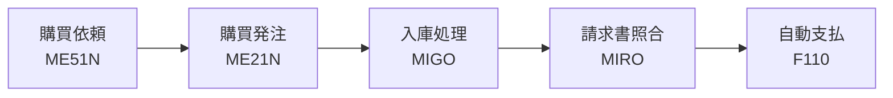
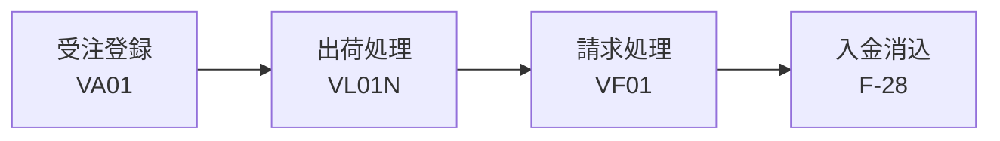

## はじめに

SAPを操作するとき、メニューツリーから目的の画面をたどっていませんか？ メニューを3〜4階層クリックして画面にたどり着く頃には、10秒以上かかっていることもあります。**トランザクションコード（Tコード）を直接入力すれば、わずか1〜2秒で目的の画面に移動できます**。

Tコードとは、SAPの各機能画面に割り当てられた**英数字のショートカットコマンド**です。画面左上のコマンドフィールドに入力するだけで、即座にその機能画面を開けます。

Tコードを覚えることが重要な理由は3つあります。

- **作業スピードが上がる** — メニュー操作と比べて画面遷移が圧倒的に速い
- **コミュニケーションが円滑になる** — SAP関係者との会話で「ME21Nで発注を…」のように共通言語として使える
- **トラブル対応が速くなる** — 障害時にすぐ該当画面を開いて状況確認ができる

逆に、Tコードを知らないと、メニュー操作に時間がかかるだけでなく、周囲のSAP経験者との会話で頻出するコードが理解できず、業務の効率と学習スピードの両方が落ちてしまいます。

この記事では、**実務で特に使用頻度の高いTコードをモジュール別に一覧化**しました。ブックマークしておけば、日々の業務やプロジェクトで辞書代わりに使えます。

---

## モジュール別トランザクションコード一覧

### FI（財務会計）

FIモジュールは企業の会計取引を記録・管理する中核モジュールです。仕訳入力から支払処理、残高照会まで幅広いTコードがあります。

| Tコード | 機能名 | 用途の簡単な説明 |
|---|---|---|
| FB01 | 仕訳伝票入力 | 一般仕訳伝票を手動で入力する（汎用的な仕訳入力画面） |
| FB03 | 仕訳伝票照会 | 登録済みの仕訳伝票の内容を確認する |
| FB50 | G/L勘定仕訳入力 | 総勘定元帳の仕訳をシンプルな画面で入力する |
| FS00 | G/L勘定マスタ管理 | 勘定科目マスタの作成・変更・照会を行う |
| F-02 | G/L勘定伝票入力 | 総勘定元帳の仕訳伝票を入力する（旧画面） |
| F110 | 自動支払処理 | 買掛金の支払を一括で自動実行する |
| FBL1N | 仕入先明細照会 | 仕入先ごとの未決済・決済済み明細を一覧表示する |
| FBL3N | G/L勘定明細照会 | 勘定科目ごとの明細（個別転記）を一覧表示する |
| FBL5N | 得意先明細照会 | 得意先ごとの未決済・決済済み明細を一覧表示する |
| F-28 | 入金処理 | 得意先からの入金を消込処理する |
| FAGLB03 | G/L勘定残高照会 | 勘定科目の残高を期間別に表示する |

### CO（管理会計）

COモジュールは社内の原価管理・収益性分析を担当します。原価センタや内部指図の管理が中心です。

| Tコード | 機能名 | 用途の簡単な説明 |
|---|---|---|
| KS01 | 原価センタ登録 | 新しい原価センタ（部門別コスト管理単位）を作成する |
| KS03 | 原価センタ照会 | 原価センタの登録内容を確認する |
| KP06 | 原価計画入力 | 原価センタに対する計画値（予算）を入力する |
| CJ20N | プロジェクトビルダ | WBS要素や内部指図を含むプロジェクト構造を一括管理する |
| KSB1 | 原価センタ実績明細 | 原価センタに転記された実績明細を一覧照会する |
| S_ALR_87013611 | 原価センタ計画/実績比較 | 原価センタの計画値と実績値を比較するレポートを出力する |
| KO01 | 内部指図登録 | 特定プロジェクトや施策の原価を集計するための内部指図を作成する |
| KO03 | 内部指図照会 | 内部指図の登録内容を確認する |
| KB21N | 振替転記（実績） | 原価センタ間の実績原価を振り替える |

### MM（購買・在庫管理）

MMモジュールは、資材の調達から在庫管理までをカバーします。購買プロセス（P2Pサイクル）で最も頻繁に使われるTコードが集まっています。

| Tコード | 機能名 | 用途の簡単な説明 |
|---|---|---|
| ME21N | 購買発注登録 | 仕入先への発注伝票を作成する |
| ME23N | 購買発注照会 | 登録済みの発注伝票の内容を確認する |
| ME2M | 購買発注一覧（品目別） | 品目を軸に購買発注の一覧を検索・表示する |
| ME2N | 購買発注一覧（発注番号別） | 発注番号を軸に購買発注の一覧を検索・表示する |
| ME51N | 購買依頼登録 | 社内の購買依頼（発注リクエスト）を作成する |
| MIGO | 入出庫処理 | 資材の入庫・出庫・振替転記などの在庫移動を処理する |
| MIRO | 請求書照合 | 仕入先からの請求書と発注・入庫の内容を照合して会計伝票を作成する |
| MB52 | 保管場所別在庫一覧 | 保管場所ごとの在庫数量・金額を一覧表示する |
| MMBE | 在庫照会 | 品目単位で在庫状況（プラント・保管場所別）を確認する |
| MM01 | 品目マスタ登録 | 新しい品目（資材）のマスタデータを作成する |
| MM03 | 品目マスタ照会 | 品目マスタの登録内容を確認する |

### SD（販売・出荷管理）

SDモジュールは受注から出荷・請求までの販売プロセス（O2Cサイクル）を管理します。

| Tコード | 機能名 | 用途の簡単な説明 |
|---|---|---|
| VA01 | 受注伝票登録 | 得意先からの受注伝票を作成する |
| VA03 | 受注伝票照会 | 登録済みの受注伝票の内容を確認する |
| VA05 | 受注伝票一覧 | 受注伝票を検索条件で一覧表示する |
| VL01N | 出荷伝票登録 | 受注に基づいて出荷伝票を作成する |
| VL03N | 出荷伝票照会 | 登録済みの出荷伝票の内容を確認する |
| VF01 | 請求伝票登録 | 出荷伝票に基づいて請求伝票（インボイス）を作成する |
| VF03 | 請求伝票照会 | 登録済みの請求伝票の内容を確認する |
| VD01 | 得意先マスタ登録（SD） | 販売エリアに紐づく得意先マスタを作成する |
| VD03 | 得意先マスタ照会（SD） | 得意先マスタの販売エリア情報を確認する |

### PP（生産計画・管理）

PPモジュールは製造業における生産計画から製造実行までを管理します。BOM（部品表）や作業手順の管理も含みます。

| Tコード | 機能名 | 用途の簡単な説明 |
|---|---|---|
| CO01 | 製造指図登録 | 生産を実行するための製造指図を作成する |
| CO03 | 製造指図照会 | 製造指図の内容・ステータスを確認する |
| MD04 | 所要量一覧（個別） | 品目単位でMRP（資材所要量計画）の結果を確認する |
| MD61 | 計画独立所要量登録 | 需要予測に基づく計画所要量（見込み生産数）を入力する |
| CS01 | BOM登録 | 製品の部品構成表（Bill of Materials）を作成する |
| CS03 | BOM照会 | 登録済みのBOMの内容を確認する |
| CR01 | 作業区登録 | 製造工程で使う作業区（ワークセンター：設備・作業場）を登録する |
| CA01 | 作業手順登録 | 製品の製造手順（工程順序・作業時間）を登録する |
| CO11N | 作業実績確認 | 製造指図に対する作業実績（作業時間・数量）を入力する |

### Basis（システム管理）

Basisはシステム基盤の管理・運用を担当する領域です。ジョブ管理、ログ確認、権限管理などのTコードが含まれます。

| Tコード | 機能名 | 用途の簡単な説明 |
|---|---|---|
| SM37 | ジョブ監視 | バックグラウンドジョブの実行状況・ログを確認する |
| SM36 | ジョブ定義 | バックグラウンドジョブのスケジュールを設定・登録する |
| SM21 | システムログ | システムレベルのエラーや警告のログを確認する |
| ST22 | ABAPダンプ分析 | プログラムの実行時エラー（ショートダンプ）を確認・分析する |
| SU01 | ユーザマスタ管理 | SAPユーザの作成・変更・ロック解除を行う |
| PFCG | ロール管理 | 権限ロールの作成・変更・権限プロファイル生成を行う |
| SE16 | テーブル内容照会 | SAPのデータベーステーブルの内容を直接参照する |
| SE16N | テーブル内容照会（拡張） | SE16の拡張版。より柔軟な条件でテーブル内容を参照する |
| STMS | 移送管理 | 開発〜本番環境への移送リクエストの管理・インポートを行う |
| SE93 | トランザクションコード管理 | Tコードの登録内容を照会・検索する |

---

## 業務フローとTコードの関係

実際の業務では、複数のTコードを順番に使ってプロセスを完了させます。以下は代表的な業務フローにおけるTコードの流れです。

### 購買サイクル（P2P：Procure to Pay）

  凡例
  <strong>→</strong> 必須フロー（前工程の完了が次工程の前提）
  <strong>[ ]</strong> 手動操作（ユーザがTコードを実行）
  <strong>英数字コード</strong> = Tコード（SAPの操作コマンド）

購買依頼で社内承認を得てから発注を行い、モノが届いたら入庫、仕入先の請求書が届いたら照合、最後に支払を実行する流れです。この一連の流れを**P2P（Procure to Pay）サイクル**と呼びます。

### 販売サイクル（O2C：Order to Cash）

  凡例
  <strong>→</strong> 必須フロー（前工程の完了が次工程の前提）
  <strong>[ ]</strong> 手動操作（ユーザがTコードを実行）
  <strong>英数字コード</strong> = Tコード（SAPの操作コマンド）

得意先からの受注を登録し、出荷・請求と進み、最終的に入金を消込する流れです。この一連の流れを**O2C（Order to Cash）サイクル**と呼びます。

---

## 効率的な使い方

Tコードを知っているだけでなく、**入力方法を工夫する**ことでさらに操作スピードが上がります。

### コマンドフィールドの入力テクニック

| 入力方法 | 動作 | 使い分け |
|---|---|---|
| `/nXXXX` | 現在の画面を閉じて、同じウィンドウでTコードXXXXを開く | 通常の画面移動に使う（最も頻繁に使用） |
| `/oXXXX` | 新しいウィンドウ（セッション）でTコードXXXXを開く | 今の画面を残したまま別の作業をしたいとき |
| `/n` | 現在のトランザクションを終了してホーム画面に戻る | 作業を中断して初期画面に戻りたいとき |
| `/nex` | 確認ダイアログなしで即座にログオフする | 急いでログオフしたいとき（保存していないデータは失われるので注意） |

### お気に入り登録

よく使うTコードは、SAPのお気に入りフォルダに登録しておくと便利です。ホーム画面で**「お気に入り」→「トランザクションの挿入」**からTコードを追加できます。メニューツリーを毎回たどる必要がなくなります。

### SE93でTコードを検索する

「この機能のTコードは何だっけ？」と思ったときは、**SE93（トランザクションコード管理）** で検索できます。機能名やプログラム名からTコードを逆引きするのに便利です。

---

## よくある疑問

### Q1. TコードはS/4HANAでも同じですか？

基本的に多くのTコードはS/4HANAでもそのまま使えます。ただし、一部のTコードは新しい画面（Fioriアプリ）に置き換えられており、旧トランザクションが非推奨になっているケースがあります。例えば、仕訳入力はFB01からFB50への移行が推奨され、さらにS/4HANAではFioriアプリ「仕訳伝票の入力」が標準となっています。

**実務への影響**: プロジェクトでTコードを前提に手順を作成する際は、対象システムのバージョンを確認し、Fioriアプリへの移行対象かどうかを事前に調べておくことが重要です。

### Q2. Tコードが多すぎて覚えられません。どこから覚えるべきですか？

すべてのTコードを暗記する必要はありません。まずは**自分の担当モジュールの登録系（xx01）と照会系（xx03）**を優先的に覚えましょう。SAPのTコードには命名規則があり、末尾が01なら登録、02なら変更、03なら照会、というパターンが多いです。この法則を知っておくと、未知のTコードでも推測できるようになります。

### Q3. カスタムTコードとは何ですか？

SAPが標準で提供するTコード以外に、企業独自に作成したTコードを**カスタムTコード**と呼びます。通常「Z」または「Y」で始まる命名規則になっており、SE93で登録されています。カスタムTコードはその企業固有のものなので、転職や別プロジェクトに移った際にはそのまま使えません。標準Tコードとの違いを意識しておくことで、汎用的なスキルと企業固有の知識を区別できます。

---

## まとめ

- **トランザクションコード（Tコード）** は、SAPの画面に直接アクセスするためのショートカットコマンド。メニュー操作より圧倒的に速い
- モジュールごとに主要なTコードは決まっており、**登録（01）・変更（02）・照会（03）の命名パターン**を覚えると応用が利く
- 実務では、Tコードを単体で使うのではなく、**業務フロー（P2P・O2Cなど）の流れに沿って複数のTコードを順番に使う**ことを意識する
- `/nXXXX`（同一ウィンドウで画面切替）や`/oXXXX`（新規ウィンドウで開く）などの**入力テクニック**を組み合わせることで、さらに操作効率が上がる
- すべてを暗記する必要はなく、**まず担当モジュールの主要Tコードから覚え**、必要に応じてこの一覧を辞書代わりに活用する
