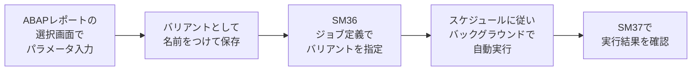

## はじめに

SAPを使っていると「バリアント」という言葉を頻繁に耳にします。しかし、この言葉は**3つのまったく異なる機能**を指して使われるため、「どのバリアントの話をしているのか」が噛み合わないケースがよく発生します。

3つのバリアントに共通するコンセプトは、**「繰り返し使う設定やパラメータを名前をつけて保存し、再利用する仕組み」** です。対象が異なるだけで、目的は同じです。

**なぜバリアントが必要か（why so）：** SAPの選択画面や一覧画面では、毎回同じ条件を手入力しなければならない場面が多発します。会社コード、プラント、伝票タイプ、日付範囲など、定型的な入力を毎回繰り返すのは非効率なだけでなく、入力ミスの原因にもなります。

**この記事を読むと何ができるようになるか（so what）：**
- 3種類のバリアントの違いを正しく区別できるようになる
- 日常業務の入力効率を大幅に向上させる方法がわかる
- バックグラウンドジョブの定義に必須となるレポートバリアントの作成・管理ができるようになる
- エンドユーザー向けの画面カスタマイズ手法を理解できる

---

## バリアントの3つの種類（概要）

SAPにおける「バリアント」は以下の3種類です。名前は似ていますが、それぞれ対象も管理方法もまったく異なります。

| 種類 | 対象 | 主な管理Tコード | 何を保存するか | 主なユースケース |
|------|------|--------------|--------------|--------------|
| **レポートバリアント** | ABAPレポートの選択画面 | SE38 / SA38 | 選択画面のパラメータ値 | バックグラウンドジョブの定義、日常の定型レポート実行 |
| **トランザクションバリアント** | トランザクション画面全体 | SHD0 | フィールドの初期値・非表示・画面スキップ | エンドユーザー画面の簡略化 |
| **表示バリアント（ALVレイアウト）** | ALV一覧画面 | 各ALV画面内 | 列の並び・幅・ソート・フィルタ | レポート出力結果の見やすいレイアウト保存 |

**so what：** まず「今話題にしているバリアントはどれか？」を確認する習慣をつけることで、コミュニケーションのズレを防げます。特にプロジェクト中は「バリアント作っておいて」と依頼されたとき、3つのどれを指しているのかを確認することが重要です。

---

## レポートバリアント（最も基本的かつ重要）

### レポートバリアントとは

ABAPレポートを実行するとき、最初に表示される**選択画面（Selection Screen）**に入力するパラメータを名前をつけて保存する仕組みです。選択画面とは、レポートの実行条件を指定する画面のことで、会社コード・プラント・日付範囲・伝票タイプなどのフィールドが並んでいます。

たとえば、在庫管理レポート（MB52）を実行するたびに「プラント: 1000」「保管場所: 0001」「評価日: 当日」と入力しているなら、これらの値をバリアントとして保存すれば、次回からはバリアントを呼び出すだけで同じ条件が自動入力されます。

**なぜレポートバリアントが最も重要か（why so）：** レポートバリアントは日常業務の効率化に加えて、**バックグラウンドジョブの定義に事実上必須**だからです。SM36でジョブを定義する際、ABAPプログラムのステップにバリアントを指定しなければ、実行時に選択画面で処理が止まり、ジョブが完了しません。つまり、定期実行バッチの自動化にはレポートバリアントが欠かせないのです。

### レポートバリアントの作成方法

レポートバリアントの作成には2つの方法があります。

**方法1：選択画面から直接保存する**

1. トランザクション（例：MB52）を実行し、選択画面を表示する
2. 保存したいパラメータ値を入力する
3. メニューバーから「移動（Goto）」→「バリアント（Variants）」→「名前をつけて保存（Save as Variant）」を選択する
4. バリアント名と説明を入力して保存する

**方法2：SE38（ABAPエディタ）から管理する**

1. SE38を実行し、プログラム名を入力する
2. 「バリアント」ラジオボタンを選択して「照会（Display）」を押す
3. 既存バリアントの一覧が表示される。新規作成・変更・削除が可能

**so what：** 方法1は手軽なので日常的なバリアント作成に向いています。方法2はプログラム単位でバリアントを一覧管理できるため、プロジェクトでのバリアント棚卸しや移送準備に便利です。

### 主要な設定項目

バリアントを保存する際に設定できる主な項目は以下のとおりです。

| 設定項目 | 説明 | 用途 |
|---------|------|------|
| **バリアント名** | 最大14文字の識別名 | バリアントを一意に特定する |
| **説明** | バリアントの内容を表すテキスト | 一覧表示時に内容がわかるようにする |
| **フィールドの保護** | 特定フィールドを変更不可にする | ジョブ実行時に値を変えられないようにする |
| **フィールドの非表示** | 特定フィールドを画面上から隠す | 不要なフィールドを非表示にして簡略化する |
| **動的日付変数** | 実行日を基準にした動的な日付を設定する | バッチジョブで「毎回当日」「前月末」などを自動設定する |

### 動的日付変数（バッチジョブに必須の機能）

レポートバリアントの最も強力な機能が**動的日付変数**です。固定日付ではなく、実行日を基準に自動計算される日付を設定できます。

たとえば、毎日実行するバッチジョブで「当日の日付」を選択画面に入れたい場合、固定日付をバリアントに保存してしまうと、翌日以降は古い日付で実行されてしまいます。動的日付変数を使えば、実行するたびにその日の日付が自動的に設定されます。

バリアント保存画面で、日付フィールドの「選択変数」列にチェックを入れ、変数名を指定します。主な変数は以下のとおりです。

| 変数タイプ | 変数名の例 | 意味 | 具体例（実行日: 2026-04-02） |
|----------|----------|------|--------------------------|
| **D: 日付計算** | 現在の日付 | 実行日当日 | 2026-04-02 |
| **D: 日付計算** | 現在の日付 - 1 | 前日 | 2026-04-01 |
| **D: 日付計算** | 当月初日 | 実行月の初日 | 2026-04-01 |
| **D: 日付計算** | 前月末日 | 前月の末日 | 2026-03-31 |
| **T: TVARVCテーブル** | 任意の変数名 | TVARVCテーブルに定義した値 | 管理者が設定した任意の日付 |

**TVARVCテーブル**は、バリアントで使える変数値を管理するテーブルです。トランザクション**STVARV**で変数の定義・値の変更ができます。標準の動的日付変数では表現できない業務固有の日付（例：会計年度開始日など）を変数化したい場合に使います。

**so what：** 動的日付変数を使いこなすことで、日次・月次のバッチジョブを「一度設定したら手を触れなくてよい」状態にできます。逆にこれを知らないと、毎月バリアントの日付を手動で更新する運用になり、更新忘れによるジョブ失敗という事故が起きます。

### レポートバリアントとバックグラウンドジョブの関係

レポートバリアントの最も重要なユースケースが、バックグラウンドジョブ（SM36）との連携です。

  凡例
  <strong>→</strong> 処理の流れ（時系列順）
  <strong>[ ]</strong> 手動操作またはシステム処理
  <strong>SM36 / SM37</strong> = Tコード（SAPの操作コマンド）

SM36でジョブを定義する際、ステップとして「プログラム名」と「バリアント名」を指定します。バリアントを指定しないと、ジョブ実行時に選択画面が表示される段階で処理が停止し、ジョブが正常に完了しません。

**so what：** バッチジョブを設計する際は、「まずバリアントを作成し、テストしてから、ジョブに組み込む」という順序で進めましょう。バリアントが正しく動作することを確認せずにジョブを定義すると、本番環境でのジョブ失敗の原因になります。

---

## トランザクションバリアント

### トランザクションバリアントとは

トランザクションバリアント（SHD0）は、特定のトランザクション画面に対して**フィールドの初期値設定・フィールドの非表示・画面のスキップ**ができる仕組みです。レポートバリアントが「選択画面のパラメータ保存」であるのに対し、トランザクションバリアントは「トランザクション画面そのものの見た目と動作を変更する」点が異なります。

**なぜトランザクションバリアントが必要か（why so）：** SAPの標準トランザクション画面には、あらゆる業種・業態に対応できるよう非常に多くのフィールドが用意されています。しかし、実際の運用では使わないフィールドが大半を占めることが多く、エンドユーザーにとっては「どこに何を入力すればよいかわからない」という混乱の原因になります。不要なフィールドが表示されていると入力ミスのリスクも高まります。

### 管理トランザクション：SHD0

トランザクションバリアントの作成・変更・削除は、すべて**SHD0**で行います。

SHD0を実行すると、対象のトランザクションコードを指定する画面が表示されます。トランザクションコードを入力して「作成」を押すと、対象トランザクションが実際に起動し、各画面でフィールドごとに以下の設定ができます。

| 設定 | 説明 |
|------|------|
| **初期値の設定** | フィールドにデフォルト値を入れた状態で画面を開く |
| **フィールドの非表示** | 不要なフィールドを画面上から見えなくする |
| **フィールドの入力不可** | フィールドを表示するが、値の変更はできなくする |
| **画面のスキップ** | 複数画面のトランザクションで、不要な画面を飛ばす |

### ユースケース

- **画面の簡略化：** 購買発注登録（ME21N）で、エンドユーザーが使わないフィールド（例：統計納入日程、確認制御キーなど）を非表示にして、入力が必要なフィールドだけを表示する
- **デフォルト値の設定：** 伝票タイプや購買組織など、ほぼ毎回同じ値を入力するフィールドにデフォルト値を設定して入力の手間を削減する
- **画面のスキップ：** 資材マスタ登録（MM01）で使わないビュー（品質管理ビューなど）の画面をスキップする

**so what：** トランザクションバリアントは**ノーコードで画面をカスタマイズできる**手段です。ABAP開発やGuiXT（スクリプトベースの画面改変ツール）と異なり、プログラミング知識が不要で、Basisチームだけで設定できます。ユーザー教育コストの削減にも直結するため、本番稼働前のユーザー受入テスト（UAT）までに検討・適用しておくことをおすすめします。

なお、GuiXTはスクリプトを使ってより柔軟な画面変更（レイアウト変更・ボタン追加など）ができるツールですが、トランザクションバリアントはSAP標準機能のみで完結するため、保守性と安定性の面で優れています。

---

## 表示バリアント（ALVレイアウト）

### 表示バリアントとは

表示バリアントは、**ALV（ABAP List Viewer）** で表示される一覧画面のレイアウトを保存する仕組みです。ALVとは、SAPで最も一般的に使われる表形式のデータ表示画面のことで、レポートの実行結果や伝票一覧などに使われています。

表示バリアントでは、以下の設定をレイアウトとして保存できます。

| 設定項目 | 説明 |
|---------|------|
| **列の表示・非表示** | 不要な列を隠して必要な列だけ表示する |
| **列の並び順** | 列の左右の並び順を変更する |
| **列幅** | 各列の幅を調整する |
| **ソート** | 特定の列で昇順・降順にソートした状態を保存する |
| **フィルタ** | 特定条件でフィルタリングした状態を保存する |
| **小計・合計** | グループごとの小計や全体の合計を表示する |

**なぜ表示バリアントが必要か（why so）：** ALVの初期レイアウトは、プログラム開発者が設定したデフォルトの列構成で表示されます。しかし、実際の業務では「この列は不要」「この列順で見たい」「常にこの条件でフィルタしたい」という要望が部門や担当者ごとに異なります。毎回手動でレイアウトを調整するのは非効率です。

### 操作方法

ALV画面のツールバーにある**レイアウトボタン（格子状のアイコン）**をクリックすると、以下の操作ができます。

- **レイアウトの変更：** 列の追加・削除・並べ替え・ソート・フィルタの設定
- **レイアウトの保存：** 現在の設定に名前をつけて保存
- **レイアウトの読込：** 保存済みのレイアウトを呼び出して適用

### 保存の種類

表示バリアントには保存の範囲が3種類あります。

| 種類 | レイアウト名の規則 | 説明 | 必要な権限 |
|------|----------------|------|----------|
| **ユーザー固有** | 任意の名前 | 自分だけが使えるレイアウト | 特に不要 |
| **共有（グローバル）** | 任意の名前 | 全ユーザーが使えるレイアウト | 管理者権限が必要 |
| **デフォルト設定** | `/`で始まる名前 | そのユーザーが画面を開くたびに自動適用される | ユーザー固有 or 共有の権限 |

**so what：** デフォルト設定（`/`で始まるレイアウト名）を活用すると、画面を開くたびにレイアウトを選び直す手間がなくなります。たとえば、MB52（倉庫在庫一覧）で不要な列を非表示にし、保管場所でソートした状態をデフォルトレイアウトとして保存しておけば、毎回その状態で画面が開きます。

チームで共通のレイアウトを使いたい場合は、管理者が共有レイアウトを作成して周知するとよいでしょう。これにより、「あの人と自分で見えている画面が違う」という混乱を防げます。

---

## 3種類の使い分けまとめ

| 場面 | 使うバリアント | Tコード | 具体例 |
|------|-------------|---------|-------|
| レポートを毎回同じ条件で実行したい | レポートバリアント | SE38 / SA38 | MB52で毎回同じプラント・保管場所を指定 |
| バッチジョブで定期実行したい | レポートバリアント | SE38 + SM36 | MRP実行を毎晩自動で走らせる |
| トランザクション画面を簡略化したい | トランザクションバリアント | SHD0 | ME21Nで不要フィールドを非表示にする |
| フィールドにデフォルト値を設定したい | トランザクションバリアント | SHD0 | VA01の販売組織にデフォルト値を設定 |
| 一覧画面の列構成を変えたい | 表示バリアント | ALV画面内 | MB52の列を並べ替えて保存 |
| チーム共通の表示設定を作りたい | 表示バリアント | ALV画面内 | 共有レイアウトを作成して全員に展開 |

---

## よくある疑問（FAQ）

### Q: レポートバリアントとトランザクションバリアントの違いがわかりません

**A:** 対象が異なります。レポートバリアントは「ABAPレポートの選択画面に入力するパラメータ値」を保存する仕組みです。一方、トランザクションバリアントは「トランザクション画面そのものの構成」を変更する仕組みで、フィールドの非表示・初期値設定・画面のスキップができます。

簡単に言えば、レポートバリアントは「何を入力するか」を保存し、トランザクションバリアントは「画面をどう見せるか」を設定するものです。

### Q: バリアントは環境間で移送できますか？

**A:** バリアントの種類によって扱いが異なります。

- **レポートバリアント：** 移送可能です。SE38のバリアント管理画面から移送依頼に登録できます。本番環境で使うバッチジョブのバリアントは、開発環境で作成してテスト後に移送するのが正しい手順です
- **トランザクションバリアント：** 移送可能です。SHD0からバリアントを移送依頼に登録できます
- **表示バリアント（ALVレイアウト）：** 原則として移送対象外です。各環境で個別に作成します。ただし、プログラム側でデフォルトレイアウトをコーディングしている場合は、プログラムの移送で反映されます

### Q: 他のユーザーが作ったバリアントを使えますか？

**A:** これもバリアントの種類によります。

- **レポートバリアント：** 他のユーザーが作成したバリアントでも、選択画面から呼び出して使えます。ただし、変更・削除できるのは作成者（または権限保持者）のみです
- **トランザクションバリアント：** トランザクションバリアントはユーザー単位ではなく、トランザクション単位で適用されます。Basisチームが設定し、特定のユーザーやロールに割り当てて使います
- **表示バリアント（ALVレイアウト）：** 共有（グローバル）レイアウトとして保存されたものは全ユーザーが利用可能です。ユーザー固有のレイアウトは本人のみ使用できます

---

## まとめ

- SAPの「バリアント」は**レポートバリアント・トランザクションバリアント・表示バリアント（ALVレイアウト）**の3種類がある
- 3つとも**「繰り返し使う設定を保存して再利用する」**という共通コンセプトだが、対象と管理方法が異なる
- **レポートバリアント**は選択画面のパラメータ保存であり、バックグラウンドジョブ（SM36）の定義に事実上必須となる最も重要なバリアント
- **動的日付変数**を使えば、日次・月次バッチジョブを「一度設定したら更新不要」にできる
- **トランザクションバリアント**（SHD0）はノーコードで画面を簡略化でき、エンドユーザーの操作ミス削減と教育コスト低減に効果がある
- **表示バリアント**はALV画面のレイアウト保存であり、デフォルト設定（`/`で始まる名前）を活用すると日常業務が効率化する
- 「バリアント作って」と依頼されたら、**まず3つのどれを指しているか確認する**ことがコミュニケーションの第一歩
